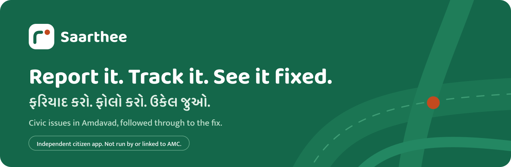
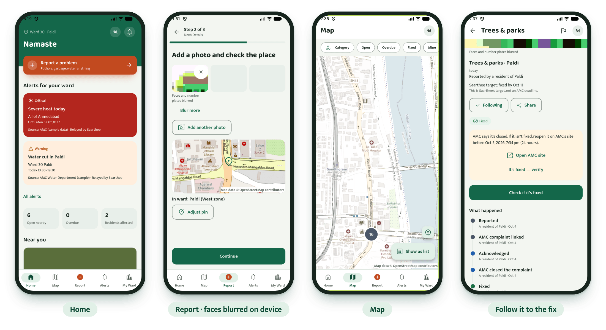
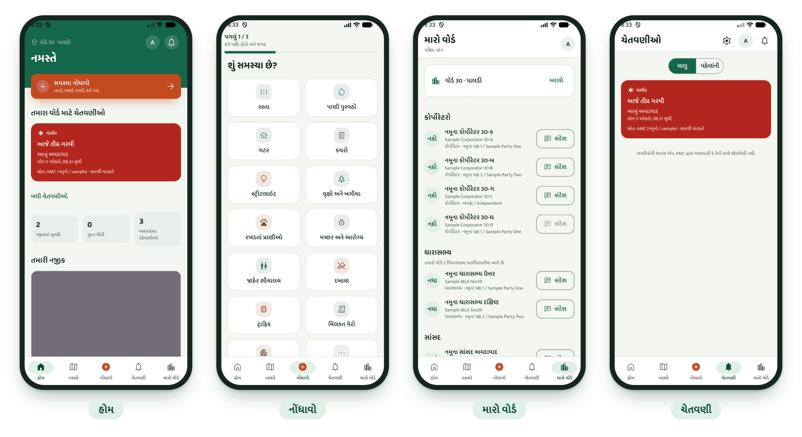
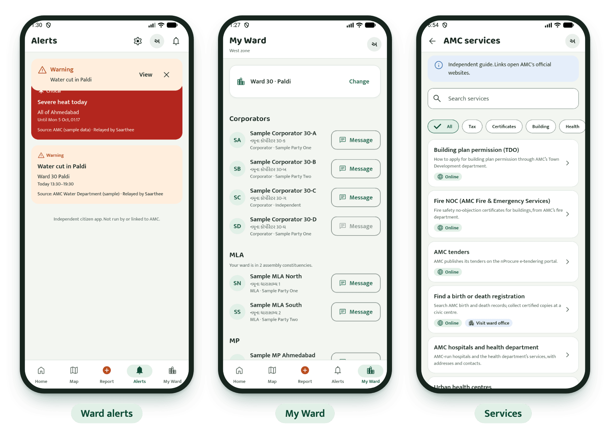
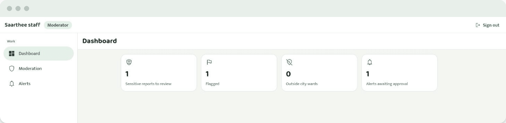
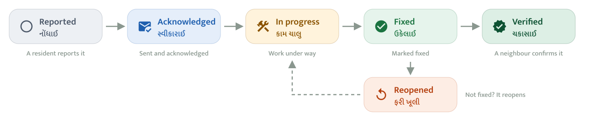
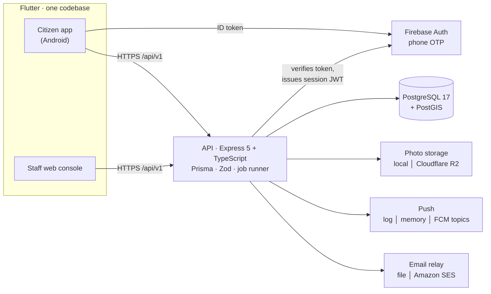

<a id="top"></a>

<p align="center">
  <picture>
    <source media="(prefers-color-scheme: dark)" srcset="docs/brand/readme/hero-dark.svg">
    
  </picture>
</p>

<p align="center">
  
  
  
  <br>
  
  
  
  
</p>

<p align="center">
  <a href="#what-it-does"><b>Features</b></a> ·
  <a href="#see-it"><b>Screenshots</b></a> ·
  <a href="#how-an-issue-gets-fixed"><b>How it works</b></a> ·
  <a href="#architecture"><b>Architecture</b></a> ·
  <a href="#privacy-by-design"><b>Privacy</b></a> ·
  <a href="#for-developers"><b>Get started</b></a> ·
  <a href="#documentation-map"><b>Docs</b></a>
</p>

Saarthee is an independent civic app for Amdavadis. Residents report a civic problem (a broken road, garbage,
a streetlight) with a photo and follow it until it is fixed. A neighbour then confirms the fix on site. The app
also sends ward alerts for water cuts, road closures and heat, lets residents message their ward corporators
without seeing personal phone numbers, and lists AMC services and civic drives. It is available in Gujarati and
English, and Gujarati is the default.

> [!IMPORTANT]
> **Independence.** Saarthee is not an AMC product. It never uses the AMC logo and never claims to file complaints
> on AMC's behalf. Every screen that shows AMC information names its source. Filing with AMC's CCRS is an optional
> hand-off that the citizen does themselves.

> [!NOTE]
> **Status: v2 pilot build.** All 14 v2 tasks are In Review (tags `v2-m6`, `v2-demo`). The remaining launch items
> need action from the founder: [founder actions](docs/v2/founder-actions.md) and the
> [pilot launch checklist](docs/v2/pilot-launch-checklist.md). Every one of the 48 wards is supported. Launch
> outreach starts in five West-zone wards: Paldi, Navrangpura, Vasna, Naranpura and Nava Vadaj.

## What it does

<table>
  <tr>
    <td width="25%" valign="top"><br><b>Report</b><br><sub>Three short steps with a camera photo. Faces and plates are blurred on the device.</sub></td>
    <td width="25%" valign="top"><br><b>Follow to a fix</b><br><sub>Status timeline, before and after photos, Me too, Follow and Share.</sub></td>
    <td width="25%" valign="top"><br><b>Neighbour verification</b><br><sub>Someone within 100 m confirms "Fixed" or "Not fixed" with a photo.</sub></td>
    <td width="25%" valign="top"><br><b>Home and map</b><br><sub>Your ward, active alerts, nearby issues and drives, a clustered map.</sub></td>
  </tr>
  <tr>
    <td valign="top"><br><b>Ward alerts</b><br><sub>Water cuts, closures, heat. Warning and Critical need two approvals.</sub></td>
    <td valign="top"><br><b>My Ward</b><br><sub>Corporators, MLA/MP and a scorecard, reached through an email relay.</sub></td>
    <td valign="top"><br><b>Services and drives</b><br><sub>AMC services with verified links, and civic drives to RSVP to.</sub></td>
    <td valign="top"><br><b>Staff console</b><br><sub>Moderation, alerts, representatives and exports, on the web and in the app.</sub></td>
  </tr>
</table>

<details>
<summary><b>Feature details</b></summary>

| Area | What the citizen gets |
|---|---|
| **Report** | Three short steps: pick a category, take a photo (camera only; faces and number plates are blurred on the device) with an automatic location you can adjust, then add an optional description. The app suggests possible duplicates within 50 m, and an unsent report is kept as an offline draft. |
| **Follow to a fix** | A status timeline with before and after photos, plus Me too, Follow and Share. You can link a CCRS number and escalate with a pre-filled message. |
| **Neighbour verification** | A signed-in citizen standing within 100 m confirms "Fixed" or "Not fixed" with a photo. Reports of "Not fixed" reopen the issue. |
| **Home and map** | A ward header, active alerts, nearby issues and upcoming drives. The map shows clustered issues and has category, status and "mine" filters. |
| **Ward alerts** | Push notifications by ward, zone and category, plus an in-app inbox. A Warning or Critical alert needs approval from two people before it goes out. |
| **My Ward** | Your four corporators, MLA/MP, ward office and a scorecard. Messages go to representatives through an email relay, never to a personal number. |
| **Services and drives** | A directory of AMC services with verified links, and civic drives you can RSVP to. |
| **Staff console** | Runs on the web and inside the app. It covers the moderation queue, issue tools, the alert composer and approvals, representatives and their claims, services, initiatives, categories, election mode, exports, and a ward dashboard for representatives. |

</details>

## See it

<p align="center">
  
</p>

<h3 align="center">Gujarati first · ગુજરાતી પહેલાં</h3>

<p align="center">
  
</p>

<p align="center"><sub>Gujarati is the default language. Every string ships in both <code>app_gu.arb</code> and <code>app_en.arb</code>.</sub></p>

<h3 align="center">Your ward</h3>

<p align="center">
  
</p>

<h3 align="center">Staff console</h3>

<p align="center">
  
</p>

<p align="center"><sub>Screens come from the seeded demo. All names and numbers are samples.</sub></p>

## How an issue gets fixed

<p align="center">
  
</p>

Every status change is written to an append-only event history. Moderators can also mark an issue *rejected*
(spam, duplicate or out of area) or *merge* a duplicate into a canonical issue. Each category has a "Saarthee
target" SLA, and overdue issues move up an escalation ladder:

**corporators → zone office → Deputy Municipal Commissioner → Municipal Commissioner**

The full rules are in [spec §5](docs/v2/saarthee-v2-spec.md#5-issue-lifecycle).

### Roles

| Role | How obtained | Can |
|---|---|---|
| Visitor | Opens the app | Browse the feed, map, issues, alerts, services and ward directory |
| Citizen | Phone OTP | Report, Me too, follow, verify or reopen, message representatives, RSVP, export or delete their own data |
| Moderator | Granted by an admin | Moderation queue, edit an issue's category or ward, draft alerts, approve Info/Advisory alerts, give the first approval for Warning/Critical |
| Admin | `npm run admin:create` | Everything, including the second approval for Warning/Critical alerts and election mode |
| Representative | Claim flow, verified by an admin | Ward dashboard, acknowledge and comment on ward issues, mark them fixed, export |

## Architecture



<details>
<summary><b>How the pieces fit</b></summary>

- **API** (`apps/api`): Express 5, TypeScript, Prisma and PostgreSQL/PostGIS. Each feature lives in its own
  module under `src/modules/<name>/`. Routes only validate input with Zod; the business logic is in
  `*.service.ts`. Recurring work runs in one in-process job runner (`src/jobs`) that takes an advisory lock per job.
  External side effects go through drivers you can swap in `.env` (`STORAGE_DRIVER`, `PUSH_DRIVER`,
  `EMAIL_DRIVER`). The rules are enforced and documented in [apps/api/ARCHITECTURE.md](apps/api/ARCHITECTURE.md).
- **Mobile and staff web** (`apps/mobile`): Flutter with Riverpod, go_router and dio. There are two entry points:
  `lib/main.dart` (the citizen app) and `lib/main_staff.dart` (the staff web console). Code is layered as
  data → application → presentation under `lib/features/<feature>/`. Colours, motion and type come from the
  "Neem" design system ([docs/v2/design-system.md](docs/v2/design-system.md)). The map uses `flutter_map` with
  raster tiles.
- **Geo:** the 48 wards come from the OpenCity "AMC Wards Map 2024" (public domain). GPS → ward lookup runs in
  PostGIS, and points up to 3 km outside the city fall back to the nearest ward.
- **Hosting (pilot):** DigitalOcean BLR1 droplets behind Caddy, managed PostgreSQL, Cloudflare R2, Sentry with
  no PII, and UptimeRobot with Healthchecks.io. See [docs/ops/deploy.md](docs/ops/deploy.md).

The binding product and technical decisions (D1–D43) are recorded in
[spec §2](docs/v2/saarthee-v2-spec.md#2-decisions). Check them before you change behaviour.

</details>

## Privacy by design

These rules shape the code, and CI enforces several of them.

| Rule | What it means |
|---|---|
| **No phone numbers out** | No endpoint ever returns a full phone number. Data exports mask it. |
| **Relay, not personal numbers** | Representatives are reached through an email relay. An office phone is shown only if it is an officially published landline. |
| **Blur before upload** | Faces and number plates are blurred on the device **before** the photo leaves it. |
| **Anonymous in public** | Citizens appear only as "A resident of &lt;ward&gt;". Staff exports pseudonymise reporters with an HMAC. |
| **Quiet logs** | Logs never contain request bodies, phone numbers, tokens or passwords. The staff audit trail is a structured log. |
| **Your data, your call** | Users can export or delete their own data from the app (`/me/privacy`). Retention jobs remove old photos, notifications and logs. |

<br>

<a id="for-developers"></a>
<p align="center">
  <picture>
    <source media="(prefers-color-scheme: dark)" srcset="docs/brand/readme/developers-dark.svg">
    
  </picture>
</p>

<details>
<summary><b>Repository layout</b></summary>

```
apps/
  api/            Express + Prisma API; prisma/ (schema, migrations, seed, geo data), src/modules, src/jobs, test/
  mobile/         Flutter citizen app + staff web console; lib/core (API client, theme, l10n), lib/features
infra/
  docker-compose.yml   local PostGIS (native arm64 image in infra/postgis)
  deploy/              Caddy, compose, deploy/backup/restore/retention scripts, systemd units
  site/                static public site (privacy, delete-account pages)
scripts/          dev, demo, privacy and CI check scripts (demo-reset.sh, ui.sh, privacy-checks.mjs, …)
docs/
  v2/             current spec, design system, Firebase setup, founder actions, launch checklist
  tasks-v2/       v2 task plan, status board and coverage verification
  demo/           DEMO-v2.md (7-minute demo script) and screenshot evidence
  brand/          logo family, store graphics and the README artwork (readme/)
  ops/            environments, deploy, backups, restore drills, monitoring, Android release
  00…07, tasks/   v1 spec and plan (superseded wherever they differ from v2)
```

</details>

<details>
<summary><b>Prerequisites</b></summary>

- Docker Desktop (for PostGIS)
- Node.js 20 LTS (the version CI uses)
- Flutter (Dart SDK ≥ 3.13) for the app and the staff console
- For the Android demo: Android SDK command-line tools and JDK 21 (`openjdk@21`) with an `emulator-5554` AVD
- Firebase CLI (run through `npx`, no global install needed) for the Auth Emulator

</details>

<details open>
<summary><b>Getting started</b></summary>

#### 1. Configure

```bash
cp infra/.env.example infra/.env               # Postgres credentials (set a real password)
cp apps/api/.env.example apps/api/.env         # API config; defaults work locally
```

In `apps/api/.env`, make sure these are set: `APP_ENV=development`, `FIREBASE_AUTH_MODE=emulator`,
`DATABASE_URL` (matching `infra/.env`), `JWT_SECRET`, `PHOTO_STORAGE_DIR` (an absolute path **outside** the repo),
`STAFF_WEB_ORIGINS=http://localhost:8099`, and `SEED_ADMIN_EMAIL` / `SEED_ADMIN_PASSWORD`. Every variable is
described in [docs/ops/environments.md](docs/ops/environments.md).

#### 2. Run the backend

```bash
npm run db:up                                   # PostGIS container saarthee-db-1 on 127.0.0.1:5433
(cd apps/api && npm ci)
npm run db:migrate && npm run db:seed           # seeding only runs with APP_ENV=development
npx -y firebase-tools@15.32.1 emulators:start --only auth --project demo-saarthee   # Auth Emulator on :9099
npm run api:dev                                 # API on :4000
curl http://127.0.0.1:4000/api/v1/health
```

> [!WARNING]
> `npm run demo:reset` restores the seeded demo state, but it is **destructive**: it recreates the dev database,
> migrates, seeds, and clears the Auth Emulator and the app data on `emulator-5554`.

#### 3. Run the app

```bash
cd apps/mobile
flutter pub get                                 # also generates the localisation classes
scripts/run-android-emulator.sh                 # citizen app on emulator-5554 against 10.0.2.2:4000
```

To build the staff web console (served on `http://localhost:8099`), use the profile APK build, and to find the
demo accounts, see [docs/demo/DEMO-v2.md §0](docs/demo/DEMO-v2.md). All demo phone numbers are fictional. To read
an OTP code:

```bash
curl -s http://127.0.0.1:9099/emulator/v1/projects/demo-saarthee/verificationCodes
```

</details>

<details>
<summary><b>Useful root scripts</b></summary>

| Command | Purpose |
|---|---|
| `npm run db:up` / `db:down` | Start or stop local PostGIS |
| `npm run db:migrate` / `db:seed` / `db:reset` | Apply migrations, seed, reset the dev DB |
| `npm run api:dev` | API in watch mode |
| `npm run api:test` | API test suite |
| `npm run admin:create` | Create an admin account |
| `npm run demo:reset` | Restore the full v2 demo state (destructive) |
| `npm run legacy:migrate` | Copy v1 complaints into v2 issues as hidden records (safe to run again) |
| `npm run db:upgrade-postgis` | One-time upgrade of an old v1 plain-Postgres volume |
| `npm run privacy:check` | Static privacy checks |
| `npm run api:sweep` | Endpoint sweep against a running API |

</details>

<details>
<summary><b>Testing and quality gates</b></summary>

**API** (`cd apps/api`). The tests hit a real PostGIS database with no mocks, and each test file gets its own
database copied from a template. Details: [apps/api/test/README.md](apps/api/test/README.md).

```bash
cp .env.test.example .env.test && npm run test:db:create   # once; the DB name must end in _test
npm run typecheck && npm run lint && npm test
npx vitest run test/issues/some.test.ts -t "test name"     # a single file or test
npm run db:check-v1 && npm run db:drift                     # migration checksum and schema drift gates
```

**Mobile** (`cd apps/mobile`):

```bash
dart format --output=none --set-exit-if-changed lib test integration_test
dart analyze
flutter test
```

CI (`.github/workflows/ci.yml`) runs all of the above. It also runs the cleartext, secret-file and privacy checks,
validates the public site, shellchecks the deploy scripts, and builds the production API and Caddy images. Those
images must run as non-root and contain no secrets.

</details>

<details>
<summary><b>Contributing</b></summary>

- Read the spec's §2 decision table before you change behaviour. Each decision can be overruled only by the founder.
- Migrations are additive only. Never edit an applied migration; the 10 v1 migrations are checksum-frozen.
- Every new endpoint ships with Supertest tests under `apps/api/test/<module>/`. Every `/staff/*` route needs a row
  in `middleware/staffMatrix.ts`.
- New error codes go on both sides: `AppError` in the API and `error_messages.dart` plus ARB text in the app.
- Every string goes in **both** `app_en.arb` and `app_gu.arb`. Gujarati written by developers is marked
  `"x-review": "pending"` until a native speaker has reviewed it.
- Use Neem tokens for colours and `SaartheeMotion` for durations. Never hard-code either, and never hard-code
  user-facing strings.
- Commit messages for planned work follow `V2-TASK-NN: <what landed>`.
- The README artwork in `docs/brand/readme/` is generated: `node apps/mobile/tool/brand/readme.mjs .`
  (see [docs/brand/README.md](docs/brand/README.md)).

</details>

## Documentation map

| Topic | Document |
|---|---|
| Product and technical spec (source of truth) | [docs/v2/saarthee-v2-spec.md](docs/v2/saarthee-v2-spec.md) |
| Design system "Neem" | [docs/v2/design-system.md](docs/v2/design-system.md) |
| Brand assets | [docs/brand/README.md](docs/brand/README.md) |
| Task plan, status, conventions | [docs/tasks-v2/00-task-summary.md](docs/tasks-v2/00-task-summary.md) |
| 7-minute demo script | [docs/demo/DEMO-v2.md](docs/demo/DEMO-v2.md) |
| API architecture rules | [apps/api/ARCHITECTURE.md](apps/api/ARCHITECTURE.md) |
| Database and migration rules | [apps/api/prisma/README.md](apps/api/prisma/README.md) |
| Mobile core foundation | [apps/mobile/lib/core/README.md](apps/mobile/lib/core/README.md) |
| Firebase setup | [docs/v2/firebase-setup.md](docs/v2/firebase-setup.md) |
| Operations | [environments](docs/ops/environments.md) · [deploy](docs/ops/deploy.md) · [backup & restore](docs/ops/backup-restore.md) · [restore drills](docs/ops/restore-drill.md) · [monitoring](docs/ops/monitoring.md) · [Android release](docs/ops/release-android.md) |
| Pilot launch | [checklist](docs/v2/pilot-launch-checklist.md) · [founder actions](docs/v2/founder-actions.md) |
| v1 (superseded) | [spec index](docs/00-master-index.md) · [task plan](docs/tasks/00-task-summary.md) · [demo](docs/demo/DEMO.md) |

<br>

<p align="center">
  <br>
  <sub>Made for Amdavad · અમદાવાદ માટે</sub><br>
  <sub><a href="#top">Back to top ↑</a></sub>
</p>
