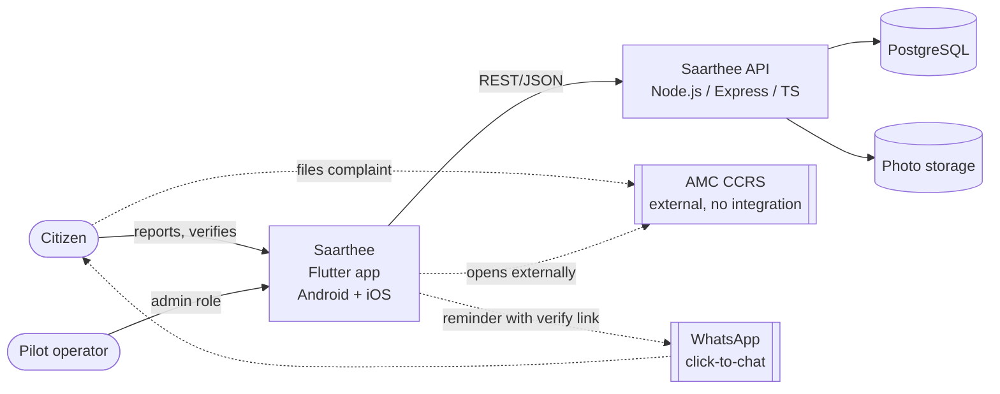

# Saarthee — Technical Specification

> **Superseded by Saarthee v2** where they differ — see `docs/v2/saarthee-v2-spec.md` and `docs/tasks-v2/00-task-summary.md`.
>
> v2 specification: [`docs/v2/saarthee-v2-spec.md`](./v2/saarthee-v2-spec.md) · v2 plan: [`docs/tasks-v2/00-task-summary.md`](./tasks-v2/00-task-summary.md) · v2 demo: [`docs/demo/DEMO-v2.md`](./demo/DEMO-v2.md)

**Version:** 1.0
**Last Updated:** 2026-10-03
**Status:** Draft
**Generated by:** Tech Spec Generator (with Claude), from the "Ahmedabad Civic Accountability – MVP Spec" and "PRD (Pilot v1)"

## Project Summary

> **v2:** the H1/H2 rates are retired (v2 spec D11). v2 measures the issue lifecycle instead: reported → acknowledged → fixed → verified by neighbours (spec §5).

> **v2:** the v1 "no automated tests" decision is reversed — v2 requires Vitest + Supertest API tests and Flutter widget/integration tests (v2 spec §12).

Saarthee is an independent mobile app for Android and iOS that checks whether civic complaints filed with the Ahmedabad Municipal Corporation (AMC) actually get fixed. Citizens file through AMC's own complaint system (CCRS) as usual, then record the CCRS complaint number in Saarthee with a photo, GPS location and their WhatsApp number. About a week later, the pilot operator sends a WhatsApp reminder with a verify link, and the citizen answers "Fixed" or "Not fixed" with a new photo.

Saarthee doesn't integrate with AMC and doesn't resolve complaints. It produces two numbers: how many citizens come back to verify (**H1**, target at least 30% from trusted sources), and how many "closed" complaints are actually not fixed (**H2**, threshold still to be set). The first pilot aims for about 100 complaints from trusted sources (RWAs and activist groups), tracked through invite codes.

The technical approach is deliberately small and fast to build:
- one Flutter app containing both the citizen flows and the admin screens;
- an Express (TypeScript) REST API;
- PostgreSQL through Prisma, with photos on local disk behind a storage interface (Cloudflare later).

Everything runs locally for now. There are no automated tests in v1 by choice; a manual QA checklist and code checks on every push cover the critical risks. Deployment, the legal review and real AMC categories come before any real citizen data is collected.

## Tech Stack at a Glance

> **v2:** the "indigo and marigold" tokens are replaced by the "Neem" design system (v2 spec D1, `docs/v2/design-system.md` v2.2).

> **v2:** citizens now sign in with phone OTP via Firebase Authentication (v2 spec D6, D8); staff roles are citizen, moderator, admin, representative (D3).

| Layer | Technology |
|-------|-----------|
| Mobile app | Flutter (Android + iOS), Riverpod, Material 3 with a custom "indigo and marigold" theme |
| Backend | Node.js, TypeScript, Express, REST/JSON, JWT for admin |
| Database | PostgreSQL (Docker Compose locally), Prisma ORM + Migrate |
| File storage | Local disk via a storage interface; Cloudflare candidate later |
| Infrastructure | Local only; GitHub with GitHub Actions running static checks |
| Monitoring | Structured JSON logs with redaction; in-app Rates screen |

## Document Index
| # | Document | Description | Status |
|---|----------|-------------|--------|
| 1 | [Project Overview & Architecture](./01-project-overview.md) | Vision, scope, architecture, nine key decisions | ✅ Draft complete |
| 2 | [Frontend Specification](./02-frontend-spec.md) | Flutter screens, design direction and tokens, accessibility, state | ✅ Draft complete |
| 3 | [Backend Specification](./03-backend-spec.md) | Endpoints, auth, workflows, file handling, errors, events | ✅ Draft complete |
| 4 | [Database Design](./04-database-design.md) | Schema, views for H1/H2, migrations, seeds, anonymization | ✅ Draft complete |
| 5 | [DevOps & Infrastructure](./05-devops-infrastructure.md) | Local setup, environment variables, CI; deployment placeholder | ✅ Draft (deployment section pending) |
| 6 | [Security & Testing](./06-security-testing.md) | Threat model, personal data, DPDP notes, manual QA checklist | ✅ Draft complete (legal review pending) |
| 7 | [Implementation Roadmap](./07-implementation-roadmap.md) | Ordered build list for Claude Code, starting with a ~2-hour thin loop | ✅ Draft complete |
| v2 | [Saarthee v2 Specification](./v2/saarthee-v2-spec.md) | v2 product & technical spec (supersedes 01–07 where they differ); design system in [`v2/design-system.md`](./v2/design-system.md) | Current |

## Key Architecture Diagram

## Quick Links
- MVP scope: [01 §5](./01-project-overview.md#5-scope)
- Key decisions: [01 §8](./01-project-overview.md#8-key-architectural-decisions)
- Screen inventory: [02 §3](./02-frontend-spec.md#3-screen-inventory--routing)
- Design tokens: [02 §2.1](./02-frontend-spec.md#21-design-tokens)
- API endpoint reference: [03 §2.2](./03-backend-spec.md#22-api-endpoint-reference)
- Database schema: [04 §3](./04-database-design.md#3-schema-definition)
- H1/H2 definitions: [04 §3.9](./04-database-design.md#39-views-read-only-computed)
- Environment variables: [05 §2.2](./05-devops-infrastructure.md#22-environment-variables)
- Manual release checklist: [06 §12.3](./06-security-testing.md#123-release-checklist-manual)
- Build list: [07 §3](./07-implementation-roadmap.md#3-ordered-build-list)

## Open Items Before a Real Pilot
| Item | Where tracked |
|------|---------------|
| H2 threshold (what "not fixed" rate means continue or rethink) | PRD Q1 |
| Pilot wards and first RWAs / groups | PRD Q2 |
| Real AMC CCRS category list; whether CCRS links can pre-fill | PRD Q4 |
| Whether reports are allowed without GPS | PRD Q6 / 02 F2 |
| WhatsApp click-to-chat pre-filled text; tappability of custom-scheme links | PRD Q8 / 01 A14 |
| Consent wording, privacy notice, retention policy; DPDP obligations (legal review) | PRD Q9, Q11 / 06 §6 |
| "Saarthee" name check (stores, trademarks, similarity to government apps) | 02 F1 |
| Deployment plan (HTTPS, app links, managed database, Cloudflare, backups) | 05 §9 |
| Public data policy, keeping in mind mySociety's warning against ranking areas | PRD Q3 / 02 §2.0 |
| PRD updates: installed app (not mobile web); one verify token per reminder; H2 counted per complaint | 01 Decision 1; 04 §2, A5 |

## Version History
| Version | Date | Author | Changes |
|---------|------|--------|---------|
| 1.0 | 2026-10-03 | Drafted with Claude | Initial index of Docs 01–07 |
