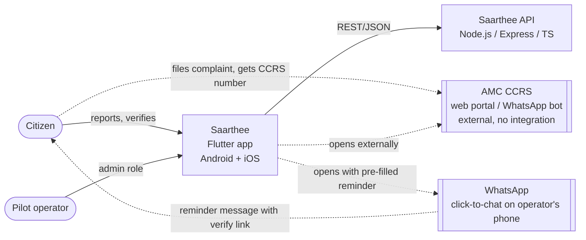
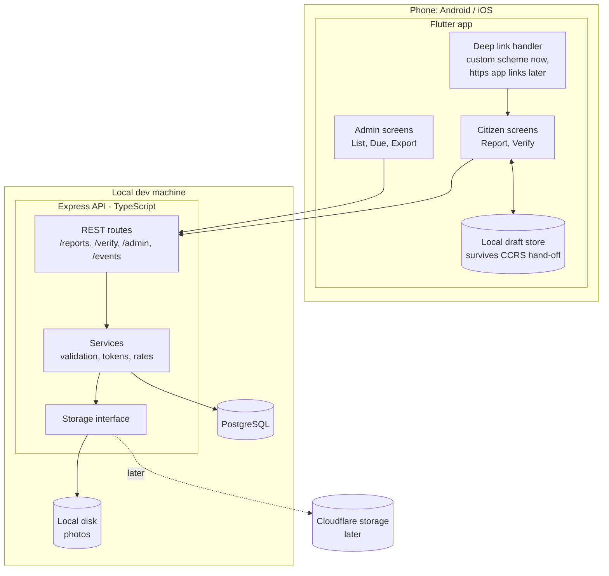
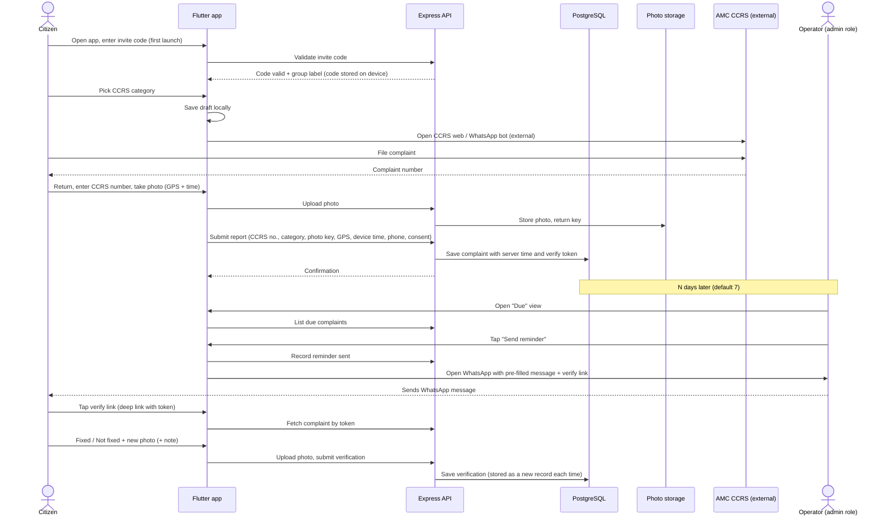

# Project Overview & Architecture

> **Superseded by Saarthee v2** where they differ — see `docs/v2/saarthee-v2-spec.md` and `docs/tasks-v2/00-task-summary.md`.

**Project:** Saarthee (Ahmedabad Civic Accountability)
**Version:** 1.0
**Last Updated:** 2026-10-03
**Status:** Draft

## Related Documents
- [Frontend Specification](./02-frontend-spec.md) — Flutter app screens, navigation, state, deep links
- [Backend Specification](./03-backend-spec.md) — Express API, business logic, auth, integrations
- [Database Design](./04-database-design.md) — PostgreSQL schema, relationships, migrations
- [DevOps & Infrastructure](./05-devops-infrastructure.md) — Local dev setup now, deployment later
- [Security & Testing](./06-security-testing.md) — Privacy, threat model, test strategy
- [Implementation Roadmap](./07-implementation-roadmap.md) — Phases and milestones

**Source documents:** "Ahmedabad Civic Accountability – MVP Spec" and "Ahmedabad Civic Accountability – PRD (Pilot v1)" (Claude Docs, 2026-10-03). Where this spec and the PRD differ, this spec reflects the later decision (see [Section 8](#8-key-architectural-decisions)).

---

## 1. Executive Summary

Saarthee (project name: Ahmedabad Civic Accountability) is an independent mobile app (Android and iOS) that checks whether civic complaints filed with the Ahmedabad Municipal Corporation (AMC) are actually fixed after they are marked closed. Citizens file their complaint through AMC's own Comprehensive Complaint Redressal System (CCRS). They then record the CCRS complaint number in our app, with a photo and GPS location. Some days later, the pilot operator sends a WhatsApp reminder, and the citizen confirms in the app whether the problem was fixed, with a new photo.

The app does not integrate with AMC systems and does not resolve complaints. Its output is a dataset: the share of citizens who come back to verify (H1), and the share of verified complaints that were not actually fixed (H2). The first release is a pilot targeting about 100 complaints from trusted sources (RWAs and activist groups). The success bar for H1 is a 30% verification rate.

This version runs entirely on a local development setup: the Flutter app, an Express (TypeScript) API, PostgreSQL, and photos stored on local disk. Hosting, real app links and cloud photo storage (Cloudflare is the candidate) are deferred to a later deployment section.

## 2. Problem Statement

AMC already accepts complaints through several CCRS channels: the 155303 call centre, SMS, a WhatsApp bot, a web portal and an app, with status checks and re-opening. Filing is not the gap. The working hypothesis, **not yet validated**, is that complaints are often marked closed without a real fix, and that no public data shows how often this happens.

- **Who is affected:** Ahmedabad residents who report potholes, garbage, streetlights, drainage and water problems.
- **Current workaround:** re-calling 155303 or re-opening the complaint in CCRS. No independent record of outcomes exists.
- **Why existing solutions fall short:** CCRS records AMC's own view of a complaint's status. Citizens have no independent way to confirm a closure.
- **Precedent:** a similar platform in Bengaluru received user feedback about issues marked resolved but not fixed. That is a single anecdote, not evidence of how often it happens.

## 3. Goals & Objectives

### 3.1 Business Goals
| # | Goal | Target |
|---|------|--------|
| G1 | Collect complaints from trusted sources (RWA and activist), each with a valid CCRS number | About 100 |
| G2 | Prove the return loop works (H1) | Verification rate of at least 30%, trusted sources only |
| G3 | Measure the "closed but not fixed" rate (H2) | Threshold **not set** (PRD Q1) |
| G4 | Every record is defensible | 100% of records have a CCRS number, photo, GPS and server timestamp |

### 3.2 Technical Goals
- **Complete records by design:** the app cannot submit a report or a verification with a required field missing.
- **No lost drafts:** an unfinished report survives the citizen switching to CCRS and back, even if the operating system closes the app in the meantime.
- **Works on low-end Android phones and slow mobile data:** photos are compressed on the device before upload, and failed uploads can be retried.
- **Privacy by default:** phone numbers never appear in logs, analytics events or verify screens.
- **Ready for cloud storage later:** photo storage sits behind an interface, so moving from local disk to Cloudflare needs no change to the app or the database.
- **Kept simple:** a single API service and a single database, with no queues or cache, sized for pilot volume (about 100–200 complaints).

### 3.3 Success Metrics

> **v2:** the H1/H2 rates are retired (v2 spec D11). v2 measures the issue lifecycle instead: reported → acknowledged → fixed → verified by neighbours (spec §5).

| Metric | Target | Measurement Method |
|--------|--------|-------------------|
| Verification rate (H1) | ≥ 30% (trusted sources) | Complaints with at least one verification ÷ complaints reminded; computed from database records |
| Closed-but-not-fixed rate (H2) | Not set (PRD Q1) | "Not fixed" verifications ÷ all verifications |
| Reminder-to-open rate | No target; watched closely | `verify_opened` events ÷ `reminder_sent` events. This captures drop-off from the app-install requirement (Decision 1) |
| Report completion | No target | `report_submitted` ÷ `report_opened`, with `ccrs_handoff_clicked` as the midpoint |
| Trusted complaint count | About 100 | Complaints with source `rwa` or `activist` and a CCRS number |

> 📎 See [Backend Specification](./03-backend-spec.md#11-analytics-events) for event definitions.

## 4. Target Users & Personas

| User Type | Description | Primary Actions | Access Level |
|-----------|-------------|-----------------|-------------|
| Trusted reporter | Member of an RWA, housing society, ward citizen group or activist group | File on CCRS, record the complaint in the app, verify later | No account. Access to their own report flow, and to a single complaint through its verify token |
| Other reporter | Reached through social media (`social`) or the founder's network (`network`) | Same as above | Same as above. Their data is reported separately (`social`) or excluded from the rates (`network`) |
| Pilot operator (admin) | The founder | View all complaints, see which are due a reminder, send WhatsApp reminders, flag records, export data | Admin role inside the same Flutter app, behind an admin login |

## 5. Scope

### 5.1 In Scope (MVP)
1. **Flutter app for Android and iOS**, containing both the citizen flows and the admin screens. The app must be installed.
2. **Source attribution:** an invite code ties each report to a source tag (`rwa`, `activist`, `social`, `network`) and an optional group ID (Decision 8; assumed).
3. **Report flow:** pick a CCRS category → open CCRS externally → enter the CCRS complaint number → photo with GPS and timestamp → phone number and consent → confirmation. The draft is kept on the device throughout.
4. **Verify flow:** opened by a deep link carrying an unguessable token → shows the original complaint → "Fixed" or "Not fixed" → new photo with GPS → optional note. Repeat verifications are kept as separate records.
5. **Admin screens:** complaint list with filters, a "Due for reminder" view, one-tap WhatsApp click-to-chat with the message pre-filled, flag or exclude a record, CSV export.
6. **Express REST API (TypeScript):** report and verify submission, photo upload, admin endpoints, and recording of analytics events.
7. **PostgreSQL database:** complaints, verifications, reminders, invite codes, events, admin users.
8. **Photo storage on local disk**, behind a storage interface.

### 5.2 Out of Scope
- Any integration with AMC or CCRS systems: no API calls, no automatic status checks.
- Automated WhatsApp messaging (the WhatsApp Business Platform); reminders are sent by hand.
- Citizen accounts and phone OTP.
- Video.
- Public ward scoreboard or any public data release.
- Services and schemes directory, AI assistant, routing across agencies.
- Gujarati and Hindi interface text (v1 is English only, but text is kept ready for translation).
- Deployment, hosting, production app links, app-store release.

### 5.3 Future Considerations (affect today's architecture)
| Future item | Architectural accommodation now |
|-------------|--------------------------------|
| Cloudflare photo storage | Storage interface with local and cloud implementations; database stores storage keys, not file paths |
| Production app links (Android App Links, iOS Universal Links) | All verify links are built from one configurable base; the app's link handling accepts both a custom scheme and https |
| Gujarati and Hindi | All interface text kept in the app's translation files from day one |
| Ward assignment from GPS (PRD R-R7, P1) | Nullable ward field; latitude and longitude stored as separate numeric fields |
| AI photo comparison (PRD R-V7, P2) | Before and after photos stay linked through complaint and verification IDs |
| Automated WhatsApp reminders | Reminder table records the channel, so automation can be added later |

## 6. System Architecture

### 6.1 High-Level Architecture Diagram (Context)

The dotted lines are hand-offs between apps on the phone, not system integrations. Our system never calls CCRS or WhatsApp servers.

### 6.2 Component Architecture (Container)

> 📎 Component details are in the [Frontend Specification](./02-frontend-spec.md) and the [Backend Specification](./03-backend-spec.md) .

### 6.3 Data Flow Overview (primary use case)

### 6.4 Technology Stack Summary
| Layer | Technology | Rationale |
|-------|-----------|-----------|
| Mobile app | Flutter (Dart), Android + iOS | Founder's choice; one codebase for both platforms and for the citizen and admin roles |
| App state management | Riverpod | Founder's choice |
| Backend | Node.js, TypeScript, Express | Founder's choice; a simple, widely known REST stack |
| API style | REST over JSON | Few resources and one client; nothing needs GraphQL's flexibility |
| Database | PostgreSQL (local) | Founder's choice; relational data with clear relationships, and the rates are simple SQL aggregates |
| Database access / migrations | Prisma (ORM + Prisma Migrate) | Founder's choice; typed client for TypeScript |
| Cache | None | Pilot volume does not need one |
| Search | None (database filters) | Admin filters on indexed columns are enough |
| File storage | Local disk now; Cloudflare candidate later | Founder's choice; storage interface keeps the move cheap. Free-tier limits **to be verified** before adopting |
| Analytics | Events table in PostgreSQL | Keeps personal data in-house; no third-party analytics needed for the pilot |
| Cloud provider | None (local only) | Founder's choice; deployment deferred |
| CDN | None now; Cloudflare candidate later | Deferred |
| CI/CD | Not decided | Deferred to [05 DevOps](./05-devops-infrastructure.md) |
| Monitoring | Structured console logs (development) | Enough locally; production monitoring deferred |

## 7. Constraints & Dependencies

### 7.1 Technical Constraints
- **Local only:** the API and database run on a development machine. Physical test phones must be able to reach that machine over the local network, or emulators/simulators are used. Real citizens cannot use the app until it is deployed.
- **iOS builds need a Mac.** Building and running on iOS requires macOS with Xcode. Installing on physical iPhones outside the App Store needs an Apple developer setup. Check Apple's current requirements.
- **Deep links:** Android App Links and iOS Universal Links require a hosted https domain serving association files, so they cannot work in local-only mode. The app will handle a custom URL scheme for development.
  - Unverified: WhatsApp may not make custom-scheme links tappable inside messages. If so, end-to-end testing of the reminder link can't happen until deployment, and local testing triggers deep links through platform developer tools instead. **To verify.**
- **No AMC integration:** the app can only open CCRS externally. Whether CCRS supports links that pre-fill a form or category is **unverified** (PRD Q4).
- **Photos only:** no video in v1.

### 7.2 Business Constraints
- Budget: free or near-free tools only, since the founder plans to use free Cloudflare options.
- Team, timeline and launch date: **not yet given**. Needed for [07 Roadmap](./07-implementation-roadmap.md).
- Regulatory: phone numbers and street photos are personal data. Obligations under India's Digital Personal Data Protection Act must be checked with legal advice before the pilot (PRD Q11). This spec does not claim compliance.

### 7.3 External Dependencies
| Dependency | Purpose | Risk Level | Fallback |
|-----------|---------|-----------|----------|
| AMC CCRS (web portal, WhatsApp bot) | Where citizens file and get the complaint number | Medium: outside our control, may change | App shows the 155303 call-centre number as an alternative way to file |
| WhatsApp click-to-chat on operator's phone | Sending reminders by hand | Medium: pre-filled text support **unverified** (PRD Q8) | Copy the message to the clipboard and open the chat without pre-filled text |
| Device camera and GPS | Evidence capture | Medium: permission may be denied | Ask for permission again; fallback for denied GPS undecided (PRD Q6) |
| OS deep link mechanisms | Opening the verify screen from a link | High while running locally (see 7.1) | Manual token entry screen in the app (assumption A6) |
| Cloudflare storage (future) | Photo storage after deployment | Low now | Local disk |

## 8. Key Architectural Decisions

### Decision 1: Native Flutter app for all users (install required)
- **Context:** The PRD specified a no-install mobile web app, because H1 depends on one-tap verification from a WhatsApp link.
- **Decision:** A Flutter app for Android and iOS, used by both citizens and the admin. Installation is required.
- **Rationale:** Founder's choice, confirmed on 2026-10-03 after the trade-off was discussed.
- **Alternatives considered:** Flutter Web for everything; a Flutter app plus a Flutter Web verify page. Both were declined.
- **Consequences:**
  - Citizens who don't have the app installed when the reminder arrives must install it before verifying. This will probably reduce H1; how much is unknown, and the reminder-to-open metric (3.3) tracks it.
  - Deep linking and attribution become harder (Decisions 7 and 8).
  - The PRD's "mobile web, no install" decision is replaced; update the PRD.

### Decision 2: No integration with AMC systems
- **Context:** The product is deliberately independent of AMC.
- **Decision:** CCRS is opened externally. The citizen types the complaint number in by hand, and nothing is fetched from CCRS.
- **Rationale:** Avoids dependence on AMC, any risk under CCRS terms of use, and fragile scraping.
- **Alternatives considered:** Automatic status checks against CCRS (rejected: terms of use unverified and likely to break).
- **Consequences:** No live CCRS status. Verification depends entirely on the citizen's answer.

### Decision 3: Express REST API in TypeScript
- **Context:** One client, a small number of resources.
- **Decision:** Node.js, Express, TypeScript, REST with JSON.
- **Rationale:** Founder's choice; small surface area and widely known.
- **Alternatives considered:** NestJS and Fastify (not chosen).
- **Consequences:** Express leaves validation, error handling and project structure to us, so the backend spec must define these explicitly.

### Decision 4: PostgreSQL as the single data store, including analytics events
- **Decision:** All records, including events, live in one PostgreSQL database.
- **Rationale:** The rates are simple SQL aggregates; keeping events in-house keeps personal data out of third-party tools.
- **Consequences:** Analysis means exporting data or writing SQL; there are no dashboards in v1.

### Decision 5: Photo storage behind an interface; local disk now
- **Decision:** The API writes photos through a storage interface. The database stores a storage key, never a path or URL.
- **Rationale:** No deployment yet; Cloudflare is the candidate for later.
- **Consequences:** Photos are served through the API locally; signed or public URLs are designed at deployment.

### Decision 6: Manual WhatsApp reminders via click-to-chat

> **v2:** manual WhatsApp reminders and verify tokens are retired (v2 spec D11). Any signed-in neighbour verifies a fix in the app (spec §5); updates arrive as FCM push + in-app inbox (D9).

- **Decision:** The admin taps "Send reminder"; the app records it and opens WhatsApp with the citizen's number and the message pre-filled.
- **Rationale:** At pilot volume this avoids WhatsApp Business Platform setup and message template approval.
- **Consequences:** A reminder counts as "sent" when the tap is recorded, even if the operator then doesn't actually send the message.

### Decision 7: Verify access by unguessable token; no citizen login

> **v2:** manual WhatsApp reminders and verify tokens are retired (v2 spec D11). Any signed-in neighbour verifies a fix in the app (spec §5); updates arrive as FCM push + in-app inbox (D9).

> **v2:** citizens now sign in with phone OTP via Firebase Authentication (v2 spec D6, D8); staff roles are citizen, moderator, admin, representative (D3).

- **Decision:** Each complaint has a random, high-entropy verify token. The verify link carries the token, and the token grants access only to that complaint's verify screen.
- **Rationale:** Keeps verification to a single tap (PRD US3, US4) without accounts.
- **Consequences:** Anyone holding the link can verify. This is acceptable for the pilot and covered in [06 Security](./06-security-testing.md). The token never reveals the phone number.

### Decision 8: Source attribution through invite codes (confirmed 2026-10-03)

> **v2:** invite codes and source tags are retired from the citizen UI (v2 spec D11); v2 identifies citizens by phone OTP (D6, D8). v1 tables stay read-only for history.

- **Context:** The PRD sets the source tag from the invite link. With an installed app, a tag carried in a link is lost during installation unless "deferred deep linking" is used, which needs a hosted service that isn't available locally.
- **Decision (proposed):** Each group gets an invite code (for example, one per RWA). The citizen enters it once on first launch, or it's pre-filled if they open an invite link with the app already installed. The code maps to a source tag and group ID on the server.
- **Rationale:** Works offline from any link service, works locally, and still means the citizen never chooses a source tag themselves.
- **Alternatives considered:** A deferred deep-link service (not possible locally; vendor availability unverified); asking "How did you hear about us?" (rejected: the PRD says citizens don't pick their own source).
- **Consequences:** A small amount of friction on first launch. Reports with no code are stored as `unknown`.

### Decision 9: Server time is authoritative
- **Decision:** Every report and verification stores both the device capture time and the server receipt time. Rates and reminder due dates use server time.
- **Rationale:** Device clocks can be wrong or changed, which matters for evidence (PRD integrity requirement).

## 9. Cross-Cutting Concerns

### 9.1 Error Handling Strategy
- **API:** every error returns the same JSON shape, with a stable machine-readable error code, a safe human-readable message, and field-level details for validation failures. HTTP status codes follow normal REST conventions.
- **App:** error codes are mapped to plain-language messages. Network failures during photo upload or submission are retried by the user, and the local draft is kept until the server confirms.
- **Never lose a draft:** a report draft is deleted from the device only after the server confirms the save.
- **Duplicate CCRS numbers:** accepted, but flagged for admin review (PRD R-R3), not rejected.

### 9.2 Logging Strategy
- Structured JSON logs from the API at debug, info, warn and error levels.
- **Never logged:** phone numbers, verify tokens, admin passwords or session tokens, photo contents.
- Requests are logged with a request ID, route, status and duration. Complaint IDs may be logged; they are random identifiers, not personal data.
- Analytics events are a separate data stream stored in PostgreSQL (Decision 4), not part of the logs.

### 9.3 Configuration Management
- **API:** environment variables loaded from a local environment file that is never committed. Expected settings: database connection, storage driver and local photo path, secret used for verify tokens, admin session secret, reminder interval (default 7 days), photo size limits, CORS origins (for development tooling only).
- **App:** API base URL and deep link base supplied at build time per environment (development now, others later). No secrets in the app.
- **Reference data:** CCRS category list and invite codes are stored in the database and seeded, not hard-coded, because their source is still unconfirmed (PRD Q4).

> 📎 The full environment variable list will be in [DevOps & Infrastructure](./05-devops-infrastructure.md).

## Decisions & Assumptions
| # | Decision/Assumption | Rationale | Status | Date |
|---|---------------------|-----------|--------|------|
| 1 | Flutter app for citizens and admin; install required | Founder's choice; replaces PRD's mobile-web decision | Confirmed | 2026-10-03 |
| 2 | Android and iOS in v1 | Founder's choice | Confirmed | 2026-10-03 |
| 3 | Backend: Node.js + TypeScript + Express, REST/JSON | Founder's choice | Confirmed | 2026-10-03 |
| 4 | Database: PostgreSQL | Founder's choice | Confirmed | 2026-10-03 |
| 5 | Local development only; deployment section later | Founder's choice | Confirmed | 2026-10-03 |
| 6 | Photos on local disk now; Cloudflare candidate later | Founder's choice; free-tier limits not verified | Confirmed (Cloudflare tentative) | 2026-10-03 |
| 7 | Photos only, no video in v1 | Founder's choice, matches PRD | Confirmed | 2026-10-03 |
| 8 | Admin screens inside the same Flutter app, behind admin role | Founder's choice | Confirmed | 2026-10-03 |
| 9 | No AMC/CCRS integration | Product is independent | Confirmed | 2026-10-03 |
| 10 | Source attribution via invite codes entered at first launch | Link-based tags are lost on install without a hosted service | Confirmed | 2026-10-03 |
| 11 | Analytics events stored in PostgreSQL, no third-party tool | Keeps personal data in-house | **Assumed — confirm** | 2026-10-03 |
| 12 | REST, not GraphQL | Small API, single client | **Assumed — confirm** | 2026-10-03 |
| 13 | Custom URL scheme for verify links in dev; https app links at deployment | App/Universal Links need a hosted domain | Assumed (technical necessity) | 2026-10-03 |
| 14 | Manual token-entry screen as a fallback when deep links fail | Custom-scheme links may not be tappable in WhatsApp (unverified) | **Assumed — confirm** | 2026-10-03 |
| 15 | Flutter state management: Riverpod | Founder's choice | Confirmed | 2026-10-03 |
| 16 | Database access and migrations: Prisma | Founder's choice | Confirmed | 2026-10-03 |
| 17 | Admin login: email + password, JWT access token | Founder's choice | Confirmed | 2026-10-03 |
| 18 | Team, timeline, launch date | Not provided | Open (07) | — |
| 19 | App name: Saarthee; deep-link scheme `saarthee://` | Founder's choice; name-clash check before release | Confirmed | 2026-10-03 |
| I1 | WhatsApp tappability of `saarthee://` verify links (row 14) | Not tested — no physical device/WhatsApp on emulator; adb deep link and manual code entry both verified on Android emulator | Deferred | 2026-10-03 |
| I2 | No GitHub remote / CI run yet | Founder action: create the repository and push; CI workflow is committed | Deferred | 2026-10-03 |

## Version History
| Version | Date | Author | Changes |
|---------|------|--------|---------|
| 1.0 | 2026-10-03 | Drafted with Claude from MVP Spec + PRD | Initial draft |
