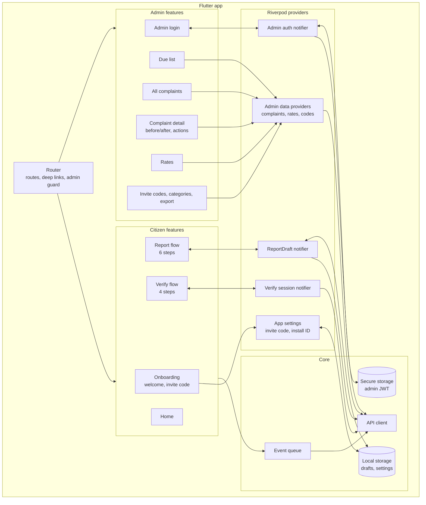
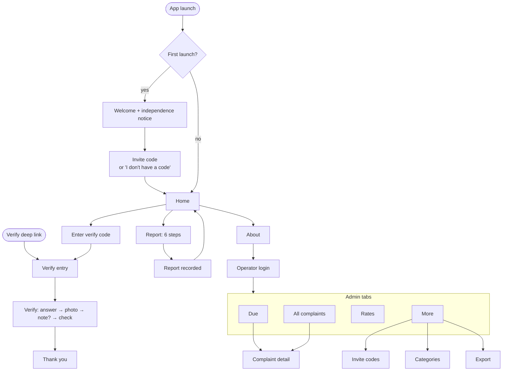
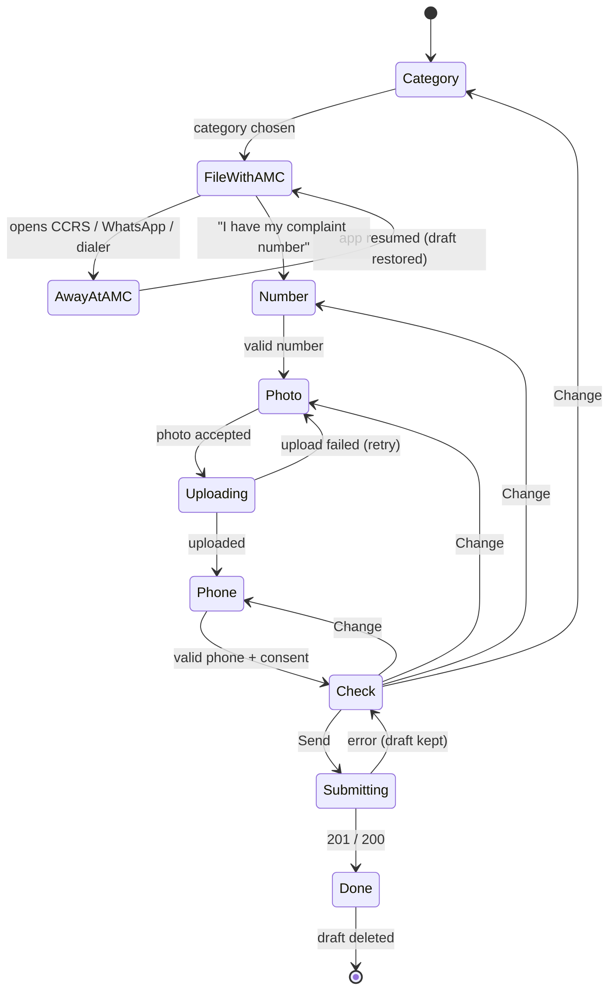

# Frontend Specification (Flutter App)
**Project:** Saarthee (Ahmedabad Civic Accountability)
**Version:** 1.0
**Last Updated:** 2026-10-03
**Status:** Draft

## Related Documents
- [Project Overview & Architecture](./01-project-overview.md) — System context, Decisions 1, 7 and 8 (installed app, verify tokens, invite codes)
- [Backend Specification](./03-backend-spec.md) — API contracts this app calls; error codes; events
- [Database Design](./04-database-design.md) — Data model behind the screens
- [Security & Testing](./06-security-testing.md) — App security and test approach

---

## 1. Frontend Architecture

### 1.1 Technology Stack
Packages marked *candidate* are widely used options, but not chosen by the founder. **Check each one on pub.dev for current version, maintenance status and platform support before adding it.**

| Concern | Technology | Version |
|---------|-----------|---------|
| Framework | Flutter (Dart), Android + iOS, one app for citizens and admin | Current stable channel at build time |
| UI foundation | Material 3 widgets with a custom theme (§2) | Bundled with Flutter |
| State Management | Riverpod | Current stable (confirmed) |
| Routing | *candidate*: go_router (declarative routes, deep-link handling, redirects for admin auth) | Verify |
| HTTP client | *candidate*: dio (multipart upload with progress, interceptors for headers and errors) | Verify |
| Deep links | *candidate*: app_links (custom scheme now; https App Links and Universal Links later) | Verify |
| Camera / photo | *candidate*: image_picker (camera only, no gallery for evidence, §4.6) | Verify |
| Image compression | *candidate*: flutter_image_compress | Verify |
| Location | *candidate*: geolocator (position, accuracy, permission state) | Verify |
| Secure storage | *candidate*: flutter_secure_storage (admin JWT) | Verify |
| Local persistence | *candidate*: shared_preferences (small JSON drafts, invite code, install ID) plus app documents folder for draft photo files (*candidate*: path_provider) | Verify |
| External apps | *candidate*: url_launcher (CCRS web, WhatsApp, phone dialer) | Verify |
| Sharing files | *candidate*: share_plus (CSV export) | Verify |
| Localization | Flutter's built-in localization (`flutter_localizations` + ARB files with code generation); English only in v1 | Bundled |
| Linting / formatting | `flutter_lints` (or stricter) and `dart format` | Verify |
| Package manager | pub | — |

### 1.2 Project Structure
Organized by feature, with a thin shared core:

- `lib/core/`
  - `config`: API base URL and deep-link base passed in at build time ([01 §9.3](./01-project-overview.md#93-configuration-management)).
  - `api`: HTTP client set-up, standard headers (`X-Install-Id`, app version, platform, request ID), error mapping to the codes in [03 §9.1](./03-backend-spec.md#91-error-code-system).
  - `theme`: design tokens (§2.1) and the Material 3 theme built from them.
  - `l10n`: ARB files and generated localization code.
  - `analytics`: event queue and batch sender (§7).
  - `widgets`: shared components (§1.3).
  - `utils`: phone and CCRS-number normalization (same rules as [03 §4.2](./03-backend-spec.md#42-validation-rules)), date formatting in IST.
- `lib/features/`
  - `onboarding`: welcome, independence notice, invite code.
  - `home`
  - `report`: the six-step report flow and its draft store.
  - `verify`: deep-link entry, manual token entry, the verify flow.
  - `admin`: login, Due list, all complaints, complaint detail, reminders, rates, invite codes, categories, export.
- `lib/router`: route table, deep-link parsing, admin auth guard.
- `test/`, `integration_test/`: see [06](./06-security-testing.md).

Each feature folder separates `data` (API calls and local storage), `application` (Riverpod providers and notifiers holding the state and rules) and `presentation` (screens and widgets). Screens never call the API directly.

### 1.3 Component Architecture Diagram

**Shared components:**
- `StepScaffold`: the step layout (title, progress "Step 2 of 6", body, a single primary button, Back).
- `PrimaryButton`, `SecondaryButton`
- `ChoiceCard`: large selectable option.
- `EvidencePhoto`: photo with capture time and GPS accuracy beneath it.
- `BeforeAfterCard`: the signature component, §2.5.
- `StatusChip`: always shows text and an icon, never colour alone.
- `ErrorSummary`, `InlineFieldError`
- `IndependenceNotice`
- `EmptyState`
- `OfflineBanner`

## 2. Design System & UI Foundation

### 2.0 Design direction and references
The app is for residents standing on a street in Ahmedabad, often in sunlight, often one-handed, and sometimes annoyed. Its job is to get one small, honest piece of evidence from them and nothing more. The design takes its principles from three public, citizen-facing references, adapted for an independent app (not a government service):

| Reference | What we take from it | How it shows up here |
|-----------|---------------------|----------------------|
| [UK Government Design Principles](https://www.gov.uk/guidance/government-design-principles) and the [GOV.UK Design System](https://design-system.service.gov.uk/) | Start with user needs; do less; do the hard work to make it simple; this is for everyone (accessibility); consistent patterns. Their question-page pattern of one thing per page, and a "check your answers" step before submitting | Report and verify flows are **one decision per screen**, with a **check-your-answers** screen before submission; plain-language labels; no decoration that doesn't serve the task |
| [mySociety / FixMyStreet](https://www.mysociety.org/tag/user-journey/) (UK civic reporting, run by a non-profit) | Start with the problem, not "who are you"; [report without an account and ask for personal details last](https://www.mysociety.org/tag/user-centred-design/). FixMyStreet also [asks reporters a few weeks later whether the problem was fixed](https://www.nesta.org.uk/feature/civic-exchange/fixmystreet/), which is the same idea as our verify loop | The flow asks category → AMC hand-off → number → photo, and only then the phone number. No account for citizens. The verify flow is framed as a short follow-up question |
| [GIGW 3.0, Guidelines for Indian Government Websites and Apps](https://guidelines.india.gov.in/?p=9766) (NIC/MeitY) | Usability, user-centricity and universal accessibility; accessibility aligned with WCAG 2.1; guidance for mobile apps; multilingual content | WCAG 2.1 AA as our bar (§2.3); Gujarati and Hindi planned (§2.4). GIGW is mandatory only for government organisations; we use it as a **reference**, not a compliance claim |

One more lesson from mySociety, relevant to **future** public data (PRD Q3): they [publicly declined to endorse using FixMyStreet report counts to rank or denounce areas](https://www.mysociety.org/2024/02/06/statement-from-mysociety-regarding-misuse-of-fixmystreet-data/), because reporting rates reflect who reports, not only how many problems exist. Any later ward-level display should take that seriously.

**Design principles for this app:**
1. **One thing per screen.** Each screen asks one question and has one primary button.
2. **Problem first, person last.** The phone number is the last input in the report flow.
3. **Evidence over opinion.** Photo, place and time are captured by the phone, not typed.
4. **Honest about who we are.** Every entry point says the app is independent and not run by AMC. No AMC logo, emblem or colours.
5. **Built for the street.** High contrast for sunlight, large touch targets, main actions within thumb reach, works on slow data.
6. **Never lose someone's effort.** Drafts survive switching to AMC's channels and back, app closures and failed uploads.

### 2.1 Design Tokens

**Visual identity: "Indigo and marigold."** Indigo is a nod to Ahmedabad's textile history and reads as calm and trustworthy on a public-interest tool. Marigold is used sparingly as a highlight for the one thing that needs attention on a screen, always with dark text on it, never as text colour. Backgrounds are cool off-white and white, so photos (the actual evidence) carry the visual weight.

Contrast ratios below were calculated with the WCAG 2.x relative-luminance formula.

| Token | Hex | Use | Contrast |
|-------|-----|-----|----------|
| `ink` | #1B2433 | Primary text, icons | 15.6:1 on white; 14.6:1 on `surface` |
| `inkMuted` | #55607A | Secondary text, captions | 6.3:1 on white; 5.9:1 on `surface` |
| `indigo` | #2B3F87 | Primary buttons, links, focus, app bar | 9.7:1 with white text |
| `indigoDark` | #1E2C61 | Pressed state | Higher than `indigo` |
| `indigoTint` | #E6E9F5 | Selected option background | `ink` on it: 12.9:1 |
| `surface` | #F6F7FB | Screen background | — |
| `white` | #FFFFFF | Cards, inputs | — |
| `fieldBorder` | #7A849B | Input and selectable-card borders | 3.75:1 on white; 3.5:1 on `surface` (meets the 3:1 rule for interface parts) |
| `divider` | #C9CEDB | Decorative dividers only (never the only boundary of a control) | 1.6:1, decorative |
| `marigold` | #F2B233 | Attention highlight fill (e.g. "Due" count badge), with `ink` text | `ink` on it: 8.3:1. **Never as text on white (1.9:1)** |
| `fixed` | #1D6B43 | "Fixed" status text, icon, or fill with white text | 6.5:1 on white |
| `fixedTint` | #E2F1E8 | "Fixed" status background | `ink` on it: 13.4:1 |
| `notFixed` | #A8321F | "Not fixed" status, error text | 6.7:1 on white |
| `notFixedTint` | #F8E4E0 | "Not fixed" and error backgrounds | `ink` on it: 12.8:1 |
| `waitingTint` | #FDF1D6 | "Waiting for answer" background | `ink` on it: 13.9:1 |

Statuses always pair colour with an **icon and a word** (e.g. ✓ "Fixed", ✕ "Not fixed", ⏳ "Waiting"), so they work for colour-blind users and in grayscale.

**Typography.** The typeface must cover Latin, Gujarati and Devanagari, so v1's English layouts survive translation.
- **Proposed:** the Anek family (Anek Latin, Anek Gujarati, Anek Devanagari) from Ek Type, a typeface designed for Indian scripts. **To verify:** licence (believed to be the SIL Open Font License), current script coverage and file sizes before adopting.
- **Fallback:** Noto Sans, Noto Sans Gujarati and Noto Sans Devanagari (Google), a safe and widely used choice.
- Fonts are **bundled in the app**, not downloaded at runtime, because of slow connections.

| Style | Size / line height (logical px) | Weight | Use |
|-------|------------------------------|--------|-----|
| Display | 28 / 34 | Semibold | One per screen at most: step question, confirmation headline |
| Title | 22 / 28 | Semibold | Screen titles in admin; card titles |
| Body large | 18 / 26 | Regular | Default body in citizen flows (larger than usual, for outdoor reading) |
| Body | 16 / 24 | Regular | Admin body, secondary citizen text |
| Label | 16 / 20 | Medium | Buttons, choice cards |
| Caption | 14 / 20 | Regular | Photo metadata, help text (never smaller than 14) |

Sentence case everywhere: no all-caps labels, no small-caps headers.

**Spacing:** a 4-point base with steps of 4, 8, 12, 16, 24, 32 and 48. Screen padding is 20 horizontal on phones.

**Shape:** corner radius follows hierarchy rather than one value everywhere: inputs and buttons 12; cards and photos 16; bottom sheets 24 (top corners); status chips fully rounded. No drop shadows on cards; separation comes from `white` on `surface` plus `divider` lines. Elevation only for bottom sheets and dialogs.

**Iconography:** Material Symbols (Rounded), 24 px, always with a text label in citizen flows.

**Motion:** functional only. A screen transition between steps, and a single confirmation moment when a report or verification is accepted. All motion respects the system "reduce motion" setting.

### 2.2 Screen Sizes and Orientation
Phones only in v1. The layout works from **320 to 480 logical px wide**. Tablets show the phone layout centered with a maximum content width of 560. Citizen flows are **portrait-locked** (camera and one-handed use). Admin screens allow rotation.

| Breakpoint | Width (logical px) | Target |
|-----------|-----------|--------|
| Compact phone | 320–359 | Small Android phones; test every screen here |
| Phone | 360–480 | Primary target |
| Large / tablet | > 480 | Phone layout, centered, max 560 wide |

### 2.3 Accessibility Requirements
Target: **WCAG 2.1 AA**, applied to a native app (the bar GIGW 3.0 aligns with), plus platform guidance.
- **Touch targets** at least 48×48 logical px (Material guidance); primary buttons are full-width and at least 56 tall.
- **Text scaling:** every screen works at the system's largest text size without cut-off text. Layouts scroll; no fixed-height text containers.
- **Screen readers:** TalkBack and VoiceOver. Every control has a label; photos have descriptions ("Photo of the problem, taken 3 Oct, 10:42"); a step's progress is announced ("Step 3 of 6"); errors are announced when they appear.
- **Contrast:** per §2.1 (text at least 4.5:1, interface parts at least 3:1).
- **Not by colour alone:** statuses, errors and selected states always have an icon or text too.
- **Focus order** follows visual order; focus moves to the error summary on a failed submit.
- **Motion:** respects reduced-motion settings.
- **Language:** plain English, short sentences, no jargon ("complaint number from AMC", not "CCRS reference ID").

### 2.4 Internationalization
- v1 ships **English only**, but **every string is in ARB files** from day one. No user-facing strings in code.
- Planned: Gujarati, then Hindi (PRD R-R8, P2). The chosen font covers both scripts (§2.1).
- Layouts must tolerate text up to about 40% longer than the English (a common allowance; the real expansion for Gujarati is unmeasured).
- Dates and times shown in **IST** using the device locale's format (e.g. "3 Oct 2026, 10:42 am").
- Phone numbers shown as +91 98765 43210.

### 2.5 Signature component: the before/after card
This is the one place the design is allowed to be bold. It shows the report photo ("Reported, 3 Oct") and the latest verification photo ("Now, 12 Oct") side by side at equal size, with the status stamp across the bottom edge in the status colour, icon and word ("✕ Not fixed").

It appears:
- in the admin complaint detail, at full width;
- in the admin lists, as a compact thumbnail pair;
- in the citizen verify flow before submitting, as their own before and after.

It carries the product's whole purpose in one glance. Everything around it stays quiet.

## 3. Screen Inventory & Routing

### 3.1 Route Map
| Route | Screen | Auth Required | User Roles | Layout |
|-------|--------|--------------|-----------|--------|
| `/welcome` | Welcome and independence notice (first launch) | No | Citizen | Onboarding |
| `/invite` | Enter invite code (first launch; also from settings) | No | Citizen | Onboarding |
| `/` | Home | No | Citizen | Citizen |
| `/report/category` | Step 1: What kind of problem? | No | Citizen | Step |
| `/report/file-with-amc` | Step 2: File it with AMC | No | Citizen | Step |
| `/report/number` | Step 3: Your AMC complaint number | No | Citizen | Step |
| `/report/photo` | Step 4: Photo of the problem | No | Citizen | Step |
| `/report/phone` | Step 5: Your WhatsApp number | No | Citizen | Step |
| `/report/check` | Step 6: Check your answers | No | Citizen | Step |
| `/report/done` | Report recorded | No | Citizen | Confirmation |
| `/verify?t=<token>` | Verify entry (from deep link) | Verify token | Citizen | Step |
| `/verify/enter-code` | Enter verify code by hand (fallback) | No | Citizen | Step |
| `/verify/answer` | Is it fixed? | Verify token | Citizen | Step |
| `/verify/photo` | Photo now | Verify token | Citizen | Step |
| `/verify/note` | What's still wrong? (optional, "Not fixed" only) | Verify token | Citizen | Step |
| `/verify/check` | Check and send | Verify token | Citizen | Step |
| `/verify/done` | Thank you | No | Citizen | Confirmation |
| `/about` | About, privacy, independence, operator login link | No | All | Citizen |
| `/admin/login` | Operator login | No | Admin | Admin auth |
| `/admin` | Admin home → Due tab | JWT | Admin | Admin tabs |
| `/admin/complaints` | All complaints (filters) | JWT | Admin | Admin tabs |
| `/admin/complaints/:id` | Complaint detail | JWT | Admin | Admin detail |
| `/admin/rates` | Rates | JWT | Admin | Admin tabs |
| `/admin/more` | Invite codes, categories, export, log out | JWT | Admin | Admin tabs |
| `/admin/invite-codes` | Invite code list and create | JWT | Admin | Admin detail |
| `/admin/categories` | Category list and edit | JWT | Admin | Admin detail |
| `/admin/export` | Export CSV | JWT | Admin | Admin detail |

The verify token is held only in memory for the verify session. It is **not written to disk and not logged** ([03 §2.1](./03-backend-spec.md#21-api-conventions)).

**Deep links:**
- **Development:** a custom scheme, `saarthee://verify?t=<token>`.
- **Deployment:** https App Links (Android) and Universal Links (iOS) on the deployment domain ([01 §7.1](./01-project-overview.md#71-technical-constraints)).
- **If the link cannot be opened or parsed:** route to `/verify/enter-code` and record `deep_link_failed`.
- **Unverified:** WhatsApp may not make custom-scheme links tappable. Local end-to-end testing of the reminder link may therefore need platform developer tools to fire the link ([01 A14](./01-project-overview.md#decisions--assumptions)).

### 3.2 Navigation Structure

Operator login is reached from About, not from Home: citizens never see admin entry points in their main path.

### 3.3 Layout Templates
- **Onboarding:** full-screen illustration-free layout; display question, short body, one primary button at the bottom.
- **Citizen home:** independence notice line at top; two large action cards ("Record a complaint", "Answer a follow-up"); About link at the bottom.
- **Step:** `StepScaffold`: top bar with Back and "Step n of N"; display-size question; body; one primary button pinned at the bottom (in thumb reach) that stays above the keyboard.
- **Confirmation:** a single success moment; what happens next in one or two sentences; one button home.
- **Admin tabs:** bottom navigation with four tabs (Due, All, Rates, More). The Due tab icon carries a `marigold` count badge.
- **Admin detail:** top app bar with Back; scrolling content; actions in a bottom action bar.

## 4. Screen Specifications

> 📎 Data contracts: [Backend Specification §2](./03-backend-spec.md#2-api-design).

### 4.1 Welcome and independence notice
- **Route:** `/welcome` · **Auth:** none · **Roles:** citizen
- **Purpose:** explain in two sentences what the app does and that it is independent of AMC.
- **Copy (draft):** "Check that complaints to AMC really get fixed." / "You file your complaint with AMC as usual. This app records it, and in about a week asks you whether it was fixed. This is an independent app. It is not run by or linked to AMC."
- **Actions:** "Continue" → `/invite`.
- **States:** static.
- **Side effect:** generate and store `installId` (random UUID) on first launch.

### 4.2 Invite code
- **Route:** `/invite` · **Auth:** none
- **Purpose:** link this install to a group (Decision 8).
- **Components:** code text field (letters and digits only, shown uppercase, 6–20 characters), primary "Continue", secondary "I don't have a code".
- **Data:** POST /invite-codes/validate.
- **Flow:** valid → store the code locally, show "You're part of {groupLabel}" for a moment → Home. "I don't have a code" → Home with no code (reports will be `unknown`).
- **States:** checking (button shows progress); invalid (`INVITE_CODE_INVALID` → inline error "That code didn't work. Check it with whoever shared it."); offline (banner; allow retry or skip).
- **Event:** `invite_code_entered {valid}`.
- **Later change:** from About → "Change group code" (re-runs this screen).

### 4.3 Home
- **Route:** `/` · **Auth:** none
- **Components:** `IndependenceNotice` (one line); action card "Record a complaint" (primary, shows "Continue your report" if a draft exists); action card "Answer a follow-up" (→ `/verify/enter-code`); About link.
- **States:** draft exists or not; offline banner.
- **P1:** "Your reports on this phone": a list from local storage only (CCRS number, category, date). No server call.

### 4.4 Report step 1: What kind of problem?
- **Route:** `/report/category`
- **Data:** GET /categories (cached for the session; last list kept for offline display).
- **Components:** `ChoiceCard` list (single select), primary "Continue".
- **Flow:** select → saved to draft → step 2.
- **States:** loading (skeleton cards); error (retry); empty (should not happen; show retry and log).
- **Event:** `report_opened` when the step is first shown for a new draft.
- **Draft:** a new draft gets a `clientSubmissionId` (UUID) at this point.

### 4.5 Report step 2: File it with AMC
- **Route:** `/report/file-with-amc`
- **Purpose:** send the citizen to AMC's own channels and bring them back with a complaint number.
- **Copy (draft):** "First, file your complaint with AMC. They'll give you a complaint number. Come back here when you have it — your answers so far are saved."
- **Components:** three `SecondaryButton`s:
  - "Open AMC complaint website" (url_launcher, CCRS web URL from config);
  - "Use AMC's WhatsApp" (opens the CCRS WhatsApp number);
  - "Call 155303" (dialer).
  The chosen category is shown so the citizen can pick the matching one on AMC's side. Primary "I have my complaint number".
- **Event:** `ccrs_handoff_clicked {target}`.
- **Draft safety:** the draft is saved **before** leaving the app. When the app resumes, even after the OS closed it, it reopens on this step with the draft intact.
- **Open:** whether CCRS supports links that pre-fill a category (PRD Q4). If it does, the web button passes the category.

### 4.6 Report step 3: Your AMC complaint number
- **Route:** `/report/number`
- **Components:** text field (spaces and dashes allowed; normalized for comparison), help text "It's in the SMS or WhatsApp message AMC sent you."
- **Validation:** required, 1–50 characters after trimming ([03 §4.2](./03-backend-spec.md#42-validation-rules)). Format check pending PRD Q5.
- **Error:** "Enter the complaint number you got from AMC."

### 4.7 Report step 4: Photo of the problem
- **Route:** `/report/photo`
- **Purpose:** capture the evidence with place and time.
- **Flow:**
  1. Explain once why location is needed ("so we can tell it's the same spot later"), then request location permission.
  2. "Take photo" opens the **camera only**. Gallery is not offered, so the photo is new.
  3. On capture, read the GPS position with accuracy, and the capture time.
  4. Compress on the device (§8.2) and save to the draft folder.
  5. Show the preview with "Retake" and "Use this photo".
  6. Upload in the background: POST /photos with a progress indicator. The photo ID is stored in the draft.
- **States:**
  - Location permission denied: explain and offer "Open settings". **Whether to allow submission without GPS is undecided (PRD Q6)**; until it's decided, the step can't be completed without location.
  - Weak GPS (accuracy worse than a threshold, *assumed 50 m*): show "Location is approximate. Move into the open and try again?" with options to retry or continue.
  - Upload failed: keep the photo, show "Retry upload".
  - Upload expired (`PHOTO_UNUSABLE` at submission): ask to retake.

### 4.8 Report step 5: Your WhatsApp number
- **Route:** `/report/phone`
- **Components:** phone field with fixed "+91" prefix and a numeric keypad; consent checkbox with the consent text, which has a **version** recorded with the report; "Why we ask" expandable text.
- **Consent text (draft — needs legal review, PRD Q11):** "I agree that this app may store my WhatsApp number, my photos, their location and time, and my answers, and may contact me on WhatsApp about this complaint. I can ask for my data to be deleted."
- **Validation:** phone rule as in [03 §4.2](./03-backend-spec.md#42-validation-rules) (to verify); consent required.

### 4.9 Report step 6: Check your answers
- **Route:** `/report/check`
- **Pattern:** GOV.UK-style "check your answers": a summary list of category, complaint number, photo (thumbnail with time and location accuracy) and phone number, each with "Change", which jumps to that step and returns here.
- **Action:** "Send" → POST /reports with the full draft. On success, delete the draft and go to `/report/done`. On failure, keep the draft and show the error (§9).
- **Idempotency:** retries resend the same `clientSubmissionId`; a 200 response is treated as success.

### 4.10 Report recorded
- **Route:** `/report/done`
- **Copy (draft):** "Recorded. Thank you." / "In about a week, we'll send you a WhatsApp message asking whether it's been fixed. Answering takes less than a minute."
- **Action:** "Done" → Home.

### 4.11 Verify entry
- **Route:** `/verify?t=<token>` (deep link) or from `/verify/enter-code`
- **Data:** GET /verify/complaint and GET /verify/complaint/photo, with the token in `X-Verify-Token`.
- **Shows:** "Your complaint from {date}"; category; AMC complaint number; the original photo; then "Continue". If `previousVerificationCount > 0`: "You've answered before. You can update your answer."
- **States:** loading; `VERIFY_TOKEN_INVALID` → "This link isn't valid." with "Enter a code instead"; `VERIFY_TOKEN_REVOKED` → "This link is no longer active."; offline → retry.

### 4.12 Enter verify code by hand (fallback)
- **Route:** `/verify/enter-code`
- **Purpose:** fallback when the link doesn't open the app (01 A14).
- **Components:** text field for the code from the WhatsApp message, accepting either the whole link pasted or just the code part; "Continue".
- **Note:** the reminder message therefore shows the link **and** says "or open the app and tap 'Answer a follow-up'" (§4.17 template).

### 4.13 Is it fixed?
- **Route:** `/verify/answer`
- **Components:** two large `ChoiceCard`s: "Yes, it's fixed" (✓, `fixed` styling when selected) and "No, it's not fixed" (✕, `notFixed` styling when selected). No "partly" option in v1 (assumed).

### 4.14 Photo now
- **Route:** `/verify/photo`
- **Same as report photo (§4.7)**, except:
  - the copy says "Take a photo of the same spot now";
  - the original photo is shown small for reference, so the citizen frames the same view;
  - upload goes to POST /verify/photos.

### 4.15 What's still wrong? (optional)
- **Route:** `/verify/note` (only after "No, it's not fixed")
- **Components:** multi-line text field (max 1,000 characters, with a counter), "Skip" and "Continue".

### 4.16 Check and send / Thank you
- **Routes:** `/verify/check`, `/verify/done`
- **Check:** the `BeforeAfterCard` (§2.5) with their answer, note preview and "Change" links; "Send" → POST /verify/submissions.
- **Done copy (draft):** "Thank you. Your answer helps show which complaints really get fixed."

### 4.17 Admin: Operator login
- **Route:** `/admin/login` · **Auth:** none
- **Components:** email, password (with show/hide), "Log in".
- **Data:** POST /admin/auth/login. The token is stored in secure storage; the expiry time is kept so the app can return to login when it lapses.
- **Errors:** `INVALID_CREDENTIALS`, `ADMIN_DISABLED`, `RATE_LIMITED` (shows "try again in N minutes" from Retry-After).

### 4.18 Admin: Due (default tab)
- **Route:** `/admin` · **Auth:** JWT
- **Data:** GET /admin/complaints?due=true (paged).
- **List item:** compact before/after thumbnails (only "before" for unanswered complaints), CCRS number, category, group label, days since filed or since the last reminder, reminder count.
- **Action per item:** "Send reminder" → POST /admin/complaints/{id}/reminders → bottom sheet showing the message preview with "Open WhatsApp" (url_launcher with the click-to-chat link built from `phoneE164` and `messageText`; **format to verify**, PRD Q8) and "Copy message".
- **Reminder message template (draft; the server holds the final text, [03 §4.4](./03-backend-spec.md#44-send-a-reminder)):** "Hello! About a week ago you recorded AMC complaint {ccrsNumber} in our app. Has it been fixed? Tap to answer (less than a minute): {verifyLink}. If the link doesn't open, open the app and tap 'Answer a follow-up'. — Saarthee, an independent citizen project (not AMC)."
- **States:** empty ("Nothing due. Nice."); loading; error; pull-to-refresh.

### 4.19 Admin: All complaints
- **Route:** `/admin/complaints`
- **Filters:** source, category, status, excluded, duplicate CCRS number (filter chips plus a bottom sheet).
- **List item:** as in Due, with a `StatusChip`.
- **Paging:** infinite scroll using `nextCursor`.

### 4.20 Admin: Complaint detail
- **Route:** `/admin/complaints/:id`
- **Data:** GET /admin/complaints/{id}; photos via the admin photo endpoints.
- **Sections:**
  - `BeforeAfterCard` (full width), with warnings for "same image as report" and distance.
  - Facts: CCRS number (with "duplicate" flag), category, source and group, filed time (server) and capture time (device), GPS and accuracy, phone number (tap to copy).
  - Reminders timeline: sent at, by whom, revoke.
  - Verifications list: result, time, photo, note, distance.
- **Bottom action bar:**
  - "Send reminder";
  - "Exclude" (sheet with reason and note) or "Include again";
  - in an overflow menu, "Remove personal data", which needs a confirm dialog where the operator types the CCRS number.

### 4.21 Admin: Rates
- **Route:** `/admin/rates`
- **Data:** GET /admin/rates.
- **Display:** a "Trusted sources" card first, then one row per source: complaints, reminded, verified, H1 % and H2 %.
- **Note under the card:** "Excluded complaints aren't counted. Network (friends and family) is shown separately but isn't part of the trusted total."
- **Copy for small samples:** when verified is under 10 (*assumed threshold*), show "Too few answers to read much into yet" next to the rates.

### 4.22 Admin: Invite codes, categories, export
- **Invite codes:** list with group label, source tag, active state and complaint count; "New code" form (source tag, group label, optional ward hint, optional custom code); deactivate. Each code has a "Share" button that sends a ready-made message through the OS share sheet ("Install the app and enter code {CODE}"). Install links come at deployment.
- **Categories:** list with drag-to-reorder, add, edit, deactivate. The note "Placeholder list — replace with AMC's real categories" stays until PRD Q4 is resolved.
- **Export:** type selector; an "Include phone numbers" toggle (off by default, with the warning "Only turn this on if you need to contact people. Don't share this file."). Downloads the CSV and opens the share sheet.

## 5. State Management

### 5.1 State Architecture
- **Riverpod** for all application state; screens only read providers and call notifier methods.
- **Server state** (admin lists, rates, categories) lives in async providers that refetch on pull-to-refresh and after mutations. No offline cache for admin data.
- **Report draft** is local state persisted to disk on every change. It is the only important offline state.
- **Verify session** is in memory only (token, complaint summary, answer, photo ID, note) and is discarded on completion or when the app closes.
- **Route state:** step position comes from the route. The draft notifier is the single source of truth for answers.

### 5.2 Providers / Stores
| Provider | Purpose | Persistence | Key actions |
|----------|---------|-------------|-------------|
| `appSettingsProvider` | Install ID, invite code, group label, onboarding done | shared_preferences | `setInviteCode`, `clearInviteCode`, `completeOnboarding` |
| `reportDraftProvider` (notifier) | Current report draft: `clientSubmissionId`, category, CCRS number, local photo path, uploaded photo ID, GPS, capture time, phone, consent version and time | shared_preferences (JSON) + photo file in the app documents folder | `start`, `setCategory`, `setCcrsNumber`, `setPhoto`, `uploadPhoto`, `setPhone`, `setConsent`, `submit`, `discard` |
| `categoriesProvider` | Active categories | In memory for the session (last list kept for offline display) | `refresh` |
| `verifySessionProvider` (notifier) | Token, summary, answer, photo, note | **Memory only** | `openWithToken`, `setAnswer`, `setPhoto`, `uploadPhoto`, `setNote`, `submit` |
| `adminAuthProvider` (notifier) | JWT, expiry, admin profile | flutter_secure_storage | `login`, `logout`, `logoutEverywhere`, `handleUnauthorized` |
| `adminComplaintsProvider` (family by filter) | Paged complaint lists | Memory | `loadMore`, `refresh` |
| `complaintDetailProvider` (family by ID) | Detail | Memory | `sendReminder`, `revokeReminder`, `setExclusion`, `anonymize` |
| `ratesProvider` | Rates | Memory | `refresh` |
| `inviteCodesProvider`, `adminCategoriesProvider` | Reference data management | Memory | create, update |
| `eventQueueProvider` | Analytics events waiting to be sent | shared_preferences (capped) | `track`, `flush` |

### 5.3 Data Fetching Strategy
- One API client, with the standard headers ([03 §2.1](./03-backend-spec.md#21-api-conventions)) added automatically.
- Error responses are converted to a typed app error with the backend `code`; screens map codes to messages from the ARB files.
- **401 on admin endpoints** (`TOKEN_EXPIRED` / `TOKEN_REVOKED`) clears the token and redirects to `/admin/login`, returning to the original route after login.
- Timeouts: assumed 15 s for JSON calls and 60 s for photo uploads; to tune.
- No optimistic updates. Every admin action shows progress, then refreshes the affected providers.

### 5.4 Real-Time State
Not applicable. Admin lists refresh when pulled down or when the screen regains focus.

## 6. Forms & Validation

### 6.1 Form Approach
Flutter's built-in `Form` and `TextFormField` widgets, with validators shared from `core/utils`. These mirror the backend rules so the user sees errors before submitting, but **the server stays authoritative**.

### 6.2 Validation Strategy
- Validate when the user taps "Continue", not on every keystroke. After the first failed attempt, re-validate as they type.
- Errors appear inline under the field, in `notFixed` colour with an icon; the screen reader announces them.
- On the check-your-answers screen, server validation errors are shown in an error summary at the top, each linking to the step to fix.
- Phone and CCRS number normalization use the same rules as the backend ([03 §4.2](./03-backend-spec.md#42-validation-rules)).

### 6.3 The Report Flow as a State Machine

## 7. Third-Party Integrations
| Integration | Purpose | Library/SDK | Loading Strategy |
|-------------|---------|-------------|-----------------|
| AMC CCRS (web, WhatsApp) | Citizen files the complaint | url_launcher (*candidate*) | Opened on tap; no SDK |
| Phone dialer | Call 155303 | url_launcher | On tap |
| WhatsApp (admin) | Send reminder by hand | url_launcher with a click-to-chat link | On tap; format **to verify** (PRD Q8) |
| OS share sheet | Export CSV, share invite codes | share_plus (*candidate*) | On tap |
| Analytics | Funnel events | **Own API** (POST /events), no third-party SDK | Batched: sent when 20 events are queued, when the app goes to the background, or every 60 s while open (assumed); queue capped at 500, oldest dropped |
| Maps | None in v1 | — | — |

## 8. Performance Strategy

### 8.1 Performance Targets
These are **proposed targets**, to measure on a low-end Android test phone (model to be chosen). They were not set by the PRD.

| Metric | Target |
|--------|--------|
| Cold start to Home (low-end Android) | ≤ 3 s |
| Step-to-step transition | No visible stutter; under 100 ms to respond to a tap |
| Photo compression on the phone | ≤ 2 s |
| Compressed photo size | Typically 200–600 KB (to be measured) |
| App download size | As small as practical; check after adding fonts |

### 8.2 Optimization Techniques
- **Photo compression on the phone:** resize so the long edge is at most 1,600 px, JPEG quality around 80 (assumed; tune to the size target). The original full-size file is not kept after compression.
- **Fonts:** bundle only the weights used (Regular, Medium, Semibold) for the three scripts.
- **Images in admin lists:** thumbnails are scaled-down versions of the full images; a thumbnail endpoint could be added later if lists are slow.
- **Release builds:** Dart obfuscation and split debug info for releases (configured in 05).

### 8.3 SEO
Not applicable (native app).

## 9. Error Handling & UX

### 9.1 Global Error Handling
- Uncaught Flutter errors and async errors are caught at the top level: logged in debug, and in release shown as a generic "Something went wrong" screen with "Go home". **The report draft is never cleared by an error.**
- Crash reporting service: none in v1 (local only); revisit at deployment.

### 9.2 Error Display Patterns
| Situation | Pattern |
|-----------|---------|
| Field validation | Inline error under the field |
| Server rejected a submission | Error summary at the top of the check screen, with links to the steps |
| Network failure | Banner "You're offline. Your answers are saved." plus a retry button where relevant |
| Rate limited | Message with the wait time from Retry-After |
| Admin session ended | Return to login with the message "Your session ended. Please log in again." |
| Destructive admin action | Confirmation dialog; "Remove personal data" requires typing the CCRS number |

All user-facing messages come from the ARB files, keyed by the backend error code ([03 §9.1](./03-backend-spec.md#91-error-code-system)).

### 9.3 Loading States
- Skeleton placeholders for lists and the category step.
- A progress indicator inside the button for submissions (the button is disabled while sending).
- Upload progress bar on the photo step.
- No full-screen spinners except on the initial verify entry.

### 9.4 Offline Handling
- The report draft (including the compressed photo file) is always saved on the device. The citizen can go through every step offline except the photo upload and the final submission, and can finish later.
- The verify flow requires a connection to open; if it's lost mid-flow, the answers are kept in memory while the app stays open.
- Analytics events are queued and sent later (§7).

## Decisions & Assumptions
| # | Decision/Assumption | Rationale | Status | Date |
|---|---------------------|-----------|--------|------|
| 1 | Riverpod for state management | Founder's choice | Confirmed | 2026-10-03 |
| 2 | Design principles drawn from UK Government Design Principles and GOV.UK Design System, mySociety/FixMyStreet, and GIGW 3.0 (as reference, not compliance) | Founder asked for citizen-centric references | Confirmed | 2026-10-03 |
| 3 | Visual identity "indigo and marigold", palette and contrast in §2.1 | Calm, trustworthy, high contrast outdoors; photos carry the weight | Confirmed | 2026-10-03 |
| 4 | Typeface: Anek family (Latin, Gujarati, Devanagari), fallback Noto Sans family; fonts bundled | Indian-script coverage for future translation | Accepted — **verify licence and coverage** | 2026-10-03 |
| 5 | One decision per screen; check-your-answers step before submitting | GOV.UK pattern; fewer errors | Confirmed | 2026-10-03 |
| 6 | Camera only, no gallery, for evidence photos | The photo should be new | Assumed — confirm | 2026-10-03 |
| 7 | Citizen flows locked to portrait; phones only, with tablets shown the phone layout | Camera and one-handed use | Assumed — confirm | 2026-10-03 |
| 8 | Operator login reached from About, not Home | Keeps the citizen path clean | Assumed — confirm | 2026-10-03 |
| 9 | "I don't have a code" allowed; such reports become `unknown` | Matches backend decision 5 (03) | Assumed — confirm | 2026-10-03 |
| 10 | No "partly fixed" answer in v1 | PRD defines only fixed / not fixed | Assumed — confirm | 2026-10-03 |
| 11 | Photo compression: long edge 1,600 px, JPEG around quality 80 | Size and quality balance; to tune | Assumed | 2026-10-03 |
| 12 | Weak-GPS threshold 50 m; small-sample warning under 10 answers | Starting values | Assumed | 2026-10-03 |
| 13 | Analytics batching (20 events / background / 60 s; cap 500) | Simple and reliable | Assumed | 2026-10-03 |
| 14 | Packages marked *candidate* in §1.1 | Widely used; not chosen by founder | Accepted pending **verification on pub.dev** | 2026-10-03 |
| 15 | Draft copy (welcome, consent, reminder, confirmations) | Placeholder wording; consent needs legal review | Draft | 2026-10-03 |
| F1 | App name "Saarthee"; deep-link scheme `saarthee://` | Founder's choice. Similar names exist, including government apps (e.g. Rail SAARTHI); check for confusion, trademarks and store listings before release | Confirmed (name check pending) | 2026-10-03 |
| F2 | Allow reports without GPS? | PRD Q6 | **Open** | — |
| F3 | Low-end Android test phone model | Needed to measure §8.1 targets | Open | — |
| I1 | Fonts not bundled; platform default font (Roboto / SF) with the §2.1 type scale (row 4) | Anek licence/coverage not checked; bundling Noto Sans is a follow-up | Deferred | 2026-10-03 |
| I2 | Error summary component named `AppErrorSummary` | Name clash with Flutter's `ErrorSummary` | Implemented — confirm | 2026-10-03 |
| I3 | Invite-code "Share" copies the message to the clipboard; CSV export saved to downloads | No share-sheet package (`share_plus`) added | Implemented — confirm | 2026-10-03 |
| I4 | iOS Debug-only ATS exception not built | Needs a Debug-only Info.plist/xcconfig split; iOS not on the demo path | Deferred | 2026-10-03 |
| I5 | Photo compression via image_picker `maxWidth/maxHeight 1600`, `imageQuality 80` (row 11) | Same targets without adding flutter_image_compress | Implemented — confirm | 2026-10-03 |
| I6 | Photo upload starts after "Use this photo", retried on reconnect while the step is open; not resumed after app kill | No background-task plugin | Implemented — confirm | 2026-10-03 |
| I7 | CCRS WhatsApp button opens `https://wa.me/<digits>`; operator reminder uses `https://wa.me/<digits>?text=…` (falls back to `wa.me/?text=` with no phone) | Format still to verify (PRD Q8) | Implemented — confirm | 2026-10-03 |
| I8 | Step 4 cannot finish without location (F2) | Until PRD Q6 is decided | Implemented — confirm | 2026-10-03 |
| I9 | Due list ordered oldest-due first; Due badge = items in first `due=true` page (limit 200) | No order or count endpoint in spec | Implemented — confirm | 2026-10-03 |
| I10 | Small-sample note per Rates row when verified < 10; H1/H2 shown as percentages from 0–1 ratios | 02 §4.21 | Implemented — confirm | 2026-10-03 |
| I11 | Category reorder = one `PATCH sortOrder` per moved category, steps of 10 | No bulk-reorder endpoint | Implemented — confirm | 2026-10-03 |
| I12 | Verify manual entry accepts a bare 43-char base64url token; step count "of 4" ("of 3" when fixed) | Matches 03 §3.2 token format | Implemented — confirm | 2026-10-03 |
| I13 | Admin session end handled by `AdminSessionGuard`; any 401 on an admin call returns to login | Router refresh owned elsewhere; expiry also checked on resume | Implemented — confirm | 2026-10-03 |
| I14 | Release builds route uncaught errors to `/error`; portrait lock per route (admin rotates); reduce-motion skips step fades | Spec gives behaviour, not mechanism | Implemented — confirm | 2026-10-03 |
| I15 | Component gallery debug route and emulator screenshots not produced | Components exercised by real screens | Deferred | 2026-10-03 |

## Sources (found by web search, 2026-10-03; read the full pages before relying on details)
- UK Government Design Principles — https://www.gov.uk/guidance/government-design-principles
- GOV.UK Design System — https://design-system.service.gov.uk/
- mySociety, posts on FixMyStreet user journeys (starting with location, not identity) — https://www.mysociety.org/tag/user-journey/
- mySociety, posts on user-centred design (reporting without an account; personal details after the problem) — https://www.mysociety.org/tag/user-centred-design/
- Nesta feature on FixMyStreet (follow-up questionnaire on whether problems were fixed) — https://www.nesta.org.uk/feature/civic-exchange/fixmystreet/
- mySociety statement on misuse of FixMyStreet data (Feb 2024) — https://www.mysociety.org/2024/02/06/statement-from-mysociety-regarding-misuse-of-fixmystreet-data/
- GIGW 3.0, Guidelines for Indian Government Websites and Apps — https://guidelines.india.gov.in/?p=9766

## Version History
| Version | Date | Author | Changes |
|---------|------|--------|---------|
| 1.0 | 2026-10-03 | Drafted with Claude from MVP Spec, PRD, Docs 01, 03, 04 | Initial draft |
