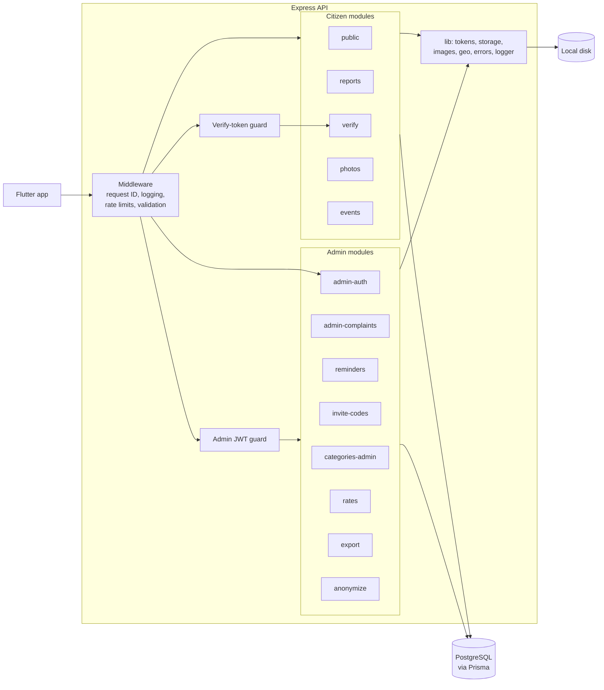
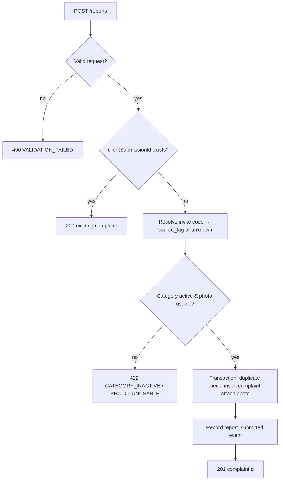

# Backend Specification
**Project:** Saarthee (Ahmedabad Civic Accountability)
**Version:** 1.0
**Last Updated:** 2026-10-03
**Status:** Draft

## Related Documents
- [Project Overview & Architecture](./01-project-overview.md) — System architecture context and key decisions
- [Frontend Specification](./02-frontend-spec.md) — The Flutter app that calls this API
- [Database Design](./04-database-design.md) — Tables, views and constraints this backend uses
- [DevOps & Infrastructure](./05-devops-infrastructure.md) — Local runtime, environment variables
- [Security & Testing](./06-security-testing.md) — Threat model, password hashing, test strategy

---

## 1. Backend Architecture

### 1.1 Technology Stack
Versions are not pinned here. Use the current stable release at build time, and check each library's maintenance status before adopting it. Rows marked *candidate* were not chosen by the founder; they are suggestions to confirm.

| Concern | Technology | Version |
|---------|-----------|---------|
| Runtime | Node.js | Current LTS at build time (verify) |
| Language | TypeScript, strict mode | Current stable |
| Framework | Express | Current stable major. Check that the middleware below supports it |
| API Style | REST over JSON; multipart for photo uploads | — |
| ORM / Query Builder | Prisma Client + Prisma Migrate | Current stable |
| Auth | JWT access tokens (library *candidate*: `jsonwebtoken`) | Verify |
| Password hashing | Argon2id or bcrypt (*candidate*; final choice in 06) | Verify |
| Validation | Schema validation library (*candidate*: Zod) | Verify |
| Multipart uploads | Express multipart middleware (*candidate*: Multer) | Verify |
| Image processing | *candidate*: sharp (re-encode, strip metadata, read dimensions) | Verify |
| Logging | Structured JSON logger (*candidate*: pino) | Verify |
| Rate limiting | *candidate*: express-rate-limit with its in-memory store | Verify |
| Task Queue | None | — |
| Email / SMS / Push | None (WhatsApp reminders are sent by hand) | — |

### 1.2 Project Structure
The code is split into modules, each with its own routes, request handlers and business logic:

- `prisma/`: Prisma schema, migrations (including hand-written SQL for views and constraints, see [04 §7](./04-database-design.md#7-migration-strategy)), seed scripts.
- `src/config/`: loads and validates environment variables at startup; the server refuses to start if any are invalid.
- `src/lib/`: shared code:
  - `errors`: error classes and the error-response formatter (§9.1).
  - `logger`: structured logger with redaction (§9.2).
  - `tokens`: verify-token generation and hashing; JWT signing and checking.
  - `storage`: the storage interface with a local-disk implementation now and a Cloudflare one later ([01 Decision 5](./01-project-overview.md#decision-5-photo-storage-behind-an-interface-local-disk-now)).
  - `images`: photo validation and re-encoding.
  - `geo`: distance between two GPS points.
  - `pagination`: cursor encoding and decoding.
- `src/middleware/`: request ID, request logging, admin JWT auth, verify-token auth, rate limiters, request validation, error handler.
- `src/modules/`: one folder per feature:
  - Citizen side: `public` (health, categories, invite-code validation), `reports`, `verify`, `photos`, `events`.
  - Admin side: `admin-auth`, `admin-complaints`, `reminders`, `invite-codes`, `categories-admin`, `rates`, `export`, `anonymize`.
- `src/app` and `src/server`: the app is built separately from the code that starts it listening, so tests can run the app without a network port.
- `scripts/`: maintenance commands run from the command line (cleanup of orphaned photos, creating an admin user), see §5.

**Layering rule:** request handlers parse the request and shape the response; services hold all business rules; only services and the storage interface touch Prisma or the file system.

### 1.3 Service Architecture Diagram



## 2. API Design

### 2.1 API Conventions
- **Base URL:** `http://<dev-machine-LAN-IP>:<port>/api/v1` in local development. Physical phones reach it over Wi-Fi; emulators use their host loopback alias ([02](./02-frontend-spec.md), [05](./05-devops-infrastructure.md)).
- **Versioning:** URL path prefix `/api/v1`.
- **Content Type:** `application/json` everywhere, except photo uploads (`multipart/form-data`) and CSV export (`text/csv`).
- **Field naming:** camelCase in JSON, mapped to snake_case columns by Prisma.
- **IDs:** UUID strings.
- **Date format:** ISO 8601 with timezone offset in requests; UTC (`Z`) in responses. The app shows times in IST.
- **Pagination (admin lists):** cursor-based. Requests pass `limit` (default 50, max 200) and an optional `cursor`. Responses return `items` plus `nextCursor` (null on the last page). The cursor encodes the sort key and record ID, which keeps paging stable while new records arrive.
- **Idempotency:** report and verification submissions carry a `clientSubmissionId` UUID made by the app. Resending one already stored returns the existing record with `200` instead of `201` (§4.1).
- **Citizen identity:** none. Every citizen request sends an `X-Install-Id` header (random per-install UUID), and app version and platform headers, used only for events and abuse checks.
- **Verify-token transport:** in the `X-Verify-Token` header, **never in the URL path or query string**, so tokens stay out of access logs and proxies.
- **Admin auth:** `Authorization: Bearer <JWT>`.
- **Error response format:** every error has the same JSON structure:
  - `error.code`: stable uppercase code from §9.1.
  - `error.message`: safe human-readable message.
  - `error.details`: optional list of field errors, each with `field` and `issue`.
  - `error.requestId`: matches the server log entry.

### 2.2 API Endpoint Reference

#### Public and citizen
| Method | Endpoint | Description | Auth | Request Body | Response | Error Codes |
|--------|----------|-------------|------|-------------|----------|-------------|
| GET | /health | Liveness and database connectivity | No | — | `{status, db}` | 503 |
| GET | /categories | Active complaint categories, in display order | No | — | `{items:[{id, name}]}` | 429 |
| POST | /invite-codes/validate | Check an invite code on first launch | No | `{code}` | `{valid:true, groupLabel}` | 400, 404 `INVITE_CODE_INVALID`, 429 |
| POST | /photos | Upload a report photo | No | multipart: `photo`, `purpose=report` | 201 `{photoId}` | 400, 413, 415, 422, 429 |
| POST | /reports | Submit a complaint record | No | See §2.3 | 201/200 `{complaintId, createdAt}` | 400, 404, 409, 422, 429 |
| GET | /verify/complaint | Complaint summary for the verify screen | Verify token | — | See §2.3 | 401 `VERIFY_TOKEN_INVALID`, 410 `VERIFY_TOKEN_REVOKED`, 429 |
| GET | /verify/complaint/photo | The original report photo (image stream) | Verify token | — | `image/jpeg` | 401, 404, 410 |
| POST | /verify/photos | Upload a verification photo | Verify token | multipart: `photo` | 201 `{photoId}` | 400, 401, 410, 413, 415, 422, 429 |
| POST | /verify/submissions | Submit Fixed / Not fixed | Verify token | See §2.3 | 201/200 `{verificationId, createdAt}` | 400, 401, 404, 409, 410, 422, 429 |
| POST | /events | Batch of analytics events | No | `{events:[…]}` (max 50) | 202 `{accepted}` | 400, 429 |

#### Admin: authentication
| Method | Endpoint | Description | Auth | Request Body | Response | Error Codes |
|--------|----------|-------------|------|-------------|----------|-------------|
| POST | /admin/auth/login | Log in | No | `{email, password}` | `{accessToken, expiresAt, admin:{id, email, displayName}}` | 400, 401 `INVALID_CREDENTIALS`, 403 `ADMIN_DISABLED`, 429 |
| GET | /admin/me | Current admin | JWT | — | `{id, email, displayName}` | 401 |
| POST | /admin/auth/logout-all | Invalidate every token for this admin | JWT | — | 204 | 401 |

#### Admin: complaints, reminders, exclusion
| Method | Endpoint | Description | Auth | Request Body | Response | Error Codes |
|--------|----------|-------------|------|-------------|----------|-------------|
| GET | /admin/complaints | List complaints with derived status | JWT | Query: `source`, `categoryId`, `status`, `due` (true/false), `excluded` (true/false/all, default false), `ccrsDuplicate`, `cursor`, `limit` | `{items:[ComplaintSummary], nextCursor}` | 400, 401 |
| GET | /admin/complaints/{id} | Full detail: complaint, phone, reminders, verifications | JWT | — | `ComplaintDetail` | 401, 404 |
| GET | /admin/complaints/{id}/photo | Report photo | JWT | — | `image/jpeg` | 401, 404, 410 `PHOTO_DELETED` |
| GET | /admin/verifications/{id}/photo | Verification photo | JWT | — | `image/jpeg` | 401, 404, 410 |
| POST | /admin/complaints/{id}/reminders | Create a reminder and verify token | JWT | — | 201 `{reminderId, sentAt, verifyLink, messageText, phoneE164}` | 401, 404, 409 `COMPLAINT_EXCLUDED`, 409 `COMPLAINT_ANONYMIZED` |
| POST | /admin/reminders/{id}/revoke | Revoke a reminder's token | JWT | — | 200 `{revokedAt}` | 401, 404 |
| PATCH | /admin/complaints/{id}/exclusion | Exclude or re-include a complaint | JWT | `{isExcluded, reason?, note?}` | `ComplaintSummary` | 400, 401, 404 |
| POST | /admin/complaints/{id}/anonymize | Remove personal data (phone, photos) | JWT | `{confirm:true}` | 200 `{anonymizedAt}` | 400, 401, 404 |
| GET | /admin/rates | H1/H2 rates by source plus the trusted total | JWT | — | `{rows:[RateRow], computedAt}` | 401 |
| GET | /admin/export | CSV export | JWT | Query: `type=complaints\|verifications\|reminders`, `includePhone` (default false) | `text/csv` file download | 400, 401 |

#### Admin: reference data
| Method | Endpoint | Description | Auth | Request Body | Response | Error Codes |
|--------|----------|-------------|------|-------------|----------|-------------|
| GET | /admin/invite-codes | List invite codes with complaint counts | JWT | — | `{items}` | 401 |
| POST | /admin/invite-codes | Create a code | JWT | `{code?, sourceTag, groupLabel, wardHint?}` (code generated if left out) | 201 `InviteCode` | 400, 401, 409 `INVITE_CODE_TAKEN` |
| PATCH | /admin/invite-codes/{id} | Change label, ward hint or active flag | JWT | `{groupLabel?, wardHint?, isActive?}` | `InviteCode` | 400, 401, 404 |
| GET | /admin/categories | All categories, including inactive | JWT | — | `{items}` | 401 |
| POST | /admin/categories | Add a category | JWT | `{name, ccrsLabel?, sortOrder}` | 201 `Category` | 400, 401, 409 |
| PATCH | /admin/categories/{id} | Edit or deactivate | JWT | `{name?, ccrsLabel?, sortOrder?, isActive?}` | `Category` | 400, 401, 404, 409 |

The source tag of an existing invite code **cannot be changed** through the API. Create a new code instead, so that the attribution history stays clear.

### 2.3 Request/Response Schemas
> 📎 Entity definitions: [Database Design §3](./04-database-design.md#3-schema-definition).

#### POST /photos and POST /verify/photos — Request (multipart)
| Field | Type | Required | Validation | Description |
|-------|------|----------|-----------|-------------|
| photo | file | Yes | JPEG only (checked from the file's content, not its name); ≤ `PHOTO_MAX_UPLOAD_BYTES` (default 5 MB, assumed); decodable image | Photo, already compressed on the phone ([02](./02-frontend-spec.md)) |
| purpose | string | Yes on `/photos` | Must be `report` | `/verify/photos` sets `verification` itself |

#### POST /photos — Response (201)
| Field | Type | Description |
|-------|------|-------------|
| photoId | UUID | Used in the report submission. Unattached photos expire (§5) |

#### POST /reports — Request
| Field | Type | Required | Validation | Description |
|-------|------|----------|-----------|-------------|
| clientSubmissionId | UUID | Yes | UUID v4 | Draft ID made by the app |
| inviteCode | string | No | 6–20 letters or digits; looked up case-insensitively | Code stored on the device at first launch |
| categoryId | UUID | Yes | Must exist and be active | Chosen category |
| ccrsNumber | string | Yes | 1–50 characters after trimming; format rule pending PRD Q5 | Typed CCRS complaint number |
| photoId | UUID | Yes | Exists, purpose `report`, not attached yet, uploaded within the last 24 h (assumed) | From POST /photos |
| latitude | number | Yes | −90 to 90; up to 6 decimal places | GPS at capture |
| longitude | number | Yes | −180 to 180; up to 6 decimal places | GPS at capture |
| gpsAccuracyM | number | No | ≥ 0 | Accuracy reported by the device |
| deviceCapturedAt | ISO datetime | Yes | No more than 10 min ahead of server time (assumed) | Photo capture time |
| phone | string | Yes | Indian mobile number; normalized to E.164 (+91 and 10 digits); exact rule in §4.2 | WhatsApp number |
| consentGivenAt | ISO datetime | Yes | Present | When the consent box was ticked |
| consentTextVersion | string | Yes | Must be a version the server recognizes (config) | Wording the citizen saw |
| platform | string | Yes | `android` or `ios` | — |
| appVersion | string | Yes | ≤ 20 characters | — |

#### POST /reports — Response (201 created / 200 already received)
| Field | Type | Description |
|-------|------|-------------|
| complaintId | UUID | Stored complaint |
| createdAt | ISO datetime | Server receipt time |

The duplicate-CCRS-number flag is **not** returned to the citizen; it only appears in admin screens.

#### GET /verify/complaint — Response (200)
| Field | Type | Description |
|-------|------|-------------|
| complaintId | UUID | — |
| categoryName | string | — |
| ccrsNumber | string | As typed (`ccrs_number_raw`) |
| reportedAt | ISO datetime | Server receipt time |
| hasPhoto | boolean | False if the report photo was deleted |
| previousVerificationCount | integer | Lets the app say "You've already answered; you can update it" |

**Never returned on any verify endpoint:** the phone number, coordinates of the report, the invite code or source tag.

#### POST /verify/submissions — Request
| Field | Type | Required | Validation | Description |
|-------|------|----------|-----------|-------------|
| clientSubmissionId | UUID | Yes | UUID v4 | Idempotency |
| result | string | Yes | `fixed` or `not_fixed` | Citizen's answer |
| photoId | UUID | Yes | Exists, purpose `verification`, uploaded with the same verify token's complaint (§4.4), not attached | New photo |
| latitude, longitude, gpsAccuracyM, deviceCapturedAt | — | lat, lng, time required | Same rules as reports | Evidence |
| note | string | No | ≤ 1,000 characters after trimming | Mainly for "not fixed" |
| platform, appVersion | — | Yes | Same as reports | — |

#### POST /verify/submissions — Response (201 / 200)
| Field | Type | Description |
|-------|------|-------------|
| verificationId | UUID | — |
| createdAt | ISO datetime | Server receipt time |

#### POST /admin/complaints/{id}/reminders — Response (201)
| Field | Type | Description |
|-------|------|-------------|
| reminderId | UUID | — |
| sentAt | ISO datetime | Server time the reminder was recorded |
| verifyLink | string | `VERIFY_LINK_BASE` + raw token. The raw token appears **only here, once**; it is not stored |
| messageText | string | Reminder message built from a server-side template, with the CCRS number and the link |
| phoneE164 | string | Recipient for the app to build the WhatsApp click-to-chat link ([02](./02-frontend-spec.md); format to verify, PRD Q8) |

#### ComplaintSummary (admin list item)
| Field | Type | Description |
|-------|------|-------------|
| id, createdAt, sourceTag, categoryName, ccrsNumber | — | Core fields |
| groupLabel | string or null | From the invite code |
| ccrsDuplicate | boolean | Duplicate flag |
| status | string | `filed`, `reminded`, `verified_fixed`, `verified_not_fixed` (from `complaint_status_v`) |
| isDue | boolean | §4.3 |
| reminderCount, lastReminderAt | — | — |
| verificationCount, latestResult, latestVerifiedAt | — | — |
| isExcluded, exclusionReason | — | — |
| anonymized | boolean | — |

The phone number appears **only** in ComplaintDetail and in a reminder response, not in list items.

#### RateRow
| Field | Type | Description |
|-------|------|-------------|
| group | string | A source tag, or `trusted` (`rwa` + `activist`) |
| complaints, reminded, verified | integer | Counts, excluding excluded complaints |
| h1Rate | number or null | verified ÷ reminded; null if nothing has been reminded |
| notFixed | integer | Complaints whose latest result is `not_fixed` |
| h2Rate | number or null | notFixed ÷ verified; null if nothing has been verified |

## 3. Authentication & Authorization

### 3.1 Authentication Flow

```mermaid
sequenceDiagram
    participant A as Admin (Flutter app)
    participant API as Express API
    participant DB as PostgreSQL

    A->>API: POST /admin/auth/login {email, password}
    API->>DB: Find admin by lowercase email
    API->>API: Check password hash (constant-time); check is_active
    alt valid
        API->>DB: Update last_login_at
        API-->>A: accessToken (JWT incl. token_version), expiresAt
        A->>A: Store token in platform secure storage
    else invalid
        API-->>A: 401 INVALID_CREDENTIALS (same message for unknown email and wrong password)
    end

    A->>API: Admin request + Bearer JWT
    API->>API: Check signature, expiry, issuer, audience
    API->>DB: Load admin; compare token_version and is_active
    alt ok
        API-->>A: Response
    else expired / revoked
        API-->>A: 401 TOKEN_EXPIRED or TOKEN_REVOKED → app returns to login
    end

    A->>API: POST /admin/auth/logout-all
    API->>DB: token_version += 1 (all existing tokens invalid)
```

**Citizen "authentication" for verification:** possessing a valid, unrevoked verify token. The API hashes the `X-Verify-Token` header with SHA-256, looks up `reminders.token_hash`, and checks `revoked_at` and `expires_at` ([04 §3.6](./04-database-design.md#36-reminders)). A wrong token and a never-issued token give the same response, so tokens cannot be probed.

### 3.2 Token Strategy
| Item | Specification |
|------|---------------|
| Admin token type | JWT access token, signed with a symmetric secret (`JWT_SECRET`, at least 32 random bytes) |
| Claims | `sub` (admin ID), `tv` (token_version), `iat`, `exp`, `iss`, `aud` |
| Expiry | 8 hours (assumed); no refresh token in v1, so the admin logs in again |
| Storage on device | Platform secure storage (Android Keystore / iOS Keychain through a Flutter secure-storage plugin, chosen in 02) |
| Revocation | `token_version` check on every admin request. Logout on one device = the app deletes its token; "log out everywhere" = increment the version |
| Verify tokens | 32 random bytes from a cryptographically secure generator, encoded URL-safe; only the SHA-256 hex stored; no expiry in the pilot ([04, A7](./04-database-design.md#decisions--assumptions)) |
| Admin creation | No sign-up endpoint. Admins are created by a command-line script (§5.3) |

### 3.3 Authorization Model
Two roles (admin and citizen), plus a token-scoped citizen capability for verification. There is no fine-grained permission system.

| Permission | Admin (JWT) | Citizen with verify token | Citizen (no token) |
|-----------|-------|------|-------|
| Read categories, validate invite code | ✅ | ✅ | ✅ |
| Upload report photo, submit report | ✅ (via app) | ✅ | ✅ |
| Read one complaint's verify summary and report photo | ✅ (any) | ✅ (only the token's complaint) | ❌ |
| Upload verification photo, submit verification | ❌ (not in v1) | ✅ (only the token's complaint) | ❌ |
| List or read all complaints, see phone numbers | ✅ | ❌ | ❌ |
| Create or revoke reminders | ✅ | ❌ | ❌ |
| Exclude or anonymize complaints | ✅ | ❌ | ❌ |
| Manage invite codes and categories | ✅ | ❌ | ❌ |
| Rates and CSV export | ✅ | ❌ | ❌ |

### 3.4 OAuth Integration
Not applicable.

## 4. Business Logic & Workflows

### 4.1 Submit a report
- **Trigger:** POST /reports from the Report screen ([02](./02-frontend-spec.md)).
- **Steps:**
  1. Validate the request (§2.3). Normalize the phone number to E.164, and the CCRS number (uppercase, spaces and dashes removed).
  2. If `clientSubmissionId` already exists, return that complaint with 200 and stop.
  3. Resolve the invite code. An unknown or inactive code is **not** rejected: the report is stored with `source_tag = unknown` and no invite code, and a warning is logged. A report must not be lost over a code problem.
  4. Check the category exists and is active, and that the photo exists, has purpose `report`, is unattached and is recent.
  5. In one database transaction:
     - set `ccrs_duplicate_flag` if another complaint has the same normalized number;
     - insert the complaint with `source_tag` copied from the code;
     - set `photos.attached_at`.
  6. Record a `report_submitted` event server-side, with source tag and complaint ID.
- **Side effects:** none outside the database. No message is sent to the citizen.
- **Error handling:** the transaction rolls back entirely on any failure. If two submissions with the same `clientSubmissionId` arrive at once, the unique constraint makes one fail; that one re-reads and returns the existing complaint with 200.



### 4.2 Validation rules
| Entity | Rule | Error Message |
|--------|------|---------------|
| Complaint | Phone must be an Indian mobile number: after removing spaces, dashes and an optional +91, 0 or 91 prefix, exactly 10 digits starting with 6, 7, 8 or 9. **Verify this rule against current Indian numbering before relying on it.** | "Enter a valid 10-digit Indian mobile number." |
| Complaint | CCRS number is required, 1–50 characters after trimming | "Enter the complaint number you got from AMC." |
| Complaint | Photo must be purpose `report`, unattached, uploaded within 24 h | "Your photo upload expired. Please retake the photo." |
| Complaint / Verification | `deviceCapturedAt` no more than 10 min ahead of server time | "Your phone's clock looks wrong. Please check the date and time." |
| Complaint / Verification | Coordinates within valid ranges | "We couldn't read your location. Please try again." |
| Complaint | Consent time and a recognized consent text version are present | "Please agree to the consent statement to continue." |
| Verification | The token's reminder must belong to a complaint that is not anonymized | "This link is no longer active." |
| Verification | Photo must have been uploaded with a token for the **same** complaint (§4.4) | "Please retake the photo." |
| Verification | Note ≤ 1,000 characters | "Your note is too long." |
| Exclusion | `reason` required when `isExcluded` is true | "Choose a reason." |
| Invite code | Letters and digits only, 6–20 characters, unique ignoring case | "That code is invalid or already in use." |

### 4.3 "Due for reminder" calculation
- **Rule:** a complaint is due when **all** of these are true:
  - it is not excluded and not anonymized;
  - it has no verification;
  - either it has no reminder and was created more than `REMINDER_INTERVAL_DAYS` ago, or its latest reminder was sent more than `REMINDER_INTERVAL_DAYS` ago.
- **Default interval:** 7 days (`REMINDER_INTERVAL_DAYS`). This is a placeholder; PRD Q13.
- **Implementation note:** computed at query time from `complaint_status_v` plus the configured interval ([04 §3.9](./04-database-design.md#39-views-read-only-computed)). All times are server times.
- **No limit on reminders per complaint** in v1. The admin sees `reminderCount` and decides.

### 4.4 Send a reminder
- **Trigger:** the admin taps "Send reminder" (POST /admin/complaints/{id}/reminders).
- **Steps:**
  1. Load the complaint; reject it if excluded or anonymized (409).
  2. Generate a raw token (§3.2) and store a reminder row with its SHA-256 hash, `sent_by` and `sent_at`.
  3. Build `verifyLink` = `VERIFY_LINK_BASE` + raw token. In development this is a custom URL scheme; at deployment, an https app link ([01 §7.1](./01-project-overview.md#71-technical-constraints)).
  4. Build `messageText` from the server-side reminder template with the CCRS number and `verifyLink`. The template is **English in v1**; the wording itself is to be written in 02.
  5. Record a `reminder_sent` event with the complaint ID.
  6. Return the reminder ID, link, message and phone number. The app opens WhatsApp ([01 Decision 6](./01-project-overview.md#decision-6-manual-whatsapp-reminders-via-click-to-chat)).
- **Side effects:** none outside the database. The server never contacts WhatsApp.
- **Error handling:** if the app fails to open WhatsApp after the reminder is recorded, the admin can use "Copy message" (02). The reminder still counts as sent, a limitation accepted in 01 Decision 6.

### 4.5 Verify
- **Trigger:** the citizen opens the verify link; the app reads the token from the deep link and sends it in `X-Verify-Token`.
- **Steps:**
  1. GET /verify/complaint: resolve the token (§3.1) and return the summary. Record `verify_opened` (complaint ID only).
  2. POST /verify/photos: resolve the token, store the photo with purpose `verification`. The photo row records `uploaded_for_complaint_id` = the token's complaint ([04 §3.4](./04-database-design.md#34-photos)), so the photo can only be used for that complaint.
  3. POST /verify/submissions: resolve the token; handle idempotency as in reports. Then in one transaction:
     - insert the verification, with `reminder_id` = the token's reminder;
     - compute `distance_from_report_m` from the report and verification coordinates;
     - set `photos.attached_at`.
  4. Record `verify_submitted` with `{result}` in properties.
- **Repeat answers:** allowed. Each one is stored as a new row (PRD R-V5); the latest drives status and H2 ([04 A5](./04-database-design.md#decisions--assumptions)).
- **Same-image check:** if the verification photo's `sha256` equals the report photo's, the admin detail view shows a "same image as report" warning. Nothing is rejected.
- **Distance flag (P1):** stored on every verification; the admin view highlights it beyond `VERIFY_DISTANCE_WARN_M`. **The threshold is not set**; default unset, meaning no highlight.

```mermaid
sequenceDiagram
    participant App
    participant API
    participant DB
    App->>API: GET /verify/complaint (X-Verify-Token)
    API->>DB: Find reminder by SHA-256(token); check revoked/expiry; load complaint
    API-->>App: Summary
    App->>API: POST /verify/photos (token, photo)
    API->>API: Validate, re-encode, store via storage interface
    API-->>App: photoId
    App->>API: POST /verify/submissions (token, result, photoId, GPS…)
    API->>DB: Transaction: insert verification (+ distance), attach photo
    API-->>App: 201 verificationId
```

### 4.6 Exclude, anonymize, export
- **Exclude:** sets or clears `is_excluded`, reason, note, `excluded_by` and `excluded_at`. Re-including clears all of them. Records a `record_flagged` event.
- **Anonymize:** requires `{confirm:true}`. In one transaction:
  - null the phone numbers on the complaint and set `anonymized_at`;
  - revoke all its reminder tokens.
  After the transaction commits, delete the report and verification photo files through the storage interface, and set `photos.deleted_at`. If a file deletion fails, the API logs it and the cleanup script retries. This is the technical capability from [04 §9.3](./04-database-design.md#93-personal-data-deletion-and-retention-policy-open--prd-q9); **the policy on when to use it is open** (PRD Q9, Q11).
- **Export:** CSV with one row per record of the requested type. **Phone numbers are left out unless `includePhone=true`.** Every export is logged with the admin ID, type and `includePhone`, but not its contents. Columns follow [04](./04-database-design.md), plus derived status fields for complaints.

### 4.7 Rates
GET /admin/rates reads `pilot_rates_v` ([04 §3.9](./04-database-design.md#39-views-read-only-computed)). H1 and H2 are calculated exactly as defined there, with excluded complaints left out and the `trusted` row covering `rwa` + `activist`.

## 5. Background Jobs & Async Processing

### 5.1 Job Queue Architecture
No queue in v1. Every request is handled synchronously; the only slow step is photo re-encoding, and at pilot volume that runs within the request.

### 5.2 Job Definitions
Not applicable.

### 5.3 Scheduled Tasks / Command-line Scripts
In local-only mode these are **command-line scripts run by hand** (or by the developer's own OS scheduler), not an in-process scheduler. This is revisited at deployment.

| Task | Schedule | Description | Failure Handling |
|------|----------|-------------|-----------------|
| Clean up orphaned photos | Daily, or by hand | Delete files and metadata for photos never attached and older than 24 h | Logs each failure; safe to re-run |
| Retry failed file deletions | With the cleanup | Finish anonymization file deletions that failed earlier | Safe to re-run |
| Create admin | On demand | Create an admin user from command-line input; prompts for the password and never logs it | Exits with an error if the email exists |
| Rates snapshot (optional) | On demand | Print `pilot_rates_v` to the console for quick checks | — |

## 6. Third-Party Integrations
**The server makes no outbound calls in v1.** CCRS and WhatsApp are opened on the phone ([01 §6.1](./01-project-overview.md#61-high-level-architecture-diagram-context)).

| Service | Purpose | Protocol | Auth Method | Rate Limits | Fallback |
|---------|---------|----------|-------------|------------|----------|
| Cloudflare storage (future) | Photo storage after deployment | S3-compatible API (to verify for the chosen Cloudflare product) | Access keys | Free-tier limits to verify | Local disk driver |

### 6.1 Storage interface contract
The storage interface offers four operations, and both implementations (local disk now, Cloudflare later) must behave the same way:
- **save:** store bytes under a server-generated key, return the key;
- **open for reading:** stream bytes by key;
- **delete:** by key; deleting a key that no longer exists counts as success;
- **exists:** check a key.

Keys are opaque, for example `photos/<yyyy>/<mm>/<uuid>.jpg`. The local driver keeps files under `PHOTO_STORAGE_DIR` and refuses any key that would resolve outside that folder.

## 7. Notification System
Not applicable. Reminders are sent by hand on WhatsApp from the operator's phone. There is no email, SMS or push notification in v1.

## 8. File Handling

### 8.1 Upload Flow (proxied through the server)

```mermaid
sequenceDiagram
    participant App
    participant API
    participant IMG as Image processing
    participant ST as Storage interface
    participant DB
    App->>App: Capture, compress (target set in 02)
    App->>API: multipart upload (≤ 5 MB)
    API->>API: Check size; check JPEG from file contents
    API->>IMG: Decode, re-encode as JPEG, strip all metadata, read width/height
    IMG-->>API: Clean bytes
    API->>API: SHA-256 of clean bytes
    API->>ST: save(key, bytes)
    API->>DB: Insert photos row (unattached)
    API-->>App: photoId
```

### 8.2 File Processing Pipeline
1. **Size check** before buffering the whole upload (multipart limit).
2. **Type check** from the file's content (JPEG magic bytes); the file name and declared content type are ignored.
3. **Decode and re-encode** as JPEG. This removes **all embedded metadata, including GPS location in the file**. Location is stored only in the database fields the app sends, so the image file itself carries no hidden location or device details.
4. **Downscale safety net:** if the long edge exceeds `PHOTO_MAX_EDGE_PX` (default 2,048 px, assumed), resize. The app should already have resized it ([02](./02-frontend-spec.md)).
5. **Hash** the stored bytes (SHA-256).
6. **Store** through the storage interface and insert the metadata row.

No virus scanning in v1: only re-encoded JPEG pixels are stored, never the original file.

### 8.3 Storage Configuration
| File Type | Storage | Max Size | Allowed Formats | Access |
|-----------|---------|----------|----------------|--------|
| Report photo | Local disk (`PHOTO_STORAGE_DIR`) | 5 MB upload (assumed); stored size after re-encoding | JPEG in; JPEG stored | Admin JWT; or the verify token of the same complaint (report photo only) |
| Verification photo | Same | Same | Same | Admin JWT only |

Photos are always streamed **through the API**, never from a public URL. Signed URLs are considered at deployment.

## 9. Error Handling & Logging

### 9.1 Error Code System
| Code | HTTP Status | Description | User-Facing Message |
|------|-----------|-------------|---------------------|
| VALIDATION_FAILED | 400 | Request body or query invalid; `details` lists fields | Per-field messages (§4.2) |
| INVITE_CODE_INVALID | 404 | Code unknown or inactive (validate endpoint only) | "That code didn't work. Check it with whoever shared it." |
| INVITE_CODE_TAKEN | 409 | Admin tried to create a duplicate code | "That code already exists." |
| CATEGORY_INACTIVE | 422 | Category missing or deactivated | "Please choose the category again." |
| PHOTO_UNUSABLE | 422 | Photo missing, wrong purpose, already attached, expired, or belongs to another complaint | "Please retake the photo." |
| PHOTO_TOO_LARGE | 413 | Upload over the limit | "That photo is too large. Please try again." |
| PHOTO_TYPE_UNSUPPORTED | 415 | Not a decodable JPEG | "We couldn't read that photo. Please retake it." |
| PHOTO_DELETED | 410 | Photo removed by anonymization | (Admin) "This photo was deleted." |
| VERIFY_TOKEN_INVALID | 401 | Missing or unknown verify token | "This link isn't valid. Ask for a new one." |
| VERIFY_TOKEN_REVOKED | 410 | Token revoked or expired, or complaint anonymized | "This link is no longer active." |
| INVALID_CREDENTIALS | 401 | Wrong email or password | "Email or password is incorrect." |
| ADMIN_DISABLED | 403 | Admin account inactive | "This account is disabled." |
| TOKEN_EXPIRED | 401 | Admin JWT expired | "Your session ended. Please log in again." |
| TOKEN_REVOKED | 401 | token_version mismatch | "Your session ended. Please log in again." |
| COMPLAINT_EXCLUDED | 409 | Reminder requested for an excluded complaint | (Admin) "This complaint is excluded." |
| COMPLAINT_ANONYMIZED | 409 | Action not possible after anonymization | (Admin) "This complaint's personal data was removed." |
| NOT_FOUND | 404 | Resource missing | "Not found." |
| RATE_LIMITED | 429 | Too many requests; includes a Retry-After header | "Too many attempts. Please wait a moment and try again." |
| INTERNAL_ERROR | 500 | Unexpected failure; details only in logs | "Something went wrong. Please try again." |
| SERVICE_UNAVAILABLE | 503 | Database unreachable | "The service is unavailable. Please try again later." |

Validation failures return 400 with field details. Business-rule failures on well-formed requests return 409, 410 or 422 as listed.

### 9.2 Logging Standards
- **Format:** structured JSON, one line per entry. Every entry has `time`, `level`, `msg`, `requestId`, and route and status where applicable.
- **Levels:** `error` for unexpected failures and failed file deletions; `warn` for rate-limit hits, unknown invite codes at submission, tokens presented after revocation, and logins with bad credentials (email hashed, not logged in clear); `info` for one line per request (method, route template, status, duration) and for admin actions (reminder created, exclusion, anonymization, export, category or invite-code change, with admin ID and target ID); `debug` only in development.
- **Redaction (enforced in the logger configuration):** the `Authorization` and `X-Verify-Token` headers, and the `password`, `phone`, `phoneE164` and `note` fields, are always removed. **Request and response bodies are never logged.** Routes are logged by template (e.g. `/admin/complaints/:id`), not raw URL.
- **Correlation:** an incoming request-ID header is accepted from the app if present, otherwise generated. It is returned in a response header and in `error.requestId`.

## 10. Rate Limiting & Throttling
Limits are per client IP, using an in-memory store; this works only because there is a single API process. Many mobile users in India may share one public IP through carrier network address translation, so citizen limits are deliberately **generous**. All values are **assumed starting points** to tune during the pilot.

| Endpoint Group | Limit | Window | Behavior on Exceed |
|---------------|-------|--------|-------------------|
| POST /admin/auth/login | 5 per IP + email | 15 min | 429 + Retry-After; `warn` log |
| POST /invite-codes/validate | 30 per IP | 1 hour | 429 |
| POST /photos, POST /verify/photos | 60 per IP | 1 hour | 429 |
| POST /reports | 30 per IP | 1 hour | 429 |
| /verify/* (all) | 60 per IP | 1 hour | 429 |
| POST /events | 120 per IP | 1 min | 429 (the app drops events instead of retrying forever) |
| Admin endpoints (JWT) | 300 per admin | 1 min | 429 |
| GET /health, GET /categories | 120 per IP | 1 min | 429 |

## 11. Analytics Events
Events are stored in the `events` table ([04 §3.8](./04-database-design.md#38-events)). The app sends citizen-side events in batches to POST /events; the server records its own events directly. **Event properties must never include phone numbers, tokens, invite codes, coordinates or citizen notes.**

| Event | Sent by | When | Properties |
|-------|---------|------|-----------|
| `invite_code_entered` | App | Code validated on first launch | `{valid}` |
| `report_opened` | App | Report screen opened | — |
| `ccrs_handoff_clicked` | App | Citizen taps through to CCRS | `{target: web\|whatsapp\|call}` |
| `report_submitted` | Server | Complaint stored (§4.1) | — (complaint ID and source tag in columns) |
| `reminder_sent` | Server | Reminder created (§4.4) | — |
| `verify_opened` | Server | GET /verify/complaint succeeds | — |
| `deep_link_failed` | App | App opened from a link it could not parse, or the manual token-entry fallback was used ([01 A14](./01-project-overview.md#decisions--assumptions)) | `{reason}` |
| `verify_submitted` | Server | Verification stored | `{result}` |
| `record_flagged` | Server | Exclusion changed | `{isExcluded, reason}` |

The server ignores any event name not on this list, and any property other than those listed.

## Decisions & Assumptions
| # | Decision/Assumption | Rationale | Status | Date |
|---|---------------------|-----------|--------|------|
| 1 | Express + TypeScript, REST under `/api/v1` | Founder's choice | Confirmed | 2026-10-03 |
| 2 | Admin auth: email + password, JWT access token | Founder's choice | Confirmed | 2026-10-03 |
| 3 | JWT expiry 8 h, no refresh token; revocation through `token_version` | Simplest fit for one or two admins | Confirmed | 2026-10-03 |
| 4 | Verify token sent in the `X-Verify-Token` header, never in URLs | Keeps tokens out of logs | Confirmed | 2026-10-03 |
| 5 | Unknown invite code at submission → stored as `unknown`, not rejected | A report must not be lost | Confirmed | 2026-10-03 |
| 6 | Photos re-encoded on the server, all metadata stripped, streamed only through the API | Privacy; no hidden location data in files | Confirmed | 2026-10-03 |
| 7 | 5 MB upload limit, 2,048 px max edge, 24 h unattached-photo expiry | Pilot-scale defaults | Confirmed | 2026-10-03 |
| 8 | No queue, no scheduler; maintenance as command-line scripts | Local-only, pilot scale | Confirmed | 2026-10-03 |
| 9 | Phone numbers left out of CSV exports by default | PRD privacy requirement | Confirmed | 2026-10-03 |
| 10 | Rate-limit values in §10 | Starting points; carrier IP sharing considered | Assumed (tune in pilot) | 2026-10-03 |
| 11 | Libraries marked *candidate* in §1.1 | Common, widely used options; not chosen by the founder | Accepted; versions and maintenance **to verify** | 2026-10-03 |
| 12 | Indian mobile validation rule in §4.2 | Common rule; not verified against current numbering plans | **To verify** | 2026-10-03 |
| 13 | Reminder message template in English only | v1 is English only | Confirmed | 2026-10-03 |
| 14 | No limit on reminders per complaint | Admin decides manually | Confirmed | 2026-10-03 |
| 15 | Added `admin_users.token_version` to the schema (doc 04 updated) | Needed for JWT revocation | Confirmed by Decision 2 | 2026-10-03 |
| 16 | Verify distance warning threshold | Not set by the PRD | Open | — |
| 17 | WhatsApp click-to-chat URL format | Built in the app; format to verify (PRD Q8) | Open (02) | — |
| I1 | Standard headers `X-Install-Id`, `X-Platform`, `X-App-Version`, `X-Request-Id`; malformed values stored as null, not rejected | Informational only (§2.1) | Implemented — confirm | 2026-10-03 |
| I2 | App event item `{name, occurredAt, properties?}`; no `complaintId`; invalid batch → 400; unknown names/properties dropped; `deep_link_failed.reason` must match `^[a-z0-9_]{1,40}$` | Keeps free text out of events | Implemented — confirm | 2026-10-03 |
| I3 | Unknown JSON fields stripped; oversize JSON → 413 `VALIDATION_FAILED` | No body-size code in §9.1 | Implemented — confirm | 2026-10-03 |
| I4 | Coordinates rounded to 6 dp server-side, not rejected | Phones report ~15 decimals; reports must not be lost | Implemented — confirm | 2026-10-03 |
| I5 | Malformed `inviteCode` on `POST /reports` → stored `unknown` (warn log), not 400 | §4.1 wins over §2.3 format column | Implemented — confirm | 2026-10-03 |
| I6 | Photo re-encode JPEG q85, 50 MP decompression guard, EXIF orientation applied; `STORAGE_DRIVER=cloudflare_r2` refuses start | R2 driver is a deployment-time addition | Implemented — confirm | 2026-10-03 |
| I7 | Rate limits: login 5 failed / 15 min keyed IP + SHA-256(email), successes not counted; `/verify/*` 60/IP/h shared, runs before the token guard | Token probing is rate-limited; admin never locked out by successful logins | Implemented — confirm | 2026-10-03 |
| I8 | Missing/malformed/bad admin JWT → 401 `TOKEN_REVOKED`; unknown `/admin/*` → 401 (guard first) | No `UNAUTHENTICATED` code; hides admin routes | Implemented — confirm | 2026-10-03 |
| I9 | Due: interval from `REMINDER_INTERVAL_DAYS` (no override); `due=false` = not due; ordered `due_reference_at ASC`; rates as numbers rounded to 4 dp | Spec silent on order/format | Implemented — confirm | 2026-10-03 |
| I10 | `clientSubmissionId` reused for another complaint → 409 `VALIDATION_FAILED`; distance = haversine (R 6,371,008.8 m), 2 dp; server returns `distanceWarning` | Avoids leaking other verifications | Implemented — confirm | 2026-10-03 |
| I11 | `GET /verify/complaint/photo` with no photo → 404; `previousVerificationCount` counts all verifications for the complaint | Spec lists 404 only / scope unstated | Implemented — confirm | 2026-10-03 |
| I12 | Revoke and anonymize are idempotent (200 with original timestamp; anonymize retries failed file deletes); excluding an anonymized complaint allowed | No conflict codes in spec | Implemented — confirm | 2026-10-03 |
| I13 | Export: in memory, one response; file name timestamp IST `yyyymmdd-hhmm`; `includePhone` affects complaints only; `token_hash`/`password_hash` never exported | Pilot volume; minimisation | Implemented — confirm | 2026-10-03 |
| I14 | Generated invite codes 8 chars `A–Z 2–9` without 0/O/1/I (CSPRNG); PATCH bodies strict (`sourceTag` → 400); category name clash → 409 `VALIDATION_FAILED` | No dedicated codes in §9.1 | Implemented — confirm | 2026-10-03 |
| I15 | `photos:cleanup` / `storage:check` in `apps/api/package.json` (root alias); cleanup also retries failed anonymization deletes | §5.3 safe to re-run | Implemented — confirm | 2026-10-03 |

## Version History
| Version | Date | Author | Changes |
|---------|------|--------|---------|
| 1.0 | 2026-10-03 | Drafted with Claude from MVP Spec, PRD, Docs 01 and 04 | Initial draft |
