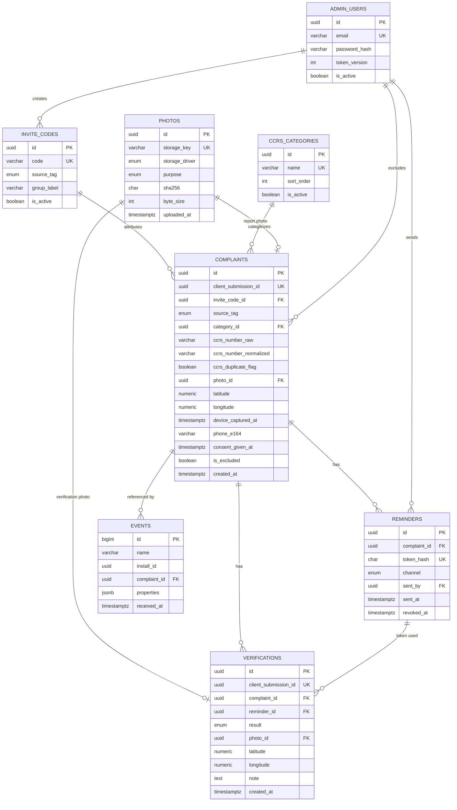

# Database Design
**Project:** Saarthee (Ahmedabad Civic Accountability)
**Version:** 1.0
**Last Updated:** 2026-10-03
**Status:** Draft

## Related Documents
- [Project Overview & Architecture](./01-project-overview.md) — System context, architectural decisions
- [Backend Specification](./03-backend-spec.md) — Services that read and write this data
- [Security & Testing](./06-security-testing.md) — Personal data handling, encryption, retention

---

## 1. Database Architecture

### 1.1 Technology
| Concern | Choice | Rationale |
|---------|--------|-----------|
| Primary Database | PostgreSQL (local instance) | Founder's choice; relational data, rates computed with SQL aggregates |
| Access layer / ORM | Prisma (Prisma Client + Prisma Migrate) | Founder's choice; typed queries for the TypeScript API |
| Cache | None | Pilot volume (about 100–200 complaints) does not need one |
| Search Engine | None | Admin filters use indexed columns; no free-text search in v1 |
| File Storage | Photos on local disk via the storage interface; Cloudflare candidate later | The database stores only photo metadata and storage keys ([01 §8, Decision 5](./01-project-overview.md#decision-5-photo-storage-behind-an-interface-local-disk-now)) |

### 1.2 Design Principles
- **Naming:** tables and columns in `snake_case` in the database. Prisma models use PascalCase names mapped to the snake_case table and column names.
- **Primary keys:** UUIDs for all entities exposed to the app or admin (`complaints`, `verifications`, `reminders`, `photos`, `invite_codes`, `admin_users`). Random UUIDs reveal neither record counts nor order. `events` uses a big-integer identity key, because it is internal and append-only.
  - UUID generation: `gen_random_uuid()` is built into PostgreSQL 13 and later. On older versions the `pgcrypto` extension provides it. Check the version installed locally.
- **Timestamps:** every time column is `TIMESTAMPTZ`, stored in UTC and shown in IST (Asia/Kolkata) in the app. Evidence records store **both** the device capture time and the server receipt time; server time is authoritative ([01 Decision 9](./01-project-overview.md#decision-9-server-time-is-authoritative)).
- **Normalization:** third normal form, with one deliberate exception: `complaints.source_tag` is copied from the invite code at submission time, so that later changes to an invite code never rewrite history.
- **Derived values are not stored:** complaint status and the H1/H2 rates are computed by database views (§3.10), not stored as columns, so they cannot drift out of step with the records.
- **No soft delete for evidence.** Records the admin wants to leave out are marked **excluded** (`is_excluded` plus a reason), which keeps an audit trail. Removing personal data is done by **anonymizing**: setting the phone number to null and deleting the photos, while keeping the non-personal fields (§9.3).
- **Idempotent submissions:** reports and verifications carry a `client_submission_id` generated by the app, so a retried upload over a poor connection cannot create a duplicate.
- **Coordinates:** latitude and longitude are stored as separate `NUMERIC(9,6)` columns (precision of roughly 0.1 m), with no PostGIS in v1. Ward assignment (PRD R-R7, P1) may add PostGIS later.
- **Never in the database in plain form:** verify tokens (only a SHA-256 hash is stored) and admin passwords (only a strong password hash).

## 2. Entity-Relationship Diagram

**Key design choice: one verify token per reminder.** The PRD describes "a unique link per complaint". Here, each reminder creates its own token, and only its SHA-256 hash is stored. The raw token is returned once, to the admin's app, to build the WhatsApp message. This means:
- A leaked database does not expose any working verify links.
- Every verification records which reminder it came from, so reminder-to-verification timing can be measured directly.
- A link can be revoked without affecting the complaint.

Older tokens for the same complaint stay valid unless revoked (assumption A7).

## 3. Schema Definition

Enum types used across tables:

| Enum | Values |
|------|--------|
| `source_tag` | `rwa`, `activist`, `social`, `network`, `unknown` |
| `verification_result` | `fixed`, `not_fixed` |
| `photo_purpose` | `report`, `verification` |
| `storage_driver` | `local`, `cloudflare_r2` |
| `reminder_channel` | `whatsapp_manual` |
| `exclusion_reason` | `test`, `invalid`, `duplicate`, `other` |
| `platform` | `android`, `ios` |

### 3.1 admin_users
**Description:** Operator accounts that can use the admin screens in the Flutter app. Expected to hold one or two rows in the pilot. The login mechanism (sessions or tokens) is defined in [03 Backend](./03-backend-spec.md); login is email and password with a JWT access token (A1, confirmed).

| Column | Type | Nullable | Default | Constraints | Index | Description |
|--------|------|----------|---------|------------|-------|-------------|
| id | UUID | No | gen_random_uuid() | PK | Primary | Unique identifier |
| email | VARCHAR(255) | No | — | UNIQUE, stored lowercase | Unique | Login identifier |
| password_hash | VARCHAR(255) | No | — | — | — | Hash from a slow password-hashing algorithm (choice in 06) |
| display_name | VARCHAR(100) | No | — | — | — | Shown in admin screens |
| is_active | BOOLEAN | No | true | — | — | Disables login without deleting the row |
| token_version | INTEGER | No | 0 | ≥ 0 | — | Included in each JWT; incrementing it invalidates all of this admin's tokens ("log out everywhere", see 03 §3.2) |
| last_login_at | TIMESTAMPTZ | Yes | NULL | — | — | Audit |
| created_at | TIMESTAMPTZ | No | NOW() | — | — | Record creation |
| updated_at | TIMESTAMPTZ | No | NOW() | Updated on every write | — | Last update |

**Relationships:**
- Has many `reminders` (`reminders.sent_by`)
- Has many `invite_codes` (`invite_codes.created_by`)
- Has many excluded `complaints` (`complaints.excluded_by`)

**Indexes:**
| Index Name | Columns | Type | Purpose |
|-----------|---------|------|---------|
| uq_admin_users_email | email | UNIQUE | Login lookup |

### 3.2 invite_codes
**Description:** One row per group or channel the pilot recruits from (for example, one RWA). The code is typed in once on the citizen's first launch and links their reports to a source tag ([01 Decision 8](./01-project-overview.md#decision-8-source-attribution-through-invite-codes-confirmed-2026-10-03)).

| Column | Type | Nullable | Default | Constraints | Index | Description |
|--------|------|----------|---------|------------|-------|-------------|
| id | UUID | No | gen_random_uuid() | PK | Primary | Unique identifier |
| code | VARCHAR(20) | No | — | UNIQUE; uppercase letters and digits only; 6–20 characters | Unique | The code citizens type in. Stored uppercase; lookup is case-insensitive |
| source_tag | source_tag | No | — | Cannot be `unknown` | B-tree | Source applied to reports using this code |
| group_label | VARCHAR(120) | No | — | — | — | Human label, e.g. the RWA's name. Shown only to the admin |
| ward_hint | VARCHAR(50) | Yes | NULL | — | — | Optional ward the group is in, as entered by the admin |
| is_active | BOOLEAN | No | true | — | — | Inactive codes are rejected when entered |
| created_by | UUID | Yes | NULL | FK → admin_users.id | B-tree | Admin who created it. Null for seeded rows |
| created_at | TIMESTAMPTZ | No | NOW() | — | — | Record creation |
| updated_at | TIMESTAMPTZ | No | NOW() | — | — | Last update |

**Relationships:**
- Has many `complaints` (`complaints.invite_code_id`)

**Indexes:**
| Index Name | Columns | Type | Purpose |
|-----------|---------|------|---------|
| uq_invite_codes_code | code | UNIQUE | Code validation on first launch |
| idx_invite_codes_source_tag | source_tag | B-tree | Grouping codes by source |

### 3.3 ccrs_categories
**Description:** Complaint categories shown in the Report flow. They should match CCRS's own categories, but the **authoritative list has not been obtained** (PRD Q4). They are therefore stored as data, not code, so they can be corrected without a release.

| Column | Type | Nullable | Default | Constraints | Index | Description |
|--------|------|----------|---------|------------|-------|-------------|
| id | UUID | No | gen_random_uuid() | PK | Primary | Unique identifier |
| name | VARCHAR(100) | No | — | UNIQUE | Unique | Label shown in the app (English in v1) |
| ccrs_label | VARCHAR(150) | Yes | NULL | — | — | Exact CCRS wording, once confirmed |
| sort_order | INTEGER | No | 0 | ≥ 0 | B-tree | Display order |
| is_active | BOOLEAN | No | true | — | — | Hidden from the app when false; historical complaints keep their link |
| created_at | TIMESTAMPTZ | No | NOW() | — | — | Record creation |
| updated_at | TIMESTAMPTZ | No | NOW() | — | — | Last update |

**Relationships:**
- Has many `complaints` (`complaints.category_id`)

**Indexes:**
| Index Name | Columns | Type | Purpose |
|-----------|---------|------|---------|
| uq_ccrs_categories_name | name | UNIQUE | Prevent duplicates |
| idx_ccrs_categories_active_order | is_active, sort_order | B-tree | Category list for the app |

### 3.4 photos
**Description:** Metadata for every uploaded photo. The image itself lives in the storage backend under `storage_key`. Photos are uploaded first and attached to a complaint or verification when that is submitted.

| Column | Type | Nullable | Default | Constraints | Index | Description |
|--------|------|----------|---------|------------|-------|-------------|
| id | UUID | No | gen_random_uuid() | PK | Primary | Unique identifier |
| storage_driver | storage_driver | No | 'local' | — | — | Backend holding the file |
| storage_key | VARCHAR(255) | No | — | UNIQUE | Unique | Opaque key, e.g. a date folder plus the UUID. Never a user-supplied filename |
| purpose | photo_purpose | No | — | — | — | Report or verification |
| mime_type | VARCHAR(50) | No | — | Allowed: image/jpeg (others decided in 03) | — | Content type after server checks |
| byte_size | INTEGER | No | — | > 0 and ≤ configured max | — | Size after compression on the phone |
| width_px | INTEGER | Yes | NULL | > 0 | — | Image width |
| height_px | INTEGER | Yes | NULL | > 0 | — | Image height |
| sha256 | CHAR(64) | No | — | Lowercase hex | B-tree | Integrity check; also detects the same image being reused |
| uploaded_for_complaint_id | UUID | Yes | NULL | FK → complaints.id; required when purpose = `verification` | — | For verification photos: the complaint whose verify token was used to upload. Stops a photo uploaded under one token being attached to another complaint (03 §4.5) |
| uploaded_at | TIMESTAMPTZ | No | NOW() | — | B-tree | Server receipt time |
| attached_at | TIMESTAMPTZ | Yes | NULL | — | Partial (where NULL) | Set when linked to a complaint or verification; unattached photos older than a configured age are cleaned up |
| deleted_at | TIMESTAMPTZ | Yes | NULL | — | — | Set when the file is removed (anonymization, §9.3). The metadata row is kept |

**Relationships:**
- Referenced by at most one `complaints.photo_id` or one `verifications.photo_id`

**Indexes:**
| Index Name | Columns | Type | Purpose |
|-----------|---------|------|---------|
| uq_photos_storage_key | storage_key | UNIQUE | Look up a file by key |
| idx_photos_sha256 | sha256 | B-tree | Flag the same image used in a report and its verification |
| idx_photos_unattached | uploaded_at WHERE attached_at IS NULL | Partial B-tree | Cleanup job for orphaned uploads |

### 3.5 complaints
**Description:** One row per citizen report: the CCRS complaint they filed, with the evidence captured in our app. This is the core record of the pilot.

| Column | Type | Nullable | Default | Constraints | Index | Description |
|--------|------|----------|---------|------------|-------|-------------|
| id | UUID | No | gen_random_uuid() | PK | Primary | Unique identifier |
| client_submission_id | UUID | No | — | UNIQUE | Unique | Generated by the app per draft; makes retries idempotent |
| invite_code_id | UUID | Yes | NULL | FK → invite_codes.id | B-tree | Null when no code was entered |
| source_tag | source_tag | No | 'unknown' | — | B-tree | Copied from the invite code at submission time |
| category_id | UUID | No | — | FK → ccrs_categories.id | B-tree | Category chosen by the citizen |
| ccrs_number_raw | VARCHAR(50) | No | — | Non-empty after trimming | — | Exactly as typed |
| ccrs_number_normalized | VARCHAR(50) | No | — | Uppercase, spaces and dashes removed | B-tree | Used for duplicate detection. Format check waits on PRD Q5 |
| ccrs_duplicate_flag | BOOLEAN | No | false | — | — | True if another complaint already has the same normalized number. Flagged, not rejected |
| photo_id | UUID | No | — | FK → photos.id, UNIQUE | Unique | Report photo |
| latitude | NUMERIC(9,6) | No | — | Between -90 and 90 | — | GPS at photo capture |
| longitude | NUMERIC(9,6) | No | — | Between -180 and 180 | — | GPS at photo capture |
| gps_accuracy_m | NUMERIC(8,2) | Yes | NULL | ≥ 0 | — | Accuracy reported by the device, in metres |
| device_captured_at | TIMESTAMPTZ | No | — | — | — | Photo capture time on the device clock |
| phone_e164 | VARCHAR(16) | Yes | — | Indian mobile in E.164 format (+91 followed by 10 digits) when present | B-tree | Citizen's WhatsApp number. Becomes null only through anonymization (§9.3) |
| consent_given_at | TIMESTAMPTZ | No | — | — | — | When the consent box was ticked (device time) |
| consent_text_version | VARCHAR(20) | No | — | — | — | Which consent wording the citizen saw |
| app_platform | platform | No | — | — | — | Android or iOS |
| app_version | VARCHAR(20) | No | — | — | — | App build that submitted the report |
| ward_code | VARCHAR(50) | Yes | NULL | — | B-tree | P1: ward from GPS. Null in v1 |
| is_excluded | BOOLEAN | No | false | — | Partial | Left out of rates (PRD R-A6) |
| exclusion_reason | exclusion_reason | Yes | NULL | Required when is_excluded is true | — | Why it was excluded |
| exclusion_note | VARCHAR(500) | Yes | NULL | — | — | Admin note |
| excluded_by | UUID | Yes | NULL | FK → admin_users.id | — | Who excluded it |
| excluded_at | TIMESTAMPTZ | Yes | NULL | — | — | When |
| anonymized_at | TIMESTAMPTZ | Yes | NULL | — | — | Set when personal data was removed |
| created_at | TIMESTAMPTZ | No | NOW() | — | B-tree | **Server receipt time (authoritative)** |
| updated_at | TIMESTAMPTZ | No | NOW() | — | — | Last update |

**Relationships:**
- Belongs to `invite_codes` (optional), `ccrs_categories`, `photos`
- Has many `reminders`, `verifications`, `events`

**Indexes:**
| Index Name | Columns | Type | Purpose |
|-----------|---------|------|---------|
| uq_complaints_client_submission | client_submission_id | UNIQUE | Idempotent submission |
| uq_complaints_photo | photo_id | UNIQUE | One photo per complaint |
| idx_complaints_ccrs_norm | ccrs_number_normalized | B-tree | Duplicate check on insert |
| idx_complaints_source_created | source_tag, created_at | B-tree | Admin filter by source; rates by source |
| idx_complaints_category | category_id | B-tree | Admin filter |
| idx_complaints_included_created | created_at WHERE is_excluded = false | Partial B-tree | "Due" view and rate views |
| idx_complaints_phone | phone_e164 | B-tree | Finding all records for a phone number on a deletion request |

### 3.6 reminders
**Description:** One row each time the admin taps "Send reminder" for a complaint. Each reminder creates a new verify token, and only its hash is stored.

| Column | Type | Nullable | Default | Constraints | Index | Description |
|--------|------|----------|---------|------------|-------|-------------|
| id | UUID | No | gen_random_uuid() | PK | Primary | Unique identifier |
| complaint_id | UUID | No | — | FK → complaints.id | Composite | Complaint being reminded |
| token_hash | CHAR(64) | No | — | UNIQUE; SHA-256 hex of the raw token | Unique | Looked up when a verify link is opened |
| channel | reminder_channel | No | 'whatsapp_manual' | — | — | Ready for automated channels later |
| sent_by | UUID | No | — | FK → admin_users.id | — | Admin who sent it |
| sent_at | TIMESTAMPTZ | No | NOW() | — | Composite | Server time the tap was recorded ([01 Decision 6](./01-project-overview.md#decision-6-manual-whatsapp-reminders-via-click-to-chat)) |
| expires_at | TIMESTAMPTZ | Yes | NULL | — | — | Null = no expiry during the pilot (assumption A7) |
| revoked_at | TIMESTAMPTZ | Yes | NULL | — | — | Token no longer accepted |
| created_at | TIMESTAMPTZ | No | NOW() | — | — | Record creation |

**Relationships:**
- Belongs to `complaints`, `admin_users`
- Has many `verifications` (`verifications.reminder_id`)

**Indexes:**
| Index Name | Columns | Type | Purpose |
|-----------|---------|------|---------|
| uq_reminders_token_hash | token_hash | UNIQUE | Verify link lookup |
| idx_reminders_complaint_sent | complaint_id, sent_at DESC | B-tree | Last reminder per complaint ("Due" view) |

### 3.7 verifications
**Description:** One row per citizen answer to "Was it fixed?". There can be several per complaint (PRD R-V5); the latest is treated as current.

| Column | Type | Nullable | Default | Constraints | Index | Description |
|--------|------|----------|---------|------------|-------|-------------|
| id | UUID | No | gen_random_uuid() | PK | Primary | Unique identifier |
| client_submission_id | UUID | No | — | UNIQUE | Unique | Idempotent submission |
| complaint_id | UUID | No | — | FK → complaints.id | Composite | Complaint being verified |
| reminder_id | UUID | Yes | NULL | FK → reminders.id | B-tree | Reminder whose token was used. Null only for admin-recorded verifications, if allowed later |
| result | verification_result | No | — | — | — | Fixed or not fixed |
| photo_id | UUID | No | — | FK → photos.id, UNIQUE | Unique | Verification photo (required) |
| latitude | NUMERIC(9,6) | No | — | Between -90 and 90 | — | GPS at capture |
| longitude | NUMERIC(9,6) | No | — | Between -180 and 180 | — | GPS at capture |
| gps_accuracy_m | NUMERIC(8,2) | Yes | NULL | ≥ 0 | — | Accuracy reported by the device |
| device_captured_at | TIMESTAMPTZ | No | — | — | — | Device clock |
| distance_from_report_m | NUMERIC(10,2) | Yes | NULL | ≥ 0 | — | Computed by the API at insert time (P1 distance check, PRD R-V6) |
| note | VARCHAR(1000) | Yes | NULL | — | — | Optional, mainly for "not fixed" (limit is an assumption, A4) |
| app_platform | platform | No | — | — | — | Android or iOS |
| app_version | VARCHAR(20) | No | — | — | — | App build |
| created_at | TIMESTAMPTZ | No | NOW() | — | Composite | **Server receipt time (authoritative)** |

**Relationships:**
- Belongs to `complaints`, `reminders` (optional), `photos`

**Indexes:**
| Index Name | Columns | Type | Purpose |
|-----------|---------|------|---------|
| uq_verifications_client_submission | client_submission_id | UNIQUE | Idempotent submission |
| uq_verifications_photo | photo_id | UNIQUE | One photo per verification |
| idx_verifications_complaint_created | complaint_id, created_at DESC | B-tree | Latest verification per complaint |
| idx_verifications_reminder | reminder_id | B-tree | Reminder-to-verification timing |

### 3.8 events
**Description:** Append-only analytics events from the PRD's event list. **No personal data is stored here:** no phone numbers, no tokens, no free text typed by citizens. `install_id` is a random UUID generated by the app on install. It is pseudonymous, and is used only to follow one install's journey from the report screen to submission.

| Column | Type | Nullable | Default | Constraints | Index | Description |
|--------|------|----------|---------|------------|-------|-------------|
| id | BIGINT | No | identity | PK | Primary | Sequential key (internal only) |
| name | VARCHAR(50) | No | — | One of the event names below | Composite | Event name |
| install_id | UUID | Yes | NULL | — | B-tree | App install identifier (citizen side) |
| admin_user_id | UUID | Yes | NULL | FK → admin_users.id | — | Set for admin events |
| complaint_id | UUID | Yes | NULL | FK → complaints.id | B-tree | Set when the event concerns one complaint |
| source_tag | source_tag | Yes | NULL | — | — | Copied when known, for funnel splits |
| properties | JSONB | No | '{}' | Size limit set in 03 | — | Extra non-personal fields, e.g. `result` on verify_submitted |
| platform | platform | Yes | NULL | — | — | Android or iOS |
| app_version | VARCHAR(20) | Yes | NULL | — | — | App build |
| occurred_at | TIMESTAMPTZ | No | — | — | — | Device time |
| received_at | TIMESTAMPTZ | No | NOW() | — | Composite | Server time |

Allowed event names: `report_opened`, `ccrs_handoff_clicked`, `report_submitted`, `reminder_sent`, `verify_opened`, `verify_submitted`, `record_flagged`. Two are added because of the installed-app design: `invite_code_entered` and `deep_link_failed`.

**Indexes:**
| Index Name | Columns | Type | Purpose |
|-----------|---------|------|---------|
| idx_events_name_received | name, received_at | B-tree | Funnel counts |
| idx_events_complaint | complaint_id | B-tree | Events for one complaint |
| idx_events_install | install_id | B-tree | One install's report funnel |

### 3.9 Views (read-only, computed)

These are described here and defined as SQL views in a migration. Prisma's schema language may not express views fully; check the current Prisma documentation and fall back to raw SQL in the migration file if needed.

| View | Grain | Columns (summary) | Used by |
|------|-------|-------------------|---------|
| `complaint_status_v` | One row per complaint | complaint id, source tag, created at, reminder count, last reminder time, verification count, latest result, **derived status** (`filed` → `reminded` → `verified_fixed` / `verified_not_fixed`), is due (no verification, and the last reminder or the creation time is older than the reminder interval) | Admin list and "Due" view (PRD R-A2) |
| `pilot_rates_v` | One row per source tag, plus a "trusted" row (`rwa` + `activist`) | complaints, complaints reminded, complaints verified, H1 rate, verifications, "not fixed" count, H2 rate. Excluded complaints are left out | Admin summary (PRD R-A5) and export |

**Rate definitions, exactly as in the PRD:**
- **H1** = complaints with at least one verification ÷ complaints with at least one reminder.
- **H2** = complaints whose **latest** verification is `not_fixed` ÷ complaints with at least one verification.

Using the latest result per complaint is an interpretation (assumption A5): the PRD defines H2 per verification, not per complaint. Counting per complaint stops repeat verifications of the same complaint from weighting the rate.

The reminder interval (default 7 days) is a configuration value, so the "is due" calculation is done by the API query or passed in as a parameter, not fixed inside the view (decided in 03).

## 4. Relationships Summary
| Parent | Child | Relationship | FK Column | On Delete | On Update |
|--------|-------|-------------|-----------|-----------|-----------|
| invite_codes | complaints | one-to-many | invite_code_id | RESTRICT | CASCADE |
| ccrs_categories | complaints | one-to-many | category_id | RESTRICT | CASCADE |
| photos | complaints | one-to-one | photo_id | RESTRICT | CASCADE |
| photos | verifications | one-to-one | photo_id | RESTRICT | CASCADE |
| complaints | reminders | one-to-many | complaint_id | RESTRICT | CASCADE |
| complaints | verifications | one-to-many | complaint_id | RESTRICT | CASCADE |
| complaints | events | one-to-many | complaint_id | SET NULL | CASCADE |
| complaints | photos (verification uploads) | one-to-many | uploaded_for_complaint_id | RESTRICT | CASCADE |
| reminders | verifications | one-to-many | reminder_id | RESTRICT | CASCADE |
| admin_users | reminders | one-to-many | sent_by | RESTRICT | CASCADE |
| admin_users | complaints (exclusions) | one-to-many | excluded_by | SET NULL | CASCADE |
| admin_users | invite_codes | one-to-many | created_by | SET NULL | CASCADE |
| admin_users | events | one-to-many | admin_user_id | SET NULL | CASCADE |

`RESTRICT` on evidence relationships is deliberate: complaints, verifications and photos are never deleted outright. Removing personal data happens through anonymization (§9.3), not deleting rows.

## 5. Indexing Strategy

### 5.1 Query Pattern Analysis
| Query Description | Frequency | Tables Involved | Index Support |
|-------------------|-----------|-----------------|--------------|
| Validate invite code on first launch | Low (once per install) | invite_codes | uq_invite_codes_code |
| List active categories | Each report | ccrs_categories | idx_ccrs_categories_active_order |
| Insert complaint, check for duplicate CCRS number | Each report | complaints | idx_complaints_ccrs_norm, uq_complaints_client_submission |
| Look up verify token | Each verify link opened | reminders | uq_reminders_token_hash |
| Latest verification per complaint | Admin views | verifications | idx_verifications_complaint_created |
| "Due for reminder" list | Daily, admin | complaints, reminders, verifications | idx_complaints_included_created, idx_reminders_complaint_sent, idx_verifications_complaint_created |
| Admin list filtered by source or category | Admin | complaints | idx_complaints_source_created, idx_complaints_category |
| H1 / H2 rates by source | Admin, export | complaints, reminders, verifications | Same as above; volumes are tiny |
| Funnel counts | Analysis | events | idx_events_name_received |
| Every record for a phone number (deletion request) | Rare | complaints | idx_complaints_phone |
| Clean up orphaned photos | Daily job | photos | idx_photos_unattached |

### 5.2 Composite Indexes
- `complaints (source_tag, created_at)`: the admin list sorts newest-first within a source filter, and the rates group by source.
- `reminders (complaint_id, sent_at DESC)`: the latest reminder per complaint for the "Due" calculation.
- `verifications (complaint_id, created_at DESC)`: the latest verification per complaint, used for H2 and status.
- `events (name, received_at)`: counts per event name over a time window.

At pilot volume, PostgreSQL would perform acceptably without most of these indexes. They are included so the schema needs no rework if the pilot grows.

### 5.3 Full-Text Search Indexes
Not applicable in v1.

## 6. Data Volume Estimates
These are pilot-scale estimates derived from PRD targets. They are **not measured**; Year 1 and Year 3 volumes are unknown until the pilot decides whether the product continues.

| Entity | Pilot (approx.) | Avg Row Size (approx.) | Total (approx.) |
|--------|-----------------|------------------------|-----------------|
| complaints | 150–250 (about 100 trusted plus other sources) | Under 1 KB | Under 1 MB |
| reminders | 2–3 per complaint → up to about 750 | Under 0.5 KB | Under 1 MB |
| verifications | Up to about 250 | Under 1 KB | Under 1 MB |
| photos (metadata) | Up to about 500 | Under 0.5 KB | Under 1 MB |
| photo files | Up to about 500 | Depends on compression target (03); for example 300 KB–1 MB each | About 150–500 MB |
| events | A few thousand | Under 1 KB | A few MB |
| invite_codes | 10–30 | Under 0.5 KB | Negligible |

Photo files dominate storage. The compression target set in [03 Backend](./03-backend-spec.md) determines the real figure, and matters when checking Cloudflare free-tier limits later.

## 7. Migration Strategy

### 7.1 Migration Tool
Prisma Migrate. The Prisma schema file is the source of truth for tables, enums, relations and simple indexes. Some features may not be expressible in the Prisma schema; check current Prisma documentation for each:
- partial indexes,
- CHECK constraints (coordinate ranges, phone format, exclusion-reason rule),
- views,
- the `identity` column on `events`.

Where a feature is not supported, add it as hand-written SQL in a Prisma migration file. Prisma supports editing a generated migration before applying it.

### 7.2 Migration Conventions
- One migration per logical change, named in lower snake_case describing the change, e.g. `add_reminder_tokens`.
- Migration files are committed to the repository. A migration that has already been applied is **never edited**; corrections are made in a new migration.
- Hand-written SQL inside a migration (constraints, partial indexes, views) has a comment explaining why it is not in the Prisma schema.
- Changes to data (for example, correcting categories after PRD Q4 is resolved) go in their own migration or seed update, never mixed with structural changes.
- In local development, the database can be reset and re-seeded at will. Once real pilot data exists, resets are forbidden and only forward migrations are applied (rule to be restated in 05).

### 7.3 Initial Migration Plan
| Order | Migration | Description | Dependencies |
|-------|-----------|-------------|-------------|
| 1 | init_enums | All enum types in §3 | None |
| 2 | create_admin_users | Admin accounts | 1 |
| 3 | create_invite_codes | Invite codes with source tag | 1, 2 |
| 4 | create_ccrs_categories | Category reference table | None |
| 5 | create_photos | Photo metadata, partial index for unattached photos | 1 |
| 6 | create_complaints | Core table, constraints, partial index | 1–5 |
| 7 | create_reminders | Reminders with token hash | 2, 6 |
| 8 | create_verifications | Verifications | 5, 6, 7 |
| 9 | create_events | Analytics events | 1, 2, 6 |
| 10 | create_views | `complaint_status_v`, `pilot_rates_v` | 6, 7, 8 |

## 8. Seed Data
| Entity | Seed Records | Purpose |
|--------|-------------|---------|
| admin_users | 1 development admin; credentials from local environment variables, never committed | Testing the admin flows |
| invite_codes | One test code per source tag (`rwa`, `activist`, `social`, `network`) | Testing attribution and rate splits |
| ccrs_categories | **Placeholder** list from the PRD's problem areas: pothole or damaged road, garbage and cleanliness, streetlight, drainage, water supply, other | Lets the Report flow be built; must be replaced with CCRS's real list (PRD Q4) |
| complaints, reminders, verifications, photos | Development-only sample set covering every status (filed, reminded, verified fixed, verified not fixed, excluded, duplicate CCRS number) | Testing the admin views and rate calculations |

Seed scripts for the development sample set must refuse to run when real pilot data is present (rule detailed in 05).

## 9. Backup & Recovery

### 9.1 Backup Strategy
Local-only for now. Production backups are defined when the deployment section is written.

| Type | Frequency | Retention | Storage |
|------|-----------|-----------|---------|
| Logical database dump | Before every migration, and daily once real pilot data exists | Last 7 dumps (assumption) | Outside the project folder; never committed |
| Photo folder copy | Daily once real pilot data exists | Last 7 copies (assumption) | Same location as the dumps |

### 9.2 Recovery Procedures
- **Development:** reset the database, re-run migrations and seeds.
- **Pilot data (if pilot runs before deployment):** restore the latest dump plus the photo copy. Data written since the last dump is lost. Restore targets are set at deployment.

### 9.3 Personal Data Deletion and Retention (policy open — PRD Q9)
The schema supports a deletion request without breaking the rates:
1. Find every complaint by `phone_e164`.
2. Set `phone_e164` to null and set `anonymized_at`.
3. Delete the photo files from storage, and set `photos.deleted_at`.
4. Keep the category, source tag, coordinates, timestamps and verification results.

Whether coordinates count as personal data in this context, and how long anything is kept, needs the legal input flagged in PRD Q11. Until that is resolved, this procedure is a technical capability, not a policy.

## 10. Caching Strategy
Not applicable in v1.

## Decisions & Assumptions
| # | Decision/Assumption | Rationale | Status | Date |
|---|---------------------|-----------|--------|------|
| 1 | PostgreSQL + Prisma (Client and Migrate) | Founder's choice | Confirmed | 2026-10-03 |
| 2 | UUID primary keys for exposed entities; bigint identity for events | No enumeration; events are internal | Assumed — confirm | 2026-10-03 |
| 3 | One verify token per reminder, stored only as SHA-256 hash | A leaked database exposes no working links; measures reminder-to-verification | Confirmed (refines PRD "one link per complaint") | 2026-10-03 |
| 4 | Complaint status and rates computed in views, not stored | No drift between stored and derived values | Assumed — confirm | 2026-10-03 |
| 5 | `source_tag` copied onto complaints at submission | History unaffected by later code edits | Assumed — confirm | 2026-10-03 |
| 6 | Exclusion flag instead of soft delete; anonymization instead of deleting rows | Keeps the audit trail and the rates intact | Assumed — confirm | 2026-10-03 |
| 7 | Coordinates as NUMERIC(9,6), no PostGIS in v1 | Distance check can be done in the API; PostGIS only if wards need it | Assumed — confirm | 2026-10-03 |
| 8 | Duplicate CCRS numbers flagged, not rejected | PRD R-R3 | Confirmed (from PRD) | 2026-10-03 |
| 9 | Phone numbers stored as Indian mobiles in E.164 format (+91 and 10 digits) | PRD R-R5 says Indian mobile format; exact validation rule to be confirmed in 03 | Assumed — confirm | 2026-10-03 |
| A1 | Admin login: email + password, JWT access token | Founder's choice; details in 03 | Confirmed | 2026-10-03 |
| A2 | CCRS categories seeded with placeholders | Real list not obtained (PRD Q4) | Assumed (temporary) | 2026-10-03 |
| A3 | Pilot volumes in §6 | Derived from PRD targets, not measured | Assumed | 2026-10-03 |
| A4 | Verification note limited to 1,000 characters | PRD left the limit to engineering | Assumed — confirm | 2026-10-03 |
| A5 | H2 counted per complaint, using the latest verification | Prevents repeat verifications from weighting the rate; PRD wording is per verification | Confirmed | 2026-10-03 |
| A6 | Events table holds no personal data; install_id is a random per-install UUID | Privacy by default | Assumed — confirm | 2026-10-03 |
| A7 | Verify tokens do not expire during the pilot; older tokens stay valid unless revoked | Late verifications are still valuable | Confirmed | 2026-10-03 |
| A8 | Backups kept 7 days locally | Placeholder until deployment | Assumed | 2026-10-03 |

## Version History
| Version | Date | Author | Changes |
|---------|------|--------|---------|
| 1.0 | 2026-10-03 | Drafted with Claude from MVP Spec, PRD and Doc 01 | Initial draft |
