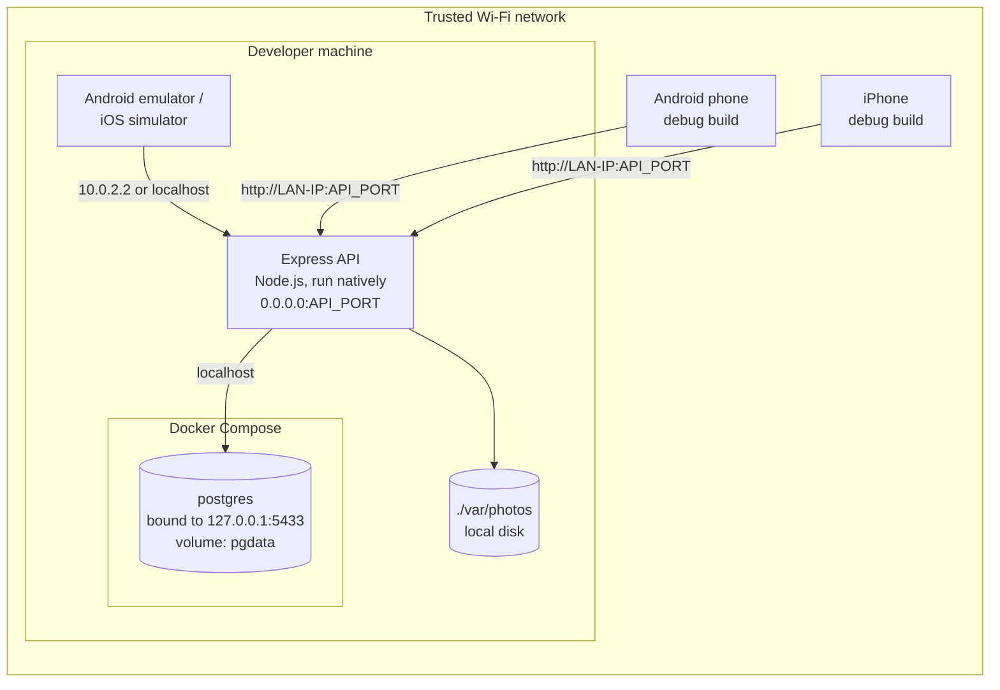
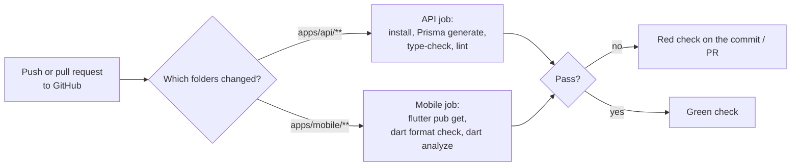

# DevOps & Infrastructure
**Project:** Saarthee (Ahmedabad Civic Accountability)
**Version:** 1.0
**Last Updated:** 2026-10-03
**Status:** Draft. Covers local development only; deployment is a placeholder (§9)

## Related Documents
- [Project Overview & Architecture](./01-project-overview.md) — Local-only constraint, configuration principles
- [Backend Specification](./03-backend-spec.md) — The API to run; scripts
- [Frontend Specification](./02-frontend-spec.md) — The Flutter app; deep links
- [Database Design](./04-database-design.md) — Migrations, seeds, backups
- [Security & Testing](./06-security-testing.md) — Local-mode security rules, release checklist

---

## 1. Infrastructure Architecture

### 1.1 Local Development Architecture

**Why PostgreSQL in Docker but the API run natively:** Docker gives a clean, version-pinned database with one command. Running the API directly with Node keeps hot-reload fast and debugging simple. The API can be containerized later for deployment (§3.4).

### 1.2 Infrastructure Summary (local)
| Component | Service | Tier/Size | Location |
|-----------|---------|-----------|--------|
| Compute | Developer machine running Node.js (current LTS) | — | Local |
| Database | PostgreSQL in Docker Compose (pin one major version; latest stable at setup) | Default | Local, bound to 127.0.0.1 only |
| Cache | None | — | — |
| Photo storage | Local folder via the storage interface (`STORAGE_DRIVER=local`) | — | Local, outside the repo |
| CDN / DNS / Load balancer | None | — | — |
| Code hosting | GitHub (single repository) | Plan to check | — |

## 2. Environments

### 2.1 Environment Matrix
| Environment | Purpose | URL | Deployment | Data |
|-------------|---------|-----|-----------|------|
| Local | Development and manual QA on test phones | `http://<LAN-IP>:<API_PORT>/api/v1` | Run by hand (§3.3) | Seed data and the team's own test reports. **No real citizen data** ([06 §5.1](./06-security-testing.md#51-local-only-mode-current)) |
| Production (pilot) | Real citizens | To be decided | **§9, not yet written** | Real |

No staging environment is planned for the pilot (assumed).

### 2.2 Environment Variables

**API (`apps/api/.env`, never committed; `apps/api/.env.example` committed with placeholders):**

| Variable | Description | Local value / example | Sensitive |
|----------|-------------|-----|-----------|
| `APP_ENV` | `development` or `production`; dev-only scripts refuse to run otherwise | `development` | No |
| `API_HOST` | Bind address. `0.0.0.0` so phones on the LAN can connect | `0.0.0.0` | No |
| `API_PORT` | Port | e.g. `4000` | No |
| `DATABASE_URL` | Prisma connection string to the Docker database | `postgresql://saarthee:<pw>@127.0.0.1:5433/saarthee` | **Yes** |
| `JWT_SECRET` | Admin JWT signing secret, at least 32 random bytes | generated | **Yes** |
| `JWT_ISSUER`, `JWT_AUDIENCE` | JWT claims | `saarthee-api`, `saarthee-admin` | No |
| `JWT_EXPIRES_IN` | Admin token lifetime | `8h` | No |
| `STORAGE_DRIVER` | `local` now; `cloudflare_r2` later | `local` | No |
| `PHOTO_STORAGE_DIR` | Absolute path for photo files, **outside the repo** | e.g. `~/saarthee-data/photos` | No |
| `PHOTO_MAX_UPLOAD_BYTES` | Upload limit | `5242880` (5 MB) | No |
| `PHOTO_MAX_EDGE_PX` | Server resize safety net | `2048` | No |
| `UNATTACHED_PHOTO_TTL_HOURS` | Orphaned-photo expiry | `24` | No |
| `REMINDER_INTERVAL_DAYS` | "Due" interval | `7` | No |
| `VERIFY_LINK_BASE` | Prefix for verify links; custom scheme in dev | `saarthee://verify?t=` | No |
| `VERIFY_DISTANCE_WARN_M` | Distance warning threshold; empty = off | *(empty)* | No |
| `CONSENT_TEXT_VERSIONS` | Accepted consent versions, comma-separated | `v1` | No |
| `REMINDER_TEMPLATE_VERSION` | Which server-side reminder text to use | `v1` | No |
| `CORS_ORIGINS` | Usually empty (CORS off) | *(empty)* | No |
| `TRUST_PROXY` | Whether to trust proxy headers for client IP (rate limits). `false` locally; set at deployment | `false` | No |
| `LOG_LEVEL` | `debug` locally | `debug` | No |
| `SEED_ADMIN_EMAIL`, `SEED_ADMIN_PASSWORD` | Used once by the create-admin script; **remove from `.env` afterwards** | — | **Yes** |

The API validates all variables at startup and exits with a clear message if any are missing or invalid ([03 §1.2](./03-backend-spec.md#12-project-structure)).

**Flutter app (build-time values passed in with `--dart-define`; no secrets):**

| Variable | Description | Local value / example |
|----------|-------------|-----|
| `APP_ENV` | `development` / `production` | `development` |
| `API_BASE_URL` | API root | Android emulator: `http://10.0.2.2:4000/api/v1`; iOS simulator: `http://localhost:4000/api/v1`; physical phones: `http://<LAN-IP>:4000/api/v1` |
| `DEEP_LINK_SCHEME` | Custom scheme | `saarthee` |
| `CCRS_WEB_URL` | AMC complaint website | `https://www.amccrs.com/` (**check it is still correct before each release**) |
| `CCRS_WHATSAPP_NUMBER` | AMC CCRS WhatsApp bot | `+917567855303` (from AMC's sites, Oct 2026; **check before each release**) |
| `AMC_HELPLINE` | AMC call centre | `155303` (**check before each release**) |

A small set of run configurations (IDE launch settings, or scripts in the repo) holds these per target, so nobody types them by hand.

### 2.3 Secrets Management
- Local: `.env` files only, ignored by git ([06 §5.2](./06-security-testing.md#52-secrets-management)).
- GitHub: if CI ever needs a secret, use GitHub Actions encrypted secrets. **The v1 CI in §4 needs none.**
- Deployment: a hosting provider's secret store (decided in §9).

## 3. Containerization

### 3.1 Docker Architecture
One container in v1: PostgreSQL. The API and Flutter run natively on the developer machine.

### 3.2 Container Definitions
| Container | Base Image | Ports | Volumes | Health Check |
|-----------|-----------|-------|---------|-------------|
| `db` | Official `postgres` image, pinned to **`postgres:17.6`** (latest stable at setup, 2026-10-03) | `127.0.0.1:5433:5432` (localhost only, never the LAN; host port 5433 because 5432 was occupied on the dev machine) | Named volume `pgdata` | `pg_isready` every 5 s |

### 3.3 Docker Compose (Local Development)
- The compose file lives in `infra/docker-compose.yml`. It defines one service, `db`, with:
  - database name, user and password read from `infra/.env`, which is ignored by git (`infra/.env.example` is committed);
  - the named volume `pgdata`, so data survives container restarts;
  - restart policy `unless-stopped`;
  - the health check above.
- **Daily workflow:**
  1. Start the database with Docker Compose (`up -d`).
  2. Apply migrations with Prisma Migrate (dev mode), then run the seed script ([04 §7–8](./04-database-design.md#7-migration-strategy)).
  3. Start the API in watch mode.
  4. Run the Flutter app on an emulator or a phone with the right run configuration.
- **Reset:** a repo script stops the container, removes the `pgdata` volume, starts it again, and re-applies migrations and seeds. It refuses to run unless `APP_ENV=development`, and asks for confirmation.
- **Root scripts** (in a root `package.json` or a Makefile; the developer chooses): `db:up`, `db:down`, `db:reset`, `db:migrate`, `db:seed`, `api:dev`, `admin:create`, `photos:cleanup`.

### 3.4 Production Container Strategy
Not decided. When deploying (§9), the API likely gets a multi-stage Docker image (build TypeScript, then a slim runtime image). The production database should be a managed PostgreSQL service rather than a container.

## 4. CI/CD Pipeline

### 4.1 Pipeline Architecture
Kept minimal to match the speed-first approach ([06 §7.1](./06-security-testing.md#71-approach-for-v1-speed-first)). CI runs **static checks only**; there are no tests and no deployment.

### 4.2 Pipeline Stages
| Stage | Trigger | Actions | Duration | Failure Action |
|-------|---------|---------|----------|---------------|
| API static checks | Push or PR touching `apps/api/**` | Install dependencies, `prisma generate`, `tsc --noEmit`, ESLint | A few minutes (not measured) | Red check; fix before sharing a build |
| Mobile static checks | Push or PR touching `apps/mobile/**` | `flutter pub get`, `dart format` check, `dart analyze` | A few minutes (not measured) | Red check |
| Dependency audit | Weekly schedule (optional) | `npm audit --audit-level=high` | ~1 min | Notification only |
| Build / deploy | — | None in v1 | — | — |

Platform: **GitHub Actions**. Free usage limits depend on whether the repository is public or private and on the GitHub plan; check the current limits.

### 4.3 Branch Strategy
GitHub flow, which is the lightest model for a small team:
- `main` is always buildable.
- Short-lived branches (`feat/…`, `fix/…`), merged into `main` through a pull request when there's more than one developer. A solo developer may push to `main` directly.
- Tag builds shared with testers, e.g. `mobile-v0.3.0+12`, so bug notes can name the build ([06 §12.2](./06-security-testing.md#122-bug-reporting)).

### 4.4 Deployment Strategy
None in v1 (§9).

### 4.5 Distributing Test Builds to Phones (local mode)
- **Android:** install a debug or profile build directly over USB, or share an APK with team testers.
- **iOS:** install from Xcode on a Mac to a registered iPhone. Running on a physical iPhone needs Apple code signing; a free personal team may allow short-lived installs on your own devices, while TestFlight and wider distribution need a paid Apple Developer Program membership. **Check Apple's current rules.**

### 4.6 Mobile Platform Configuration for Local Mode
| Concern | Android | iOS |
|---------|---------|-----|
| Plain-HTTP access to the dev API | Network security configuration allowing cleartext **only for the dev machine's address, only in the debug build type** | App Transport Security exception for the dev address **only in the Debug build configuration** |
| Custom deep link `saarthee://verify` | Intent filter for the `saarthee` scheme on the main activity | URL type registered for the `saarthee` scheme |
| Camera and location permission text | Manifest permissions | Info.plist usage-description strings, in plain language matching [02 §4.7](./02-frontend-spec.md#47-report-step-4-photo-of-the-problem) |
| Testing a deep link without WhatsApp | Fire the link with Android's developer tools | Fire the link with the iOS Simulator's developer tools |

The release checklist in [06 §12.3](./06-security-testing.md#123-release-checklist-manual) requires confirming the plain-HTTP exceptions are **absent** from release builds.

## 5. Infrastructure as Code
Not applicable in v1. The compose file and `.env.example` files are the only infrastructure definitions.

## 6. Monitoring & Observability

### 6.1 Monitoring Stack (local)
| Concern | Tool | Purpose |
|---------|------|---------|
| Application logs | Structured JSON to the terminal; optionally also to a rotating local file ([06 §4.3](./06-security-testing.md#43-data-retention--deletion): keep ≤ 14 days) | Debugging |
| Error tracking | None (logs only) | — |
| Metrics / uptime | None; GET /health for a manual check | — |
| Database | `docker compose` logs; a SQL client of choice | — |
| Business metrics | Admin Rates screen and CSV export | H1/H2 |

### 6.2 Alerting Rules
None in v1.

### 6.3 Dashboard Requirements
None beyond the in-app Rates screen ([02 §4.21](./02-frontend-spec.md#421-admin-rates)).

### 6.4 Log Aggregation
Not applicable locally. Redaction rules apply everywhere ([03 §9.2](./03-backend-spec.md#92-logging-standards)).

## 7. Scaling Strategy
Not applicable: a single API process and a single database for pilot volume (about 100–250 complaints). The in-memory rate-limit store ([03 §10](./03-backend-spec.md#10-rate-limiting--throttling)) assumes exactly one API process; revisit this if more are ever run.

## 8. Backup & Disaster Recovery (local)
| Scenario | Data at risk | Strategy |
|----------|-----|----------|
| Bad migration or accidental reset | Dev data | Take a `pg_dump` before risky migrations; seeds recreate dev data |
| Docker volume lost | Dev data | Re-seed |
| Laptop lost or stolen | Anything on it | Full-disk encryption; no real citizen data locally ([06 §5.1](./06-security-testing.md#51-local-only-mode-current)) |

Production recovery targets (how much data can be lost, and how fast service must return) are set in §9.

## 9. Deployment (placeholder — to be written before the pilot)
This section will be written when deployment is planned. These items are already known to be required, and are referenced from other documents:

- [ ] Hosting for the API (provider and region to choose) and a **managed PostgreSQL** service with automated backups.
- [ ] HTTPS on a domain you own; remove all plain-HTTP exceptions from release builds.
- [ ] **Android App Links and iOS Universal Links** on that domain: host the platform association files, and switch `VERIFY_LINK_BASE` to https ([01 §7.1](./01-project-overview.md#71-technical-constraints)).
- [ ] Decide what an https verify link shows when the app isn't installed (e.g. a simple page with store links).
- [ ] Photo storage: switch `STORAGE_DRIVER` to Cloudflare (product, free-tier limits and API compatibility **to verify**) and migrate existing local files if any.
- [ ] Secrets in the host's secret store; rotate all secrets used in development.
- [ ] `TRUST_PROXY` set correctly, so rate limits see real client IPs.
- [ ] Error tracking and uptime monitoring (tools to choose).
- [ ] App store accounts, listings, **privacy disclosures** (Google Play Data safety, Apple privacy labels), and a name check for "Saarthee" ([02 F1](./02-frontend-spec.md#decisions--assumptions)).
- [ ] Legal review done: consent wording, privacy notice, retention policy ([06 §6](./06-security-testing.md#6-compliance)).
- [ ] Backups: a schedule and recovery targets for real pilot data.

## Decisions & Assumptions
| # | Decision/Assumption | Rationale | Status | Date |
|---|---------------------|-----------|--------|------|
| 1 | PostgreSQL in Docker Compose | Founder's choice | Confirmed | 2026-10-03 |
| 2 | One GitHub repository for app and backend | Founder's choice | Confirmed | 2026-10-03 |
| 3 | API runs natively (not in Docker) during development | Faster reload and debugging | Assumed — confirm | 2026-10-03 |
| 4 | Repo layout: `apps/api`, `apps/mobile`, `infra`, `docs` | Clear separation in one repository | Assumed — confirm | 2026-10-03 |
| 5 | npm as the Node package manager | Default; no preference given | Assumed — confirm | 2026-10-03 |
| 6 | Minimal GitHub Actions: static checks only, no tests, no deploy | Speed-first; no secrets needed | Assumed — confirm | 2026-10-03 |
| 7 | GitHub flow branching | Lightest model for a small team | Assumed — confirm | 2026-10-03 |
| 8 | Database port bound to localhost only; API bound to the LAN | Phones need the API; nothing needs the database directly | Assumed (security) | 2026-10-03 |
| 9 | Photos stored outside the repository folder | Prevents committing personal data by accident | Assumed (security) | 2026-10-03 |
| 10 | No staging environment for the pilot | Small scale | Assumed — confirm | 2026-10-03 |
| 11 | CCRS web URL, WhatsApp number and 155303 helpline as config values | From AMC sites in Oct 2026; may change | To verify before each release | 2026-10-03 |
| 12 | Deployment section deferred | Founder's choice (local only for now) | Confirmed | 2026-10-03 |
| I1 | Database image pinned to `postgres:17.6` (§3.2) | Latest stable at setup | Implemented — confirm | 2026-10-03 |
| I2 | Host port 5433 (`127.0.0.1:5433:5432`), still localhost only | 5432 occupied on the dev machine | Implemented — confirm | 2026-10-03 |
| I3 | `LOG_FILE_DIR` added: pino-roll daily files, 14 kept | Meets ≤ 14-day local retention (06 row 11) | Implemented — confirm | 2026-10-03 |
| I4 | Express 5.2.1, Zod 4.6.5, Prisma 6.19.3, TypeScript 5.9.3 pinned | Prisma 6 not 7/8 — avoid new-major churn | Implemented — confirm | 2026-10-03 |
| I5 | Root `package.json` scripts (npm); mobile CI job gated on `apps/mobile/pubspec.yaml` | 05 D5; simplest cross-platform option | Implemented — confirm | 2026-10-03 |
| I6 | No GitHub remote / CI run yet | Founder action: create remote, push, confirm CI green | Deferred | 2026-10-03 |

## Version History
| Version | Date | Author | Changes |
|---------|------|--------|---------|
| 1.0 | 2026-10-03 | Drafted with Claude from Docs 01–04 and 06 | Initial draft: local development; deployment placeholder |
