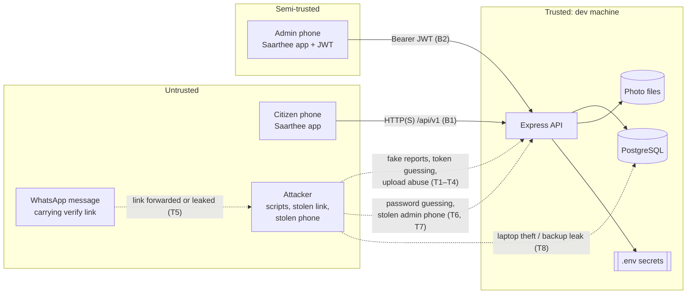
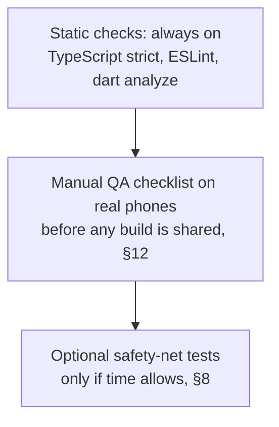

# Security & Testing

> **Superseded by Saarthee v2** where they differ — see `docs/v2/saarthee-v2-spec.md` and `docs/tasks-v2/00-task-summary.md`.

**Project:** Saarthee (Ahmedabad Civic Accountability)
**Version:** 1.0
**Last Updated:** 2026-10-03
**Status:** Draft

## Related Documents
- [Project Overview & Architecture](./01-project-overview.md) — System context and constraints
- [Frontend Specification](./02-frontend-spec.md) — App-side storage of tokens and drafts
- [Backend Specification](./03-backend-spec.md) — Auth, validation, rate limits, logging
- [Database Design](./04-database-design.md) — Personal-data columns, anonymization
- [DevOps & Infrastructure](./05-devops-infrastructure.md) — Local setup and future deployment

> This document is a technical specification, not legal advice. Statements about Indian law are summaries of public sources (listed at the end) and must be confirmed by a lawyer before the pilot collects real citizens' data.

---

## Part A: Security

## 1. Security Overview

### 1.1 Data Classification
| Classification | Description | Examples in Saarthee | Handling |
|---------------|-------------|----------|---------|
| Public | Non-sensitive | Category names, app copy | No restrictions |
| Internal | Operational data, no personal data | Analytics events (random install ID, no phone), aggregate rates, request logs (redacted) | Admin-only access; never shared publicly in v1 |
| Personal data | Data about an identifiable person | **Phone number**; **photos** (may show faces, vehicle plates, homes); **GPS coordinates and timestamps** linked to a phone number; CCRS complaint number (traceable in AMC's system); free-text notes | Minimized, consent recorded, access limited to admin, left out of logs and exports by default, deletable (§4.3) |
| Secret | Credentials and tokens | Admin passwords, JWT secret, verify tokens, database password, future Cloudflare keys | Never in source control or logs; hashed where possible; environment variables only |

### 1.2 Threat Model
Trust boundaries and the main threats, using STRIDE categories (Spoofing, Tampering, Repudiation, Information disclosure, Denial of service, Elevation of privilege).

| # | Threat (STRIDE) | Where | Impact | Mitigation | Residual risk |
|---|-----------------|-------|--------|-----------|---------------|
| T1 | Fake or junk reports (Spoofing, Tampering) | POST /reports | Skews H1/H2 | Invite codes and source tags; rates count trusted sources only; CCRS number required; admin exclusion; rate limits | Someone with a trusted code can still submit junk; admin review needed |
| T2 | Verify-token guessing (Spoofing) | /verify/* | Fake verifications | 256-bit random tokens; only hashes stored; same response for unknown and malformed tokens; rate limits | Negligible |
| T3 | Malicious upload (Tampering, Elevation) | POST /photos | Code execution, storage abuse | Size limit; JPEG check from file contents; full decode and re-encode; server-generated storage keys; no user file names; storage path containment ([03 §6.1](./03-backend-spec.md#61-storage-interface-contract)) | Image library vulnerabilities; keep it updated |
| T4 | Flooding (Denial of service) | All citizen endpoints | API or disk unavailable | Rate limits ([03 §10](./03-backend-spec.md#10-rate-limiting--throttling)); body size limits; orphaned-photo cleanup | Single process, so a determined flood still hurts; acceptable for pilot |
| T5 | Leaked or forwarded verify link (Spoofing, Information disclosure) | WhatsApp | A stranger answers, or sees the report photo and CCRS number | The verify summary never shows phone, coordinates or source; admin can revoke tokens; distance check and same-image check flag odd answers | Accepted for pilot (01 Decision 7) |
| T6 | Admin password guessing (Spoofing) | /admin/auth/login | Full data access | Strong password policy (§2.1); 5 tries per 15 min; slow password hash; generic error | Low |
| T7 | Stolen or unlocked admin phone (Information disclosure) | Admin app | Phone numbers exposed | JWT expires in 8 h; token in secure storage; "log out everywhere"; phone lock required (§2.3) | Data visible during an open session |
| T8 | Dev machine or backup leak (Information disclosure) | Database, photos, dumps | All personal data exposed | Full-disk encryption; backups outside project folder and never committed; no real citizen data on dev machines without the controls in §5 | **High while running locally**; this is why the pilot should not run on a laptop (§5.1) |
| T9 | Personal data in logs or analytics (Information disclosure) | Logs, events table | Wider exposure | Logger redaction; bodies never logged; event property allow-list ([03 §9.2, §11](./03-backend-spec.md#92-logging-standards)) | Low |
| T10 | Hidden metadata in photos (Information disclosure) | Stored files | Device or location leak | Metadata stripped on re-encode ([03 §8.2](./03-backend-spec.md#82-file-processing-pipeline)) | None for stored files |
| T11 | Disputed records, "you changed the data" (Repudiation) | Database | Credibility of findings | Server timestamps; citizens cannot edit records after submission; admin actions logged with admin ID; exclusions keep the reason and audit fields | Admin with database access could still edit; acceptable for pilot |

## 2. Authentication Security
📎 Implementation: [Backend Spec §3](./03-backend-spec.md#3-authentication--authorization).

### 2.1 Password Policy (admin only; citizens have no accounts)

> **v2:** citizens now sign in with phone OTP via Firebase Authentication (v2 spec D6, D8); staff roles are citizen, moderator, admin, representative (D3).

| Requirement | Value |
|-------------|-------|
| Minimum length | 12 characters (a passphrase is encouraged) |
| Complexity rules | None beyond length; reject the 10,000 most common passwords (list bundled with the create-admin script) |
| Hash algorithm | **Argon2id** (library *candidate*, verify current recommended parameters). Fallback: bcrypt with cost factor 12 if Argon2 is impractical on the dev machine |
| Max attempts | 5 per IP + email per 15 minutes ([03 §10](./03-backend-spec.md#10-rate-limiting--throttling)) |
| Lockout | No account lockout (so an attacker can't lock the only admin out); rate limiting only |
| Password change | Through the create-admin script (resets the password and increments `token_version`) |

### 2.2 Token Security
| Token | Generation | Storage (server) | Storage (client) | Lifetime | Revocation |
|-------|-----------|------------------|------------------|----------|-----------|
| Admin JWT | HS256 with `JWT_SECRET` (at least 32 random bytes); claims `sub`, `tv`, `iat`, `exp`, `iss`, `aud` | Not stored; `token_version` checked on each request | flutter_secure_storage (Android Keystore / iOS Keychain) | 8 h | "Log out everywhere" or a password reset increments `token_version` |
| Verify token | 32 random bytes from a secure generator, URL-safe | SHA-256 hash only (`reminders.token_hash`) | Memory only during the verify session; never written to disk | No expiry in pilot (04 A7) | `revoked_at` per reminder; anonymization revokes all |

Rules:
- Verify tokens travel only in the `X-Verify-Token` header, never in API URLs ([03 §2.1](./03-backend-spec.md#21-api-conventions)).
- Rotating the JWT secret logs out every admin; acceptable.
- Tokens are compared by hash lookup (verify) or signature check (JWT), never by direct string comparison in application code.

### 2.3 Session Management
- One admin JWT per login; several devices are allowed. "Log out everywhere" ends all of them.
- The app returns to login on any 401 from admin endpoints.
- **Device requirement for admins:** the phone must have a screen lock. The app does not check this; it's an operating rule for the pilot operator.
- *P2:* on Android, block screenshots on admin screens that show phone numbers (complaint detail, export).

## 3. API Security

### 3.1 Input Validation
- **Every request is checked against a schema** (validation library *candidate*: Zod) before it reaches business logic: type, length, format and allowed values ([03 §2.3, §4.2](./03-backend-spec.md#23-requestresponse-schemas)). Unknown fields are rejected or stripped.
- **Database access only through Prisma's parameterized queries.** Any hand-written SQL (views, the rate query) uses Prisma's parameterized raw-query form; never build SQL by joining strings together.
- **Body size limits:** JSON bodies capped at 64 KB (assumed); multipart capped by `PHOTO_MAX_UPLOAD_BYTES`.
- **Uploads:** content check, decode and re-encode, server-generated storage keys only (§1.2 T3).
- **Output:** the API returns JSON only. CSV export **escapes values that begin with `=`, `+`, `-` or `@`** (spreadsheet formula injection), because notes and CCRS numbers are typed by citizens and the CSV will be opened in Excel or Sheets.
- **Error responses** never include stack traces, SQL, file paths or internal IDs other than the request ID.

### 3.2 CORS Configuration
The only client is a native app, which doesn't need CORS. CORS is **disabled by default** (no `Access-Control-Allow-Origin` header).

| Environment | Allowed Origins | Methods | Headers |
|-------------|----------------|---------|---------|
| Development | None by default; `CORS_ORIGINS` may list a local tool (e.g. a browser-based API client) | As needed | As needed |
| Production (later) | None | — | — |

### 3.3 Rate Limiting
📎 See [Backend Spec §10](./03-backend-spec.md#10-rate-limiting--throttling).

### 3.4 HTTP Security Headers
The API sets standard defensive headers (middleware *candidate*: helmet): no content sniffing, deny framing, no referrer, a strict Content-Security-Policy of `default-src 'none'` (the API serves no web pages). HSTS is added once HTTPS is in place (05).

## 4. Data Security

### 4.1 Encryption
| Data State | Method | Standard | Status |
|-----------|--------|----------|--------|
| In transit (local dev) | **Plain HTTP over the local network** | — | **Development only.** Android and iOS block plain HTTP by default for apps, so debug builds need a debug-only exception limited to the dev machine's address (05). **Release builds must not include it** |
| In transit (deployment) | HTTPS | TLS 1.2+ | Required before any real citizen uses the app |
| At rest: database | Dev machine full-disk encryption (FileVault / BitLocker / LUKS) | OS-provided | Required on any machine holding real data |
| At rest: photo files | Same as above; Cloudflare's storage encryption later (to verify) | OS / provider | As above |
| At rest: field level | Not in v1 (phone numbers stored in plain text, admin-only) | — | P2 option: encrypt `phone_e164` with a key from the environment |
| Backups (database dumps, photo copies) | Encrypted archive, or stored only on an encrypted disk | — | Required once real data exists |

### 4.2 Personal Data Handling
| Field | Storage | Masking / exposure | Retention |
|-----------|---------|---------|-----------|
| Phone number (`complaints.phone_e164`) | Plain text column, admin-only | Never in logs, events, verify responses or list views; shown in complaint detail and reminder sheet; in CSV only with `includePhone=true` | Until anonymized; **policy open (PRD Q9)** |
| Photos | Re-encoded, metadata stripped, streamed through the API only | Report photo visible to the holder of that complaint's verify token; verification photos admin-only | Until anonymized; policy open |
| GPS coordinates | Numeric columns | Admin-only; never on verify screens | Kept after anonymization as non-identifying aggregate data, **subject to legal advice** (04 §9.3) |
| Notes (free text) | Text column | Admin-only; never logged | As complaint |
| Install ID | Events table | Random; not linked to phone in the database | As events |
| Admin email and password | Email plain text; password as Argon2id hash | — | Account lifetime |

**Data minimization in v1:** no name, address, email or account for citizens; only the phone number needed for the WhatsApp follow-up.

### 4.3 Data Retention & Deletion
- **Deletion requests:** the operator runs "Remove personal data" on each of the requester's complaints. It is found by phone number and requires the operator to confirm by typing the CCRS number ([02 §4.20](./02-frontend-spec.md#420-admin-complaint-detail), [03 §4.6](./03-backend-spec.md#46-exclude-anonymize-export)). How requesters reach the operator (e.g. a contact in the app's About screen) is to be decided with the privacy notice.
- **Retention period:** **not set (PRD Q9).** Proposed starting point for legal review: delete phone numbers and photos within a fixed period after the pilot ends, keeping only anonymized results.
- **Orphaned photos:** deleted after 24 h ([03 §5.3](./03-backend-spec.md#53-scheduled-tasks--command-line-scripts)).
- **Logs:** local logs rotated and kept no more than 14 days (assumed).

## 5. Infrastructure Security
📎 Deployment details: [DevOps & Infrastructure](./05-devops-infrastructure.md).

### 5.1 Local-Only Mode (current)
- The API listens on the local network so test phones can reach it. Run it only on **trusted networks** (home or office Wi-Fi), never on public Wi-Fi. A host firewall should allow the API port only from the local subnet.
- PostgreSQL listens **only on localhost**.
- **Recommendation: no real citizen data in local-only mode.** Use invented data and team members' own test reports until the app is deployed with HTTPS, managed backups and the legal review done. Running the pilot from a laptop puts all citizen data on one stealable device (T8).

### 5.2 Secrets Management
- Every secret lives in a local `.env` file excluded by `.gitignore`. A committed `.env.example` lists the variable names with placeholder values.
- Required secrets: `DATABASE_URL`, `JWT_SECRET`, initial admin credentials (used once by the create-admin script, then removed from the file). Later: Cloudflare storage keys.
- Generate secrets with a cryptographically secure random generator, never by hand.
- Rotate `JWT_SECRET` and the database password if a laptop or `.env` file may have been exposed.
- The Flutter app contains **no secrets**: only the API base URL and link base.

### 5.3 Dependency Security
Lightweight because of the speed goal, but not skipped:
- Run `npm audit` and `flutter pub outdated` before each test build shared with others.
- If the code is on GitHub, turn on Dependabot alerts (free). Check current availability for your plan.
- Keep the image-processing library (*candidate*: sharp) up to date; it handles untrusted files.

## 6. Compliance
| Regulation | Applicability | Key Requirements (summary; confirm with a lawyer) | Implementation Status |
|-----------|--------------|------------------|---------------------|
| Digital Personal Data Protection Act, 2023 and DPDP Rules, 2025 (India) | **Likely applies**: the app collects personal data of people in India | Per the government's announcement: a standalone, clear and simple consent notice explaining the specific purpose; phased compliance over 18 months from notification in November 2025, with secondary sources putting the main deadline around May 2027. Detailed obligations (security safeguards, breach notification, data principal rights) to be confirmed | Consent capture with versioning built in (02 §4.8); deletion capability built in (§4.3); **consent wording, privacy notice and retention policy pending legal review (PRD Q9, Q11)** |
| GIGW 3.0 | Not mandatory (Saarthee is not a government app) | Used as an accessibility and usability reference | Applied via 02 §2.3 |
| App store privacy disclosures (Google Play Data safety, Apple privacy labels) | Applies at store release | Declare collection of phone number, photos, precise location and app interactions | At deployment (05) |

The pilot is expected to run before the main DPDP deadline. This spec still assumes the stricter path: design for compliance now.

---

## Part B: Testing

## 7. Testing Strategy Overview

### 7.1 Approach for v1: speed first

> **v2:** the v1 "no automated tests" decision is reversed — v2 requires Vitest + Supertest API tests and Flutter widget/integration tests (v2 spec §12).

**Decision (founder, 2026-10-03): no automated test cases in v1, to move faster.** Vitest is the chosen backend framework for when tests are added.

What remains, because it costs almost nothing in build time:

**The risk being accepted.** A few things could break silently and damage the pilot's credibility without anyone noticing:
- the H1/H2 calculations;
- duplicate complaints on retry;
- verify-token access;
- phone numbers leaking into logs or exports.

The manual checklist (§12.3) covers them by hand. The optional tests in §8.1 are the cheapest way to automate them later.

### 7.2 Testing Tools
| Test Type | Tool | Coverage Target | v1 status |
|-----------|------|----------------|-----------|
| Static analysis (backend) | TypeScript strict mode, ESLint | Zero errors | **Required** |
| Static analysis (app) | `dart analyze` with `flutter_lints` | Zero errors | **Required** |
| Unit / integration (backend) | Vitest (+ an HTTP testing helper, *candidate*: Supertest) | None | Optional (§8.1) |
| Widget / integration (app) | `flutter_test`, `integration_test` | None | Not in v1 |
| End-to-end | Manual on real phones | Checklist §12.3 | **Required before sharing builds** |
| Load | None | — | Not in v1 (pilot volume) |
| Security | `npm audit`, manual checks in §12.3 | — | Required, lightweight |

## 8. Unit Testing

### 8.1 Optional Safety-Net Tests (recommended if an hour or two becomes available)
These are not required. They are listed in order of value.

| # | Test | Why it matters |
|---|------|---------------|
| 1 | Rate calculation: a fixed set of seed complaints, reminders and verifications (including excluded, repeat answers and each source) produces the expected H1 and H2 per source and for "trusted" | The pilot's whole output |
| 2 | Report submission is idempotent: the same `clientSubmissionId` twice gives one complaint, and 201 then 200 | Prevents double-counting |
| 3 | Verify access: valid token works; unknown, revoked or anonymized token is rejected; a token can't reach another complaint's photo | Core security property |
| 4 | Logger redaction: a request carrying phone, password and verify token leaves no trace of them in the log output | Privacy |
| 5 | CSV export: phone column absent by default; formula characters escaped | Privacy, spreadsheet safety |
| 6 | "Due" calculation around the reminder-interval boundary | Operator workflow |

### 8.2 Mocking Strategy (when tests are added)
- Use a real local PostgreSQL test database (reset per run) rather than mocking Prisma.
- Use the local storage driver pointed at a temporary folder.
- No external services to mock.

## 9. Integration Testing
Not in v1. When added: Vitest with an HTTP helper against the app instance built without a network port ([03 §1.2](./03-backend-spec.md#12-project-structure)), using a separate test database and seed data.

## 10. End-to-End Testing (manual in v1)

### 10.1 Critical User Flows
| Flow | Steps | Priority |
|------|-------|----------|
| First launch | Install → welcome → invite code (valid, invalid, skip) → Home | P0 |
| Report | Category → CCRS hand-off (leave the app, return, draft intact) → number → photo (GPS allowed) → phone and consent → check → send → done | P0 |
| Report under poor conditions | Airplane mode mid-flow; app killed during the CCRS hand-off; upload failure and retry; resending after a timeout | P0 |
| Reminder | Admin login → Due → Send reminder → WhatsApp opens with message (or Copy message) | P0 |
| Verify | Open link (or fallback code entry) → summary → Fixed / Not fixed → photo → note → check → send | P0 |
| Admin data | Complaint detail with before/after; exclude and re-include; rates update; export with and without phone | P0 |
| Anonymize | Remove personal data → phone gone, photos gone, old verify link rejected | P1 |
| Accessibility | TalkBack and VoiceOver through report and verify; largest system font; colour statuses readable in grayscale | P1 |

### 10.2 E2E Environment
- **Devices:** at least one low-end Android phone (model to choose, 02 F3) and one iPhone. Emulators and simulators for quick checks only.
- **Network:** phones on the same trusted Wi-Fi as the dev machine (§5.1).
- **Data:** development seed data plus test reports made by the team. **No real citizen data** (§5.1).
- **Deep links:** if WhatsApp doesn't make `saarthee://` links tappable, trigger links with platform developer tools and test the manual code-entry fallback separately (01 A14).

## 11. Performance Testing
Not in v1. Check the proposed app targets in [02 §8.1](./02-frontend-spec.md#81-performance-targets) by hand on the low-end Android phone.

## 12. QA Process

### 12.1 QA Workflow
- **Who:** the founder or the developer, using the checklist in §12.3.
- **When:** before any build is installed on someone else's phone, and before the pilot starts.
- **Record:** a simple shared checklist (copy of §12.3), with date, build version, device and pass or fail per item.

### 12.2 Bug Reporting
| Severity | Definition | Fix before sharing a build? |
|----------|-----------|------------------|
| S1 Critical | Data loss, wrong H1/H2, personal data exposed, crash in report or verify | Yes, always |
| S2 Major | A P0 flow blocked with a workaround | Yes, unless the workaround is documented |
| S3 Minor | Cosmetic or wording issue, P1 flow issue | No |

Bug note format: build version, device and OS, steps, expected result, actual result, screenshot (with phone numbers blurred).

### 12.3 Release Checklist (manual)
**Builds and static checks**
- [ ] Backend type-check and lint pass; `dart analyze` passes.
- [ ] `npm audit` shows no high or critical issues (or each one is noted and accepted).
- [ ] Release build has **no** plain-HTTP exception and no debug flags (when building for deployment).

**Core flows (§10.1)**
- [ ] All P0 flows pass on the low-end Android phone and on an iPhone.
- [ ] Draft survives: app killed during the CCRS hand-off, then reopened.
- [ ] Retry after a network drop creates **one** complaint, not two (check the admin list).

**Correct numbers**
- [ ] With the seed dataset, Rates matches a hand count for at least the "trusted" row: complaints, reminded, verified, H1, not fixed, H2.
- [ ] Excluded complaints disappear from the rates; re-including restores them.

**Privacy and security**
- [ ] Search the API log file for a test phone number and a verify token: **no matches**.
- [ ] Verify screens show no phone, coordinates or source.
- [ ] CSV without "include phone" has no phone column; a note starting with `=` appears as text in Excel or Sheets.
- [ ] A revoked or anonymized complaint's verify link is rejected.
- [ ] Wrong admin password five times leads to a rate-limit message.
- [ ] A downloaded stored photo has no location or device metadata (check with any metadata viewer).

## Decisions & Assumptions
| # | Decision/Assumption | Rationale | Status | Date |
|---|---------------------|-----------|--------|------|
| 1 | No automated test cases in v1 | Founder's choice, to move faster | Confirmed | 2026-10-03 |
| 2 | Vitest as the backend test framework when tests are added | Founder's choice | Confirmed | 2026-10-03 |
| 3 | App testing: manual checklist on real phones (founder had no preference) | Fastest approach that still catches the critical issues | Assumed — confirm | 2026-10-03 |
| 4 | Static checks (TS strict, ESLint, dart analyze) required | No extra effort; catches errors early | Assumed — confirm | 2026-10-03 |
| 5 | Argon2id for admin passwords (bcrypt cost 12 as fallback); 12-character minimum; no lockout | Current common practice; one admin can't be locked out | Assumed — confirm | 2026-10-03 |
| 6 | CORS disabled | Native app client only | Assumed — confirm | 2026-10-03 |
| 7 | CSV formula-injection escaping | Citizen-typed text opened in spreadsheets | Assumed — confirm | 2026-10-03 |
| 8 | No real citizen data in local-only mode | Laptop theft would expose everything; plain HTTP | **Recommended — founder to confirm** | 2026-10-03 |
| 9 | DPDP Act 2023 and Rules 2025 likely apply; design for compliance now | Public sources; not legal advice | **Needs legal review** | 2026-10-03 |
| 10 | Phone numbers not encrypted at field level in v1 | Admin-only, small pilot; P2 option | Assumed — confirm | 2026-10-03 |
| 11 | Log retention ≤ 14 days locally; JSON body limit 64 KB | Starting values | Assumed | 2026-10-03 |
| I1 | npm audit high GHSA-ggr8-5vv4-36mx (deepmerge-ts via prisma CLI) accepted | Dev-only dependency, not in the API runtime | Implemented — confirm | 2026-10-03 |
| I2 | Common-password list = SecLists 10k-most-common, bundled in `apps/api/scripts/data/` | §2.1 names no source | Implemented — confirm | 2026-10-03 |
| I3 | Login limiter key uses raw IP; `TRUST_PROXY` must be set at deployment | Otherwise all users share one key | Implemented — confirm | 2026-10-03 |
| I4 | Physical-device, iPhone and real WhatsApp checks not run | Only Android emulator available | Deferred | 2026-10-03 |
| I5 | Screenshot blocking on admin screens (REQ-S-037) | Out of scope for v1 | Deferred | 2026-10-03 |

## Sources (found by web search, 2026-10-03)
- Press Information Bureau, "Government notifies DPDP Rules to empower citizens and protect privacy" (14 Nov 2025) — https://www.pib.gov.in/PressReleasePage.aspx?PRID=2190014&reg=3&lang=2
- PIB explainer, "DPDP Rules, 2025 Notified" (17 Nov 2025) — https://static.pib.gov.in/WriteReadData/specificdocs/documents/2025/nov/doc20251117695301.pdf
- Secondary source on the phased timeline (deadline around May 2027): https://www.sansalegal.com/post/dpdp-act-2023-and-rules-2025-phased-implementation-timeline-and-business-compliance-deadlines. Secondary sources disagree on whether the notification date was 13 or 14 November 2025; confirm from the Gazette notification.
- GIGW 3.0 — https://guidelines.india.gov.in/?p=9766

## Version History
| Version | Date | Author | Changes |
|---------|------|--------|---------|
| 1.0 | 2026-10-03 | Drafted with Claude from Docs 01–04 | Initial draft |
