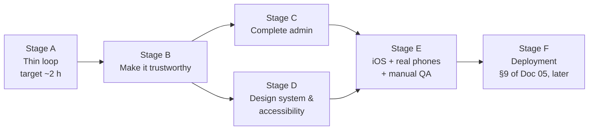
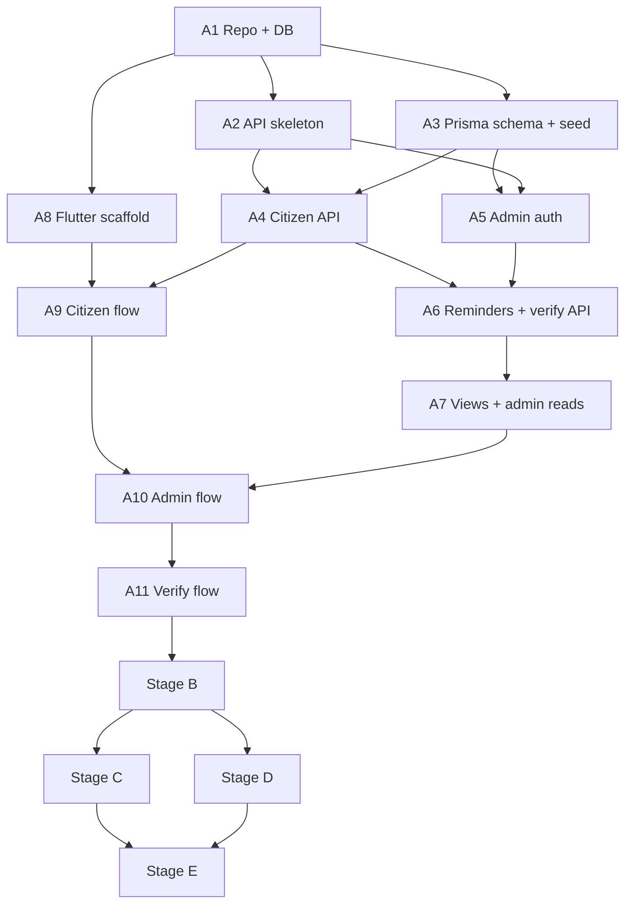

# Implementation Roadmap

> **Superseded by Saarthee v2** where they differ — see `docs/v2/saarthee-v2-spec.md` and `docs/tasks-v2/00-task-summary.md`.

**Project:** Saarthee (Ahmedabad Civic Accountability)
**Version:** 1.0
**Last Updated:** 2026-10-03
**Status:** Draft

## Related Documents
- [Project Overview & Architecture](./01-project-overview.md) — Scope and decisions
- [Frontend Specification](./02-frontend-spec.md) — Screens, state, design system
- [Backend Specification](./03-backend-spec.md) — Endpoints and workflows
- [Database Design](./04-database-design.md) — Schema, migrations, seeds
- [DevOps & Infrastructure](./05-devops-infrastructure.md) — Local setup, CI
- [Security & Testing](./06-security-testing.md) — Manual QA checklist

---

## 1. Project Phasing

### 1.1 How this roadmap works
- **Builder:** the founder, working with Claude Code. No other team members.
- **Format:** an **ordered build list**, with no sprints or dates. Each step is sized to be one focused Claude Code session, names the spec sections to give Claude Code, and has a "Done when" check you can confirm by hand.
- **Target:** a working local build in about **2 hours**. That's ambitious for the full scope described in Docs 01–06, which covers some 25 app screens, about 30 API endpoints, and the admin tools. This roadmap therefore puts a **thin end-to-end slice first** (Stage A), designed to be the 2-hour goal: one complete report → reminder → verify loop on an Android emulator. Everything after Stage A completes the spec.
- **Time estimates are not given per step.** How long Claude Code takes depends on prompts, review and debugging, and I can't predict it reliably. Treat "2 hours" as the goal for Stage A only, and re-plan from what Stage A actually takes.

### 1.2 Stage Overview

| Stage | Name | Goal | Key Deliverables |
|-------|------|------|-----------------|
| A | Thin loop | Prove the core loop runs end to end, locally, on an Android emulator | Database and schema, the minimum API, a plain-Material Flutter app: report, admin Due list with "Send reminder", verify, Rates |
| B | Make it trustworthy | Data integrity, privacy and draft safety, the things that protect the pilot's credibility | Idempotency, draft persistence across the CCRS hand-off, photo re-encoding and metadata stripping, log redaction, rate limits, token hashing checks |
| C | Complete admin | Everything the operator needs to run the pilot | Complaint detail with before/after, exclusion, anonymization, export, invite-code and category management, full filters |
| D | Design & accessibility | The citizen experience from Doc 02 | Tokens, typography, step layout, check-your-answers, before/after card, accessibility pass |
| E | Real devices | Works on a low-end Android phone and an iPhone | iOS build, physical-device networking, deep-link fallback, full manual QA checklist |
| F | Deployment | Real pilot | Doc 05 §9 (not planned yet) |

## 2. Team Allocation

### 2.1 Team Structure
| Role | Count | Responsibilities |
|------|-------|-----------------|
| Founder (all roles) | 1 | Prompts Claude Code, reviews changes, runs the app, manual QA, product decisions |
| Claude Code | — | Writes code against the spec documents |

### 2.2 Skills and Setup Needed Before Starting
- [ ] Docker installed and running.
- [ ] Node.js (current LTS) and npm.
- [ ] Flutter SDK (stable) and Android Studio with an emulator; `flutter doctor` passes for Android.
- [ ] For Stage E: a Mac with Xcode for iOS builds ([05 §4.5](./05-devops-infrastructure.md#45-distributing-test-builds-to-phones-local-mode)).
- [ ] GitHub repository created (empty).
- [ ] Copy `docs/` (these spec files) into the repo, so Claude Code can read them.

**Working with Claude Code (suggested):**
- Start each step by pointing Claude Code to the named spec sections, e.g. "Implement step A4 using docs/03-backend-spec.md §2.2 and §4.1".
- Ask it to stop and list questions when the spec is unclear, rather than guess.
- Commit after each step, so mistakes are easy to undo.
- Where a step uses a *candidate* library, ask Claude Code to check that it is current and maintained first ([03 §1.1](./03-backend-spec.md#11-technology-stack), [02 §1.1](./02-frontend-spec.md#11-technology-stack)).

## 3. Ordered Build List

### Stage A — Thin loop (the ~2-hour target)
Scope cuts in Stage A, all added back later:
- plain Material styling;
- no draft persistence across app restarts;
- the photo is stored as uploaded (no re-encoding yet);
- English only;
- Android emulator only;
- admin has Due, Send reminder, Rates and login only.

| Step | Task | Spec to give Claude Code | Done when |
|------|------|--------------------------|-----------|
| A1 | Repo scaffold: `apps/api`, `apps/mobile`, `infra`, `docs`; `.gitignore`; `.env.example` files; Docker Compose for PostgreSQL bound to localhost | 05 §1, §2.2, §3 | Database container is healthy; repo pushed to GitHub with no `.env` committed |
| A2 | API skeleton: Express + TypeScript strict, config validation at startup, structured logger, error format, request ID, GET /health | 03 §1.2, §2.1, §9.1 | `/health` returns ok with database status; a missing environment variable stops startup with a clear message |
| A3 | Prisma schema for **all** tables and enums in Doc 04; first migration; seed (dev admin, one invite code per source, placeholder categories, sample complaints) | 04 §3, §7.3, §8 | Migration applies cleanly; seed runs; tables are visible in a SQL client. Views can wait until A7 |
| A4 | Citizen API: GET /categories, POST /invite-codes/validate, POST /photos (local storage driver, basic JPEG check), POST /reports (with `clientSubmissionId`) | 03 §2.2–2.3, §4.1, §6.1 | A report can be created with a photo; a retry with the same `clientSubmissionId` returns 200 and creates no duplicate |
| A5 | Admin auth: create-admin script, POST /admin/auth/login (password hash + JWT), auth guard, GET /admin/me | 03 §3, 06 §2 | Login returns a token; admin routes reject requests without a valid token |
| A6 | Reminders and verify: POST /admin/complaints/{id}/reminders (token generation, hash stored, link and message returned); GET /verify/complaint, POST /verify/photos, POST /verify/submissions using `X-Verify-Token` | 03 §4.4, §4.5; 04 §3.6–3.7 | A reminder returns a `saarthee://` link; that token loads the complaint and accepts a verification; a wrong token gets 401 |
| A7 | Views and admin reads: `complaint_status_v`, `pilot_rates_v`; GET /admin/complaints (with `due`), GET /admin/rates | 04 §3.9; 03 §4.3, §4.7 | Due list and rates match a hand count on the seed data |
| A8 | Flutter scaffold: Riverpod, router, API client with standard headers, run configurations for emulator `API_BASE_URL` | 02 §1, 05 §2.2 | App launches on the Android emulator and calls `/health` |
| A9 | Citizen flow (plain Material): invite code → home → report steps 1–6 → done; camera + GPS; upload; submit | 02 §3.1, §4.2–4.10 | A report made in the app appears in the database with photo, GPS and phone |
| A10 | Admin flow (plain Material): login (from About) → Due list → Send reminder (bottom sheet: Copy message; Open WhatsApp if installed) → Rates | 02 §4.17–4.18, §4.21 | Reminder created; message with link shown |
| A11 | Verify flow: deep link `saarthee://verify?t=…` (fired with emulator developer tools) and manual code entry → answer → photo → note → send | 02 §4.11–4.16, 05 §4.6 | Verification stored; Rates shows the updated H1/H2 |

**Stage A is complete when:** on the emulator you can record a complaint, send a reminder from the admin screens, open the verify link, answer "Not fixed" with a photo, and see the H2 rate change on the Rates screen.

### Stage B — Make it trustworthy
| Step | Task | Spec | Done when |
|------|------|------|-----------|
| B1 | Report draft persisted to disk (JSON + photo file), restored after the app is killed during the CCRS hand-off | 02 §5.2, §6.3, §9.4 | Kill the app at step 2, reopen it: the draft is intact |
| B2 | Server photo pipeline: size limit, content check, decode and re-encode, metadata stripped, SHA-256 hash, max edge; `uploaded_for_complaint_id` on verify photos | 03 §8; 04 §3.4 | A downloaded stored photo has no metadata; a verify photo can't be used for a different complaint |
| B3 | Log redaction and no request bodies in logs; event allow-list; POST /events with batching in the app | 03 §9.2, §11; 02 §7 | Searching the logs for a test phone number or token finds nothing; events arrive in the table |
| B4 | Rate limits and security headers; uniform error responses for tokens | 03 §10; 06 §3 | Six bad logins → 429; headers present |
| B5 | Validation everywhere: shared rules for phone and CCRS number in the API and the app; device-clock check; consent version | 03 §4.2; 02 §6 | Invalid inputs are rejected with the specified messages |
| B6 | Duplicate CCRS flag; same-image and distance values on verifications | 03 §4.1, §4.5 | Flags are visible in the API response for admin detail |
| B7 | Orphaned-photo cleanup script | 03 §5.3 | Unattached photos older than 24 h are removed |

### Stage C — Complete admin
| Step | Task | Spec | Done when |
|------|------|------|-----------|
| C1 | All complaints list with filters and cursor paging | 03 §2.2; 02 §4.19 | Filters by source, category, status and excluded work |
| C2 | Complaint detail with before/after thumbnails, reminders timeline, verifications, revoke reminder | 02 §4.20; 03 §2.2 | All of a complaint's data visible; a revoked link stops working |
| C3 | Exclude / include, with reason | 03 §4.6 | Excluded complaints leave the rates |
| C4 | Anonymize (typed confirmation), file deletion, token revocation | 03 §4.6; 04 §9.3 | Phone and photos gone; old link rejected |
| C5 | CSV export (phone off by default; formula escaping) and share sheet | 03 §4.6; 06 §3.1 | A file opens correctly in a spreadsheet |
| C6 | Invite-code and category management screens | 02 §4.22; 03 §2.2 | Codes can be created and shared; categories can be reordered and deactivated |
| C7 | "Log out everywhere"; 401 handling returns to login | 03 §3.2; 02 §5.3 | Old tokens rejected after "log out everywhere" |

### Stage D — Design system & accessibility
| Step | Task | Spec | Done when |
|------|------|------|-----------|
| D1 | Theme from design tokens (colours, type scale, spacing, radii); bundle fonts (Anek or Noto, after checking licence and coverage) | 02 §2.1 | All screens use tokens; no hard-coded colours |
| D2 | `StepScaffold`, `ChoiceCard`, `StatusChip`, `IndependenceNotice`, error summary | 02 §1.3, §3.3 | Report and verify flows use the shared step layout |
| D3 | Check-your-answers screens with "Change" links | 02 §4.9, §4.16 | Every answer can be edited from the check screen |
| D4 | Before/after card (signature component) in admin detail, lists and verify check | 02 §2.5 | Matches the spec on a 320-wide screen |
| D5 | All strings moved to ARB files; final copy (welcome, consent, confirmations) | 02 §2.4, §4 | No user-facing string literals in code |
| D6 | Accessibility pass: labels, focus order, announcements, largest text size, contrast, statuses in grayscale | 02 §2.3 | TalkBack run-through of report and verify passes |

### Stage E — Real devices & manual QA
| Step | Task | Spec | Done when |
|------|------|------|-----------|
| E1 | Android physical phone: LAN `API_BASE_URL`, debug-only cleartext exception | 05 §4.6 | The full loop works on a low-end Android phone |
| E2 | iOS: run on simulator, then iPhone; ATS debug exception; permission texts; URL scheme | 05 §4.5–4.6 | The full loop works on an iPhone |
| E3 | Deep link from a real WhatsApp message; if not tappable, confirm the fallback code entry works | 01 A14; 02 §4.12 | One of the two paths works reliably; result recorded |
| E4 | GitHub Actions static checks | 05 §4 | Green check on `main` |
| E5 | Run the full manual checklist; fix S1/S2 bugs | 06 §12.3 | Checklist passes on both phones |

### Stage F — Deployment (not planned yet)

> **v2:** deployment is specified by v2 spec D12 and built in TASK-13 (`docs/ops/`).

See [05 §9](./05-devops-infrastructure.md#9-deployment-placeholder--to-be-written-before-the-pilot). Prerequisites from other documents: legal review (06 §6), "Saarthee" name check (02 F1), HTTPS and app links, real AMC categories (PRD Q4).

## 4. Milestone Schedule
No dates, at the founder's request. Milestones are defined by their criteria.

| Milestone | Criteria |
|-----------|----------|
| M1: Loop works | Stage A "complete when" statement passes on the emulator |
| M2: Trustworthy data | Stage B done; logs and photos checked for personal data |
| M3: Operator-ready | Stage C done; the operator can run a week of the pilot from the app |
| M4: Citizen-ready | Stage D done; accessibility pass completed |
| M5: Device-ready | Stage E done; the manual checklist passes on Android and iPhone |
| M6: Pilot live | Stage F done (later) |

## 5. Dependency Map

### 5.1 Critical Path
A1 → A3 → A4 → A6 → A7 → A10 → A11. The database schema and the reminder/verify API sit on the path to every visible result. Get A3 right first; it encodes most of Doc 04.

### 5.2 Parallel Work Streams
With one person and Claude Code, "parallel" means order flexibility, not simultaneous work:
- A8 (Flutter scaffold) can be done any time after A1.
- Stages C and D can be done in either order, or interleaved.

## 6. Risk Register
| Risk | Probability | Impact | Mitigation | Owner |
|------|------------|--------|-----------|-------|
| Stage A takes much longer than 2 hours | High | Low (only the plan moves) | Thin-slice scope cuts already applied; re-plan from actual time | Founder |
| Claude Code drifts from the spec or invents APIs and packages | Medium | Medium | Name spec sections in every prompt; ask it to list questions; check candidate packages are real and current; commit per step | Founder |
| No automated tests, so regressions go unnoticed | Medium | High for H1/H2 correctness | Manual checklist (06 §12.3) at M2 and M5; optional safety-net tests (06 §8.1) | Founder |
| Deep links from WhatsApp not tappable in local mode | Medium | Medium | Manual code-entry fallback; developer tools for testing | Founder |
| iOS setup (Mac, signing) blocks Stage E | Medium | Medium | Android first; iOS when a Mac and signing are ready | Founder |
| Real AMC category list unavailable (PRD Q4) | Medium | Low | Categories are data; editable in admin | Founder |
| Legal review delays the pilot | Medium | High (for launch) | Start the legal review in parallel with Stages B–E | Founder |

## 7. Definition of Done

> **v2:** the v1 "no automated tests" decision is reversed — v2 requires Vitest + Supertest API tests and Flutter widget/integration tests (v2 spec §12).

### 7.1 Step Level
- [ ] The step's "Done when" check passes when you run it by hand.
- [ ] Backend type-check and lint pass; `dart analyze` passes.
- [ ] No secrets or personal data committed.
- [ ] Committed with a message naming the step (e.g. "A6: reminders and verify API").

### 7.2 Stage Level
- [ ] All steps done.
- [ ] Relevant items of the manual checklist (06 §12.3) pass.
- [ ] Any change of plan recorded in the "Decisions & Assumptions" table of the affected spec document.

### 7.3 Release Level (before any real citizen uses the app)
- [ ] Stages A–E done and the full manual checklist passes.
- [ ] Stage F (deployment) done, including HTTPS, app links, backups and secret rotation.
- [ ] Legal review complete: consent text, privacy notice, retention.
- [ ] PRD open questions resolved: H2 threshold, wards, real categories, GPS fallback.

## Decisions & Assumptions
| # | Decision/Assumption | Rationale | Status | Date |
|---|---------------------|-----------|--------|------|
| 1 | Solo founder building with Claude Code | Founder's statement | Confirmed | 2026-10-03 |
| 2 | Ordered build list, no sprints or dates | Founder's choice | Confirmed | 2026-10-03 |
| 3 | ~2-hour target applied to Stage A (thin loop) only | The full scope is unlikely to fit in 2 hours; the thin slice is the realistic target | **Assumed — confirm** | 2026-10-03 |
| 4 | Stage A scope cuts (plain styling, no draft persistence, no re-encoding, Android emulator only) | Fastest path to a working loop; all restored in B–E | **Assumed — confirm** | 2026-10-03 |
| 5 | No per-step time estimates | Can't be predicted reliably for Claude Code sessions | Assumed | 2026-10-03 |
| 6 | Spec documents copied into the repo's `docs/` folder for Claude Code | Gives Claude Code direct access to the spec | Assumed — confirm | 2026-10-03 |

## Version History
| Version | Date | Author | Changes |
|---------|------|--------|---------|
| 1.0 | 2026-10-03 | Drafted with Claude from Docs 01–06 | Initial draft |
