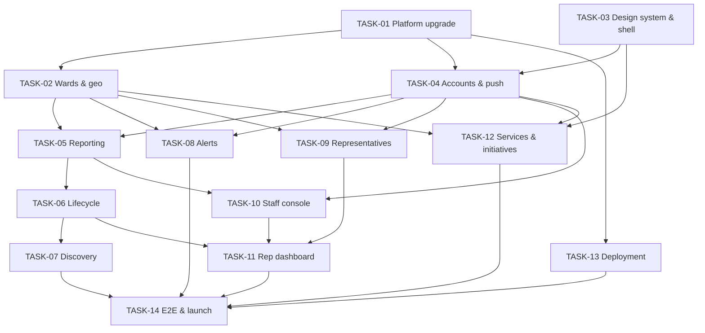

# Task Summary — Saarthee v2 (Amdavad civic platform)

**Last Updated:** 2026-10-04
**Overall Progress:** 0 / 14 tasks complete (0%)
**Current Task:** Wave 4 — TASK-06 (W-LIFE), TASK-10 (W-STAFF)
**Requirement Coverage (planned):** 119 / 119 active requirements mapped to a task (6 deferred)
**Requirement Coverage (verified):** 0 / 119 — see [coverage-verification.md](./coverage-verification.md)
**Source Documents:** `docs/v2/saarthee-v2-spec.md`, `docs/v2/design-system.md`, `docs/research/saarthee-v2-proposal.html`; v1 plan in `docs/tasks/` (foundation reused)

## How to use this plan

1. Read this file first in every session.
2. Open only the task file you are executing and the spec sections it names (`Spec §n`, `DS §n`).
3. Execute its Implementation Steps in order; commit at checkpoints with `V2-TASK-NN: <what landed>`.
4. Close the task with the Progress Management Protocol below.

Prompt template:
> Execute `docs/tasks-v2/TASK-NN-<slug>.md`. Read `docs/tasks-v2/00-task-summary.md` first. Use only the spec sections the task names. When done, follow the Progress Management Protocol.

## Status Board

| Task | Title | Status | Priority | Size | Depends On | Progress |
|---|---|---|---|---|---|---|
| TASK-01 | Platform upgrade: PostGIS, v2 data model, legacy migration, test harness | In Review | P0 | L | None | 95% |
| TASK-02 | Wards, zones and geo services | In Review | P0 | M | TASK-01 | 95% |
| TASK-03 | Neem design system, motion system, app shell and onboarding | In Review | P0 | L | None | 90% |
| TASK-04 | Citizen accounts, privacy and push foundation | In Review | P0 | L | TASK-01, TASK-03 | 90% |
| TASK-05 | Standalone issue reporting | In Review | P0 | L | TASK-02, TASK-04 | 90% |
| TASK-06 | Issue lifecycle, verification and escalation | In Review | P0 | L | TASK-05 | 90% |
| TASK-07 | Discovery: home feed, map, issue detail and social actions | In Review | P0 | L | TASK-06 | 90% |
| TASK-08 | Civic alerts and notification inbox | In Review | P0 | L | TASK-02, TASK-04 | 90% |
| TASK-09 | Representatives, My Ward and message relay | In Review | P0 | M | TASK-02, TASK-04 | 90% |
| TASK-10 | Staff console, roles and moderation | In Review | P0 | L | TASK-04, TASK-05 | 90% |
| TASK-11 | Representative claim and ward dashboard | In Review | P1 | M | TASK-06, TASK-09, TASK-10 | 85% |
| TASK-12 | AMC services directory and civic initiatives | In Review | P1 | M | TASK-02, TASK-03, TASK-04 | 90% |
| TASK-13 | Deployment, storage, backups and release | In Review | P0 | M | TASK-01 | 80% |
| TASK-14 | End-to-end verification, accessibility and pilot launch | Not Started | P0 | L | TASK-07, TASK-08, TASK-11, TASK-12, TASK-13 | 0% |

Status vocabulary: `Not Started`, `In Progress`, `Blocked`, `In Review`, `Complete`.

## Execution Order and parallel lanes

| Lane | Sequence |
|---|---|
| Backend platform | TASK-01 → TASK-02 → (TASK-08, TASK-09 in parallel) |
| Mobile foundation | TASK-03 (parallel with TASK-01) |
| Core loop | TASK-04 → TASK-05 → TASK-06 → TASK-07 |
| Operators | TASK-10 → TASK-11 |
| Content | TASK-12 (after TASK-04) |
| Ops | TASK-13 (any time after TASK-01; must finish before TASK-14) |
| Launch | TASK-14 last |

**Ready now:** TASK-14 (end-to-end verification, accessibility, pilot launch)
**Blocked:** none

### Milestones

| Milestone | Reached when |
|---|---|
| V2-M1 New look | TASK-03 complete: Neem shell, onboarding in Gujarati and English |
| V2-M2 Report anything | TASK-05 complete: a signed-in citizen reports any of 14 categories with ward detection and duplicate check |
| V2-M3 Real fixes | TASK-06 + TASK-07 complete: lifecycle, neighbour verification, feed, map, Me too, follow |
| V2-M4 Civic hub | TASK-08, TASK-09, TASK-12 complete: alerts, My Ward with relay, services and drives |
| V2-M5 Operators | TASK-10 + TASK-11 complete: moderation, staff console, representative dashboards |
| V2-M6 Pilot live | TASK-13 + TASK-14 complete: deployed, Play closed testing in 5 West-zone wards |

## Dependency Graph

## Requirement Coverage

| Category | Active | Mapped to a task | Verified | Deferred |
|---|---|---|---|---|
| Functional (REQ-F) | 66 | 66 | 0 | 4 |
| Data (REQ-D) | 13 | 13 | 0 | — |
| Non-functional (REQ-N) | 13 | 13 | 0 | — |
| Security (REQ-S) | 15 | 15 | 0 | — |
| Operational (REQ-O) | 12 | 12 | 0 | 1 |
| **Total** | **119** | **119** | **0** | **6** |

Full mapping: [requirements-registry.md](./requirements-registry.md) · Verification: [coverage-verification.md](./coverage-verification.md)

## Project-wide conventions (v2)

- **Tests are required in v2** (reverses v1's decision, Spec §12): API integration tests with Vitest + Supertest for every endpoint group; Flutter widget tests for shared components; one emulator integration test of report → verify. Static checks (tsc, ESLint, dart analyze, dart format) stay mandatory.
- **v1 rules still apply:** layering (handlers thin, services own rules), Zod validation, parameterised SQL only, uniform error shape, logger redaction, idempotent writes, no secrets in git, no real citizen data locally.
- **Design:** only `docs/v2/design-system.md` (v2.2 "Neem") tokens, fonts (Baloo Bhai 2 + Mukta Vaani) and components; every string in ARB (Gujarati + English).
- **Motion:** every animation uses `SaartheeMotion` tokens and the DS §6 catalogue; no `Duration(` literals in features; reduced motion always honoured; 60 fps on the reference low-end phone.
- **Independence:** no AMC logo; source line on all AMC-derived content (Spec §1, DS §1).
- **Migrations:** new migrations only; never edit applied ones.
- **Never invent:** if the spec is silent, log `ASSUMPTION:` in the task's §5.6 and in Open Questions below.

## Progress Management Protocol

After each completed implementation and its commit:
1. Task file: add a §13 row (date, what landed, commit), update Status, Last Updated, Progress; tick genuinely done §14 items.
2. Coverage matrix: set the task's rows to Pass/Fail with evidence; run `python3 docs/tasks-v2/check_coverage.py --task TASK-NN`.
3. This file: board, Overall Progress, Current Task, Ready now, Blocked, Verified column, Change Log row.
4. Dependencies: if scope moves, update both task files, the graph and the registry.
5. Validate: `python3 docs/tasks/validate_tasks.py docs/tasks-v2/` must pass. Commit `V2-TASK-NN: update task docs`.

A task is `Complete` only when its acceptance criteria are verified in the running app and its tests pass.

## Decisions & Open Questions

| # | Item | Status | Impact if wrong |
|---|---|---|---|
| D1–D12 | Decisions in Spec §2 (design, contact relay, roles, languages, pilot wards, OTP, staff console on web, Firebase Auth, FCM, PostGIS, retire v1 pilot UI, deployment shape) | Decided by build lead 2026-10-03; founder may overrule | Rework of the affected task |
| 1 | 2026–31 corporator roster must be compiled by hand (no official machine-readable list) | Open — data task in TASK-09/TASK-14 | My Ward incomplete at launch |
| 2 | Ward boundaries after the 2026 delimitation (OpenCity KML is Nov 2025) | To verify in TASK-02 | Wrong ward for some addresses |
| 3 | Firebase project ownership and Play Console account | Founder action before TASK-04/TASK-13 | Blocks OTP and release |
| 4 | IMD API access (IP whitelisting) | Request in TASK-08; SACHET CAP used meanwhile | Fewer automatic alert drafts |
| 5 | Gujarati copy review by a native editor | Before TASK-14 | Wording quality |
| 7 | Cross-task contracts settled 2026-10-03: one in-process job runner (TASK-06 `src/jobs`) for all app jobs; `OUTSIDE_SERVICE_AREA` 422 for points outside the city; `amc_problem_types` created in TASK-05; `notifications` created in TASK-04; v1 writes return 410 `ENDPOINT_RETIRED`; single status-change function owned by TASK-06 | Decided | Rework where a task diverges |
| 6 | Legal review: DPDP notices, representative data, election-mode rules | Before pilot launch | Compliance risk |

## Change Log

| Date | Change |
|---|---|
| 2026-10-04 | Waves 4–5 merged: TASK-06, TASK-10 (+ INT-10: staff writes via `transitionInTx`), TASK-07, TASK-11. Emulator (cold-booted after a wedged system_server): staff moderation → acknowledge → mark fixed with after photo (EXIF-free), follower inbox rows; TASK-07 `discovery_test` 1/1, Home feed/map/detail/Me too (sign-in returns to the action, auto-follow)/Following/route-chevron pull-to-refresh; TASK-11 representative ward dashboard. Staff web console verified in Chrome. Integrator fixes: sign-in takes the app language (inbox was Gujarati under an English UI); CORS allowed client `X-*` headers (every staff-web call was blocked); representative at `/staff` got 'no access'; brand mark on staff login/app bar. Gates: API 433 passed / 4 skipped, Flutter 485, analyze 0, format clean. Tags `v2-m3`, `v2-m5`. |
| 2026-10-04 | Waves 2–3 merged: TASK-02 mobile, TASK-04, TASK-05 (+ ML Kit auto-blur), TASK-08 (+ shared job runner), TASK-09, TASK-12, TASK-13. Emulator: OTP sign-in via Auth Emulator, report 1→3 submitted with blur caption, My Ward relay (no phone digits in email), two-admin Warning alert → banner + inbox + swipe-read, initiative RSVP. Integrator fixes: report thumbnail/blur flag/pinned buttons/icons, inbox refetch, app-bar title overflow, profile emulator cleartext. Tags v2-m2, v2-m4. API 331+, Flutter 378 |
| 2026-10-04 | Wave 1 merged to main: TASK-01 (75 API tests green; native arm64 PostGIS image `infra/postgis/Dockerfile`), TASK-03 (114 Flutter tests green) and V2-BRAND identity (mark variant E "road turn", adaptive/themed launcher icons, splash light/dark, notification icon, web/Play assets, brand guide in `docs/brand/`). Both tasks In Review pending emulator checks |
| 2026-10-03 | Founder chose design direction B "Neem" (from `docs/v2/design-options.html`) and fonts A Baloo Bhai 2 + Mukta Vaani (from `docs/v2/font-options.html`); design system v2.2 adds DS §6 Motion. New requirements REQ-F-062..066 (feature motion, TASK-05/06/07/08/11) and REQ-N-012..013 (motion system TASK-03, motion performance TASK-14). 119 active |
| 2026-10-03 | v2 plan created from the research proposal, the v1 code audit and the founder's direction (standalone platform, corporators, alerts, services, professional design). 14 tasks, 112 active requirements, 5 deferred |
