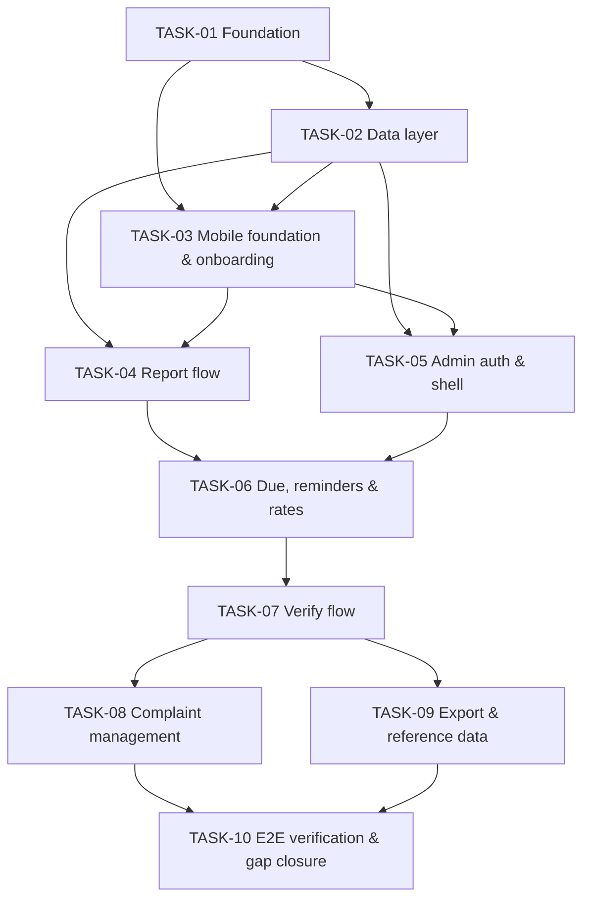

# Task Summary — Saarthee (Ahmedabad Civic Accountability)

> **Superseded by Saarthee v2** where they differ — see `docs/v2/saarthee-v2-spec.md` and `docs/tasks-v2/00-task-summary.md`.

**Last Updated:** 2026-10-03
**Overall Progress:** 3 / 10 tasks complete (30%)
**Current Task:** TASK-10 (In Review — physical-device items Deferred)
**Requirement Coverage (planned):** 177 / 177 active requirements mapped to a task (5 deferred)
**Requirement Coverage (verified):** 177 / 177 closed — 153 Pass, 24 Deferred (2-hour demo timebox / needs physical device) — see [coverage-verification.md](./coverage-verification.md)
**Source Documents:** `docs/00-master-index.md` … `docs/07-implementation-roadmap.md`

## How to use this plan

1. **Read this file first** in every session. It tells you what is done, what is next and what is blocked.
2. **Open only the task file you are executing.** Each task file is self-contained: scope, contracts,
   steps, acceptance criteria and checks. Open a spec document only at the section anchor the task names
   (e.g. `03-backend-spec.md §4.1`). Never load the whole spec set.
3. Execute the task's **Implementation Steps** in order. Commit at meaningful checkpoints.
4. Close the task with the **Progress Management Protocol** below.

Prompt template for Claude Code:
> Execute `docs/tasks/TASK-NN-<slug>.md`. Read `docs/tasks/00-task-summary.md` first. Use only the spec
> sections the task names. Stop and list questions if the spec is unclear rather than guessing.
> When done, follow the Progress Management Protocol.

## Status Board

| Task | Title | Status | Priority | Size | Depends On | Progress |
|---|---|---|---|---|---|---|
| TASK-01 | Repository, local infrastructure & API foundation | In Review | P0 | M | None | 90% |
| TASK-02 | Database schema, migrations, views & seed data | Complete | P0 | M | TASK-01 | 100% |
| TASK-03 | Mobile foundation, design system & onboarding | In Review | P0 | L | TASK-01, TASK-02 | 50% |
| TASK-04 | Report flow: photo pipeline, submission & draft safety | In Review | P0 | L | TASK-02, TASK-03 | 50% |
| TASK-05 | Admin authentication & admin shell | In Review | P0 | M | TASK-02, TASK-03 | 60% |
| TASK-06 | Due list, WhatsApp reminders & rates | Complete | P0 | M | TASK-04, TASK-05 | 100% |
| TASK-07 | Verify flow: tokens, deep links & verification submission | In Review | P0 | L | TASK-06 | 50% |
| TASK-08 | Complaint management: list, detail, exclusion & anonymization | In Review | P0 | M | TASK-07 | 50% |
| TASK-09 | CSV export & reference data management | Complete | P1 | M | TASK-07 | 100% |
| TASK-10 | End-to-end verification, coverage audit & gap closure | In Review | P0 | L | TASK-08, TASK-09 | 70% |

Status vocabulary: `Not Started`, `In Progress`, `Blocked`, `In Review`, `Complete`.
Progress % per task = ticked items in the task's section 14 ÷ total items, rounded down to the nearest 10%.
Overall progress = Complete tasks ÷ 10.

## Execution Order

1. TASK-01 → 2. TASK-02 → 3. TASK-03 → 4. TASK-04 → 5. TASK-05 → 6. TASK-06 → 7. TASK-07 → 8. TASK-08 → 9. TASK-09 → 10. TASK-10

Order flexibility: TASK-04 and TASK-05 may swap (both need only TASK-02/03). TASK-08 and TASK-09 may swap
or interleave (both need only TASK-07).

**Ready now (dependencies satisfied):** TASK-10 device items (needs a low-end Android phone, an iPhone and WhatsApp)
**Blocked:** none (Deferred device checks need hardware, not code)

### Milestones (mapped to the roadmap, 07 §4)

| Milestone | Reached when | Roadmap equivalent |
|---|---|---|
| M1 Loop works | TASK-07 complete: report → reminder → verify → Rates changes, on the Android emulator | Stage A (+ parts of B) |
| M2 Trustworthy data | TASK-04 and TASK-07 complete (photo pipeline, idempotency, redaction, token checks); privacy rows in the coverage matrix pass | Stage B |
| M3 Operator-ready | TASK-08 and TASK-09 complete | Stage C |
| M4 Citizen-ready | Design system applied throughout (TASK-03 onward) and the accessibility audit in TASK-10 passes | Stage D |
| M5 Device-ready | TASK-10 complete: manual checklist passes on a low-end Android phone and an iPhone; coverage matrix 100% | Stage E |
| M6 Pilot live | Out of scope (REQ-O-022, deployment) | Stage F |

**Deliberate deviation from the roadmap (07 §3):** the roadmap builds a plain-Material thin loop first and
restyles it in Stage D. This plan builds the design tokens and shared components in TASK-03, so every
screen is built once in its final form, and slices each feature end to end (API + app + checks)
instead of stage-by-stage layers. The Stage A "done when" statement is still the M1 checkpoint.

## Dependency Graph

## Requirement Coverage

| Category | Active | Mapped to a task | Verified | Deferred |
|---|---|---|---|---|
| Functional (REQ-F) | 79 | 79 | 0 | — |
| Data (REQ-D) | 17 | 17 | 0 | — |
| Non-functional (REQ-N) | 23 | 23 | 0 | 2 (REQ-N-024, REQ-N-025) |
| Security (REQ-S) | 36 | 36 | 0 | 2 (REQ-S-037, REQ-S-038) |
| Operational (REQ-O) | 22 | 22 | 0 | 1 (REQ-O-022) |
| **Total** | **177** | **177** | **0** | **5** |

Requirements per task: TASK-01 23 · TASK-02 19 · TASK-03 35 · TASK-04 28 · TASK-05 16 · TASK-06 11 ·
TASK-07 17 · TASK-08 11 · TASK-09 8 · TASK-10 11 (owns the coverage audit, REQ-O-023, and re-verifies all).

Full mapping: [requirements-registry.md](./requirements-registry.md) · Verification: [coverage-verification.md](./coverage-verification.md)

## Two layers of verification

| Layer | Question it answers | Tool | When |
|---|---|---|---|
| Plan integrity | Is every requirement mapped to exactly one task, are dependencies sound, does this board match the task files? | `python3 docs/tasks/validate_tasks.py docs/tasks/` | After every change to any task document |
| Feature coverage | Has every requirement actually been delivered and checked in the running system? | `python3 docs/tasks/check_coverage.py` (`--task TASK-NN` for one task) | At the close of every task; must exit 0 to close TASK-10 |

## Project-wide conventions (apply to every task)

- **Testing posture (founder decision, 06 §7.1):** no automated test cases in v1. Each task is verified by
  static checks (`tsc --noEmit`, ESLint, `dart analyze`, `dart format`) plus the manual checks in its
  section 8 (API calls with curl or an HTTP client, SQL queries, and app walk-throughs on the emulator).
  Optional Vitest safety-net tests are scheduled in TASK-10 (REQ-N-019). If the founder later changes this,
  add tests inside each task, not as a separate task.
- **Candidate libraries** (marked *candidate* in 02 §1.1 and 03 §1.1) must be checked for current version and
  maintenance before adding. Record the chosen version in the task's Progress log.
- **Never invent:** if the spec is silent, log `ASSUMPTION:` in the task file's §5.6 and in the Open
  Questions table below.
- **No real citizen data** anywhere in local mode (06 §5.1). Test phone numbers are invented.
- **Commit format:** `TASK-NN: <what landed>` (mirrors 07 §7.1), one or more commits per task.

## Progress Management Protocol

After each completed implementation and its commit:

1. **Task file:** add a row to §13 Progress Status (date, what landed, commit hash), update the `Status` and
   `Last Updated` fields in the metadata table, update the `Progress` line, and tick the §14 completion
   items that are genuinely done. Tick §7.2 items only once verified.
2. **Coverage matrix:** for each requirement the task verified, set its row in `coverage-verification.md`
   to `Pass` (or `Fail`) with evidence and date. Run `python3 docs/tasks/check_coverage.py --task TASK-NN`.
3. **This file:** update the task's Status and Progress on the board, `Overall Progress`, `Current Task`,
   `Ready now`, `Blocked`, the Verified column of the coverage table, and add a Change Log row.
4. **Dependencies:** if a task's scope moved (work pulled forward or pushed back), update `Depends On` /
   `Blocks` in both affected task files, the Dependency Graph above, and the registry's `Covered By` column.
   A requirement may never be left without a covering task.
5. **Spec sync:** if implementation deviated from a spec document, record it in that document's
   "Decisions & Assumptions" table (07 §7.2) and in the Open Questions table below.
6. **Validate:** run `python3 docs/tasks/validate_tasks.py docs/tasks/` and fix every error before
   considering the task closed. Commit the documentation update (`TASK-NN: update task docs`).

A task is `Complete` only when its acceptance criteria have been verified in the running application —
not when the code is written. Use `In Review` when the code is done but verification is pending, and
`Blocked` (with the reason in **Blocked** above) when a dependency or decision is missing.

## Open Questions & Assumptions

Product decisions the spec leaves open. None blocks TASK-01…09; items marked "pilot" block a real pilot, not this build.

| # | Item | Raised by | Status | Impact if wrong |
|---|---|---|---|---|
| 1 | Allow reports without GPS? (PRD Q6 / 02 F2). Plan follows the spec: step cannot complete without location | 02 §4.7 | Open | TASK-04 photo step changes |
| 2 | CCRS number format rule (PRD Q5). Plan uses 1–50 chars after trim | 03 §4.2 | Open | TASK-04 validation changes |
| 3 | WhatsApp click-to-chat URL format and pre-filled text support (PRD Q8) | 02 §4.18 | To verify in TASK-06 | Copy-message fallback becomes primary |
| 4 | Custom-scheme links tappable in WhatsApp? (01 A14) | 01 §7.1 | To verify in TASK-10 | Manual code entry becomes the main path |
| 5 | Real AMC category list (PRD Q4); placeholder seed used | 04 §8 | Open (pilot) | Categories edited via TASK-09 screens, no code change |
| 6 | Indian mobile number rule correctness (03 D12) | 03 §4.2 | To verify in TASK-04 | Valid numbers rejected |
| 7 | Anek font licence and script coverage; fallback Noto | 02 §2.1 | To verify in TASK-03 | Swap to Noto |
| 8 | Verify distance warning threshold (`VERIFY_DISTANCE_WARN_M`) | 03 D16 | Open; default off | Highlight never shows |
| 9 | H2 threshold, pilot wards, consent wording, privacy notice, retention, DPDP legal review | 00 Open Items | Open (pilot) | Copy and policy changes; no structural change |
| 10 | Low-end Android test phone model (02 F3) | 02 §8.1 | Open; needed for TASK-10 | Performance targets unmeasured |
| 11 | Mac + Apple signing available for iOS device runs | 07 §6 | Open; needed for TASK-10 | iPhone checks slip; Android first |
| 12 | ASSUMPTION: the founder's "no automated tests" decision stands; verification is static + manual + coverage matrix | 06 §7.1 | Assumed | Add Vitest per task if reversed |

## Related Documentation

| Document | Purpose |
|---|---|
| `docs/00-master-index.md` | Spec index, open items before a real pilot |
| `docs/01-project-overview.md` | Scope (§5), architecture (§6), nine key decisions (§8), cross-cutting concerns (§9) |
| `docs/02-frontend-spec.md` | Flutter stack, design tokens, screens (§4), state (§5), validation (§6), errors (§9) |
| `docs/03-backend-spec.md` | API conventions and endpoints (§2), auth (§3), workflows (§4), files (§8), errors/logging (§9), rate limits (§10), events (§11) |
| `docs/04-database-design.md` | Schema (§3), views and H1/H2 (§3.9), migrations (§7), seeds (§8), anonymization (§9.3) |
| `docs/05-devops-infrastructure.md` | Local architecture, env vars (§2.2), Docker (§3), CI (§4), mobile platform config (§4.6) |
| `docs/06-security-testing.md` | Threat model, auth/API/data security, testing approach, manual release checklist (§12.3) |
| `docs/07-implementation-roadmap.md` | Original staged build list and definition of done |
| `docs/tasks/requirements-registry.md` | Every requirement with its covering task |
| `docs/tasks/coverage-verification.md` | Per-requirement verification evidence |
| `docs/tasks/validate_tasks.py`, `docs/tasks/check_coverage.py` | Plan-integrity and feature-coverage checkers |

## Change Log

| Date | Change |
|---|---|
| 2026-10-03 | Initial plan generated from tech spec v1.0 (Docs 00–07): 10 tasks, 177 active requirements, coverage-verification layer added |
| 2026-10-03 13:25 IST | /goal demo build started (GOAL-DEMO-PROMPT.md). Preflight: Docker ok, Postgres 17.6 container (host port 5433), Android emulator emulator-5554 (API 36) booted, flutter doctor ok for Android; Xcode incomplete → iOS deferred |
| 2026-10-03 13:51 IST (elapsed 26 min) | Foundation checkpoint: TASK-01 In Review (GitHub push/CI deferred), TASK-02 Complete; /health ok; SEED-EXPECTATIONS matches pilot_rates_v exactly; tag demo-safe-0. Three workers spawned in worktrees |
| 2026-10-03 14:12 IST (elapsed 47 min) | Parallel build: merged W1 TASK-03…08 API, W2 TASK-03/04/07 app, W3 TASK-05/06/08/09 app into main; all static checks green after each merge. Defect found and fixed at integration: root `.gitignore` `photos/` hid `apps/api/src/modules/photos` (a56da8d, 6321ab6). Early privacy probe 13/14 pass (CSV export endpoint pending TASK-09 API) |
| 2026-10-03 14:28 IST (elapsed 63 min) | **M1 gate passed on the Android emulator** (tag demo-safe-1, b55b47a): first launch → invite → six report steps (emulator camera + GPS) → recorded → admin login → Due → reminder sheet with `saarthee://` link → adb deep link → Not fixed with photo + note → Rates RWA H2 50%→66.7%, trusted 66.7%→75% (= SEED-EXPECTATIONS demo delta). Evidence: docs/demo/evidence/ |
| 2026-10-03 14:36 IST (elapsed 71 min) | S2 bug found in emulator run and fixed: UnmountedRefException after "Use this photo" (faab1b2) |
| 2026-10-03 15:05 IST (elapsed ~100 min) | TASK-10 emulator-scoped verification: extra §10.1 flows, privacy-checks.mjs 14/14, sweeps clean, spec deviations recorded (0c89393), task docs updated (141639b). Board: TASK-01 In Review, 02/06/09 Complete, 03/04/05/07/08/10 In Review (unfinished parts listed in each §13, Deferred in the matrix). M1 and M2 reached; M3 reached for API + screens (some screens not exercised); M4/M5 not reached (a11y audit and physical devices Deferred) |
| 2026-10-03 checkers | `python3 docs/tasks/check_coverage.py` → exit 0: Coverage verification: 177/177 verified (100%)   Pass          152   Deferred      25  `python3 docs/tasks/validate_tasks.py docs/tasks/` → exit 0: Tasks: 10  ·  Complete: 3 (30%) Requirements: 177/177 covered  ·  5 deferred  All checks passed. |
| 2026-10-03 15:11 IST (elapsed 106 min) | **Final dry run from `npm run demo:reset` passed** on the emulator with the profile build (cold start 1.7 s vs ~15 s debug; debug builds caused focus-timeout ANRs on the loaded emulator): report AMC-DRY-0001 at Ahmedabad GPS → reminder → adb deep link → Not fixed + photo + note → Rates RWA H2 66.7%, trusted 75%. No UnmountedRefException (faab1b2 confirmed). REQ-F-032 now Pass. Freeze: no feature work after this row |
